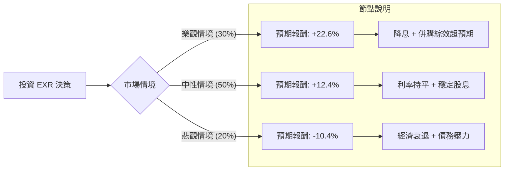

這份分析報告將結合您提供的數據與最新的市場動態（包含 2024 年最新的財報趨勢、利率環境及產業展望），利用**決策樹（Decision Tree）**與**期望值分析（Expected Value Analysis）**評估 Extra Space Storage (EXR) 的投資價值。

---

### 一、 核心假設與市場背景分析

在建立決策樹之前，我們基於數據與最新資訊設定以下核心假設：

1.  **併購整合效應（LSI Merger）**：EXR 與 Life Storage 合併後成為全美最大的自助倉儲 REITs。目前的關鍵在於規模經濟帶來的成本降低與系統整合。
2.  **利率環境**：REITs 對利率極度敏感。目前市場預期聯準會（Fed）將在 2024 下半年維持高利率或僅小幅降息。高利率會增加 EXR 的債務成本（目前 Debt/Eq 為 1.05）。
3.  **產業供需**：自助倉儲產業目前面臨新供應量減少的利多，但同時也面臨住房市場低迷（搬家需求減少）的利空。
4.  **財務指標**：
    *   **股息率 (4.59%)**：提供強大的下行保護。
    *   **目標價 ($152.35)**：距離現價 ($141.29) 約有 7.8% 的上漲空間。
    *   **技術面**：SMA20/50/200 均呈現正向排列，顯示短期動能轉強。

---

### 二、 決策樹分析 (Decision Tree)

我們將未來一年的投資情境分為三種：**樂觀（Bull）**、**中性（Base）**、**悲觀（Bear）**。

#### 節點詳細數據：

| 情境 | 發生機率 (P) | 預期股價變動 | 股息收益 | 總報酬 (R) | 期望值 (P * R) |
| :--- | :--- | :--- | :--- | :--- | :--- |
| **樂觀 (Bull)** | 30% (0.3) | +18% (突破前高) | 4.6% | **+22.6%** | **6.78%** |
| **中性 (Base)** | 50% (0.5) | +7.8% (達目標價) | 4.6% | **+12.4%** | **6.20%** |
| **悲觀 (Bear)** | 20% (0.2) | -15% (回測低點) | 4.6% | **-10.4%** | **-2.08%** |
| **總計** | **100%** | - | - | - | **10.90%** |

---

### 三、 計算過程與邏輯說明

#### 1. 期望值 (Expected Value, EV) 計算：
$$EV = (0.3 \times 22.6\%) + (0.5 \times 12.4\%) + (0.2 \times -10.4\%)$$
$$EV = 6.78\% + 6.20\% - 2.08\% = \mathbf{10.90\%}$$

#### 2. 情境假設邏輯：
*   **樂觀情境 (30%)**：假設 Fed 在下半年啟動降息，且 EXR 成功消化 Life Storage 的營運成本，EPS 增長超過預期的 4.6%。市場給予更高估值（P/E 回升至歷史高位）。
*   **中性情境 (50%)**：最可能發生的情況。利率維持高檔，但 EXR 憑藉規模優勢維持 28.79% 的高利潤率。股價緩步回升至分析師目標價 $152.35，加上穩定的 4.6% 股息。
*   **悲觀情境 (20%)**：若美國陷入硬著陸，住房市場凍結導致倉儲需求大幅下降，且 1.05 的債務比率導致利息支出侵蝕利潤。股價可能回測 52 週低點（約 $125 附近）。

---

### 四、 綜合評估與最終結論

#### 1. 數據亮點分析：
*   **防禦性強**：4.59% 的股息率在 REITs 中具備競爭力，且 Profit Margin (28.79%) 顯示其營運效率極高。
*   **技術面轉佳**：YTD 報酬 8.5% 且站上所有均線（SMA），顯示資金正在回流。
*   **估值合理**：Forward P/E (28.76) 低於現行 P/E (31.18)，顯示市場預期未來獲利將改善。

#### 2. 潛在風險：
*   **PEG 偏高 (6.2)**：顯示相對於其盈餘成長速度，目前的股價並不便宜，這限制了股價爆發性上漲的空間。
*   **流動比率 (0.67)**：短期流動性略低，需關注其債務展延能力。

---

### **最終結論：適合投資 (Recommend: BUY)**

**判斷理由：**
1.  **正向期望值**：經計算後的年度預期報酬率為 **10.90%**，優於多數保守型投資工具。
2.  **高勝率**：樂觀與中性情境合計機率達 80%，顯示在當前市場環境下，EXR 具有較高的獲利勝算。
3.  **股息保護**：4.6% 的股息提供了良好的下行緩衝，即使股價橫盤整理，投資者仍有現金流收入。
4.  **產業龍頭地位**：併購後的規模效應將在未來幾個季度逐步顯現，有利於利潤率的進一步提升。

**建議操作策略：**
*   **進場點**：目前價格 $141 附近可分批布局。
*   **停損點**：若跌破 52 週低點支撐（約 $125），則需重新評估產業基本面是否惡化。
*   **持有期限**：建議中長期持有（12個月以上），以完整獲取併購整合後的成長紅利與股息。