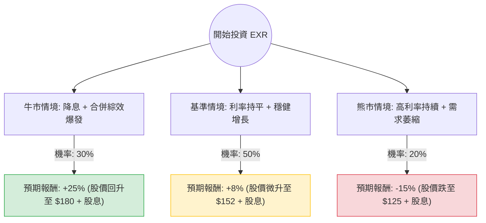

這份分析報告將針對 **Extra Space Storage Inc. (EXR)** 進行深入評估。EXR 是美國領先的自助倉儲（Self-storage）房地產投資信託基金（REITs）。

我們將結合您提供的數據與最新的市場動態（如：與 Life Storage 的合併進展、利率環境、自助倉儲產業趨勢）進行決策樹與期望值分析。

---

### 一、 核心假設與市場背景分析

在建立決策樹之前，我們基於最新資訊設定以下核心假設：

1.  **利率環境（關鍵變數）：** REITs 對利率極度敏感。目前市場預期 2024 年下半年可能降息，這將降低 EXR 的融資成本並提升估值。
2.  **合併綜效：** EXR 於 2023 年完成與 Life Storage (LSI) 的合併。2024 年的重點在於能否實現預期的成本節約與營收協同效應。
3.  **產業供需：** 自助倉儲需求在疫情後回歸常態，租金增長放緩，但 EXR 憑藉規模優勢與數據驅動的定價系統，表現優於同業。
4.  **財務數據：** 目前 P/E 約 33 倍，略高於歷史平均，但 Forward P/E 降至 30.98，顯示市場預期盈利將改善。股息率 4.38% 具備吸引力。

---

### 二、 決策樹分析 (Decision Tree)

以下為 EXR 未來一年的投資決策樹模型：

#### 節點詳細說明：

1.  **牛市情境 (Bull Case) - 30% 機率：**
    *   **條件：** 聯準會啟動降息循環，且與 Life Storage 的合併綜效超乎預期，EPS 增長率超過 10%。
    *   **預期報酬：** 資本利得 20.6% + 股息 4.4% ≈ **25%**。
2.  **基準情境 (Base Case) - 50% 機率：**
    *   **條件：** 利率維持高位震盪，合併進度符合預期，租金收入保持個位數增長。
    *   **預期報酬：** 資本利得 3.6% (接近目標價 $149) + 股息 4.4% ≈ **8%**。
3.  **熊市情境 (Bear Case) - 20% 機率：**
    *   **條件：** 通膨反彈導致利率再度上升，房地產市場低迷，自助倉儲空置率上升。
    *   **預期報酬：** 資本利得 -19.4% + 股息 4.4% ≈ **-15%**。

---

### 三、 期望值分析 (Expected Value Analysis)

#### 1. 計算過程：
期望值 (EV) = (牛市機率 × 牛市報酬) + (基準機率 × 基準報酬) + (熊市機率 × 熊市報酬)

*   **EV = (0.30 × 0.25) + (0.50 × 0.08) + (0.20 × -0.15)**
*   **EV = 0.075 + 0.04 - 0.03**
*   **EV = 0.085 (即 8.5%)**

#### 2. 數據解讀：
*   **總期望報酬率：8.5%**。
*   對比目前美債 10 年期殖利率（約 4.2% - 4.5%），EXR 提供的風險溢酬（Risk Premium）約為 4%，處於合理但非極度便宜的區間。
*   **技術面支持：** 數據顯示 SMA20, SMA50, SMA200 均為正值，且股價近期表現（Perf Week: 5.33%）強勁，顯示短期動能向上。

---

### 四、 最終結論

#### **判斷：適合投資 (Moderate Buy / Accumulate)**

#### **理由：**
1.  **正向期望值：** 8.5% 的預期報酬率在當前高利率環境下具有競爭力，尤其是考慮到其 4.38% 的穩定現金流（股息）。
2.  **規模優勢與合併紅利：** EXR 目前是美國最大的自助倉儲營運商，與 Life Storage 合併後的規模經濟將顯著提升營運利潤率（目前 Oper. Margin 已達 27.55%）。
3.  **防禦性特質：** 自助倉儲產業在經濟放緩時通常比辦公室或零售 REITs 更具韌性（因搬遷、縮減規模等需求）。
4.  **技術面轉強：** 股價已站上所有均線，且 YTD 表現（13.53%）優於許多同業，顯示資金正在流入。

#### **投資建議與風險提示：**
*   **進場策略：** 目前股價 $146 接近分析師目標價 $149，建議採取「分批買進」策略，若股價回測 $135-$140 區間則是更佳的切入點。
*   **最大風險：** 若聯準會（Fed）意外轉向鷹派或維持高利率時間遠超預期，REITs 估值將面臨下修壓力。此外，需密切觀察 EPS Q/Q 下降（-14.23%）是否為合併相關的一次性支出，若持續下滑則需重新評估。

---
*免責聲明：本分析僅供參考，不構成任何投資建議。投資者應自行承擔市場風險。*