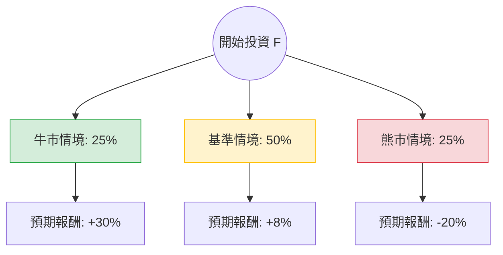

這份分析報告將結合您提供的財務數據與最新的市場動態（包含 Ford Pro 的強勁表現、電動車策略轉向及宏觀經濟環境），利用**決策樹（Decision Tree）**與**期望值分析（Expected Value Analysis）**評估 Ford (F) 的投資價值。

---

### 1. 核心假設與市場現況分析

在建立模型前，我們先整合基本面與最新資訊：

*   **利多因素：**
    *   **Ford Pro (商用車部門)：** 這是 Ford 目前的「現金牛」，利潤率極高，抵銷了電動車部門的虧損。
    *   **混合動力轉型：** Ford 靈活調整策略，減少純電動車 (EV) 投資，轉向需求更旺盛的混合動力車。
    *   **股息誘人：** 4.33% 的殖利率加上 Ford 承諾將 40-50% 的自由現金流回饋股東。
    *   **估值低廉：** Forward P/E 僅 7.57，PEG 0.3，顯示市場對其增長潛力估值偏低。
*   **利空因素：**
    *   **Model e (電動車部門) 巨虧：** 2024 年預計虧損擴大至 50-55 億美元。
    *   **高負債比：** Debt/Eq 達 4.61，在維持高利率環境下財務壓力大。
    *   **宏觀壓力：** 高利率抑制消費者購車貸款意願。

---

### 2. 決策樹分析 (Decision Tree)

我們預測未來一年的三種主要情境：

#### 節點詳細說明：

| 情境 | 機率 (P) | 預期報酬 (R) | 說明 |
| :--- | :--- | :--- | :--- |
| **牛市 (Bull Case)** | 25% | +30% | Ford Pro 增長超預期，EV 虧損縮減快於預期，聯準會降息刺激消費。 |
| **基準 (Base Case)** | 50% | +8% | 股價維持區間震盪，主要收益來自 4.3% 股息 + 小幅資本利得。 |
| **熊市 (Bear Case)** | 25% | -20% | 經濟衰退導致商用車需求下滑，EV 價格戰加劇，債務成本上升。 |

---

### 3. 期望值計算過程 (Expected Value Calculation)

期望值 (EV) 的計算公式為：
$$EV = \sum (P_i \times R_i)$$

**計算步驟：**
1.  **牛市貢獻：** $0.25 \times 30\% = 7.5\%$
2.  **基準貢獻：** $0.50 \times 8\% = 4.0\%$
3.  **熊市貢獻：** $0.25 \times (-20\%) = -5.0\%$

**總期望報酬率：**
$$7.5\% + 4.0\% - 5.0\% = 6.5\%$$

**考慮股息後的總期望值：**
由於 Ford 提供約 4.3% 的穩定股息，若將股息收益納入（假設股息不變）：
$$6.5\% (\text{資本利得期望值}) + 4.3\% (\text{股息}) = 10.8\%$$

---

### 4. 綜合評估與最終結論

#### 核心分析結論：
1.  **財務結構風險：** Ford 的 Debt/Eq (4.61) 極高，且 ROE 為負 (-20.26%)，這反映了轉型期的陣痛與沉重的債務負擔。然而，P/FCF (4.43) 顯示其產生現金的能力依然強勁，足以支撐股息。
2.  **估值陷阱 vs 價值窪地：** 目前股價 (13.78) 已接近分析師目標價 (13.77)，短期上漲空間受限。但 Forward P/E 7.57 顯示其下行風險在非衰退情況下相對較小。
3.  **產業趨勢：** Ford 轉向混合動力的決策非常及時，這將保護其 2024-2025 年的利潤率，避免被純電市場的價格戰拖垮。

#### 最終判斷：適合投資 (適合「收益型」與「價值型」投資者)

*   **判斷理由：**
    *   **正向期望值：** 10.8% 的總預期報酬率優於目前的無風險利率 (美債約 4-5%)。
    *   **防禦性：** Ford Pro 的壟斷地位與高股息提供了良好的下行保護。
    *   **轉型靈活性：** 公司不再盲目追求電動車市佔率，而是回歸利潤導向。

*   **投資建議：**
    *   **進場時機：** 目前股價處於 52 週高點附近，建議採取**分批買進 (DCA)** 策略，或等待股價回落至 SMA50 (約 13.5 附近) 再行佈局。
    *   **風險提示：** 需密切關注 Ford Pro 的訂單量是否受經濟放緩影響，以及電動車部門虧損是否超出 55 億美元的預期上限。

**結論：適合投資，但應定位為「收息與低速增長」的價值股，而非高成長股。**