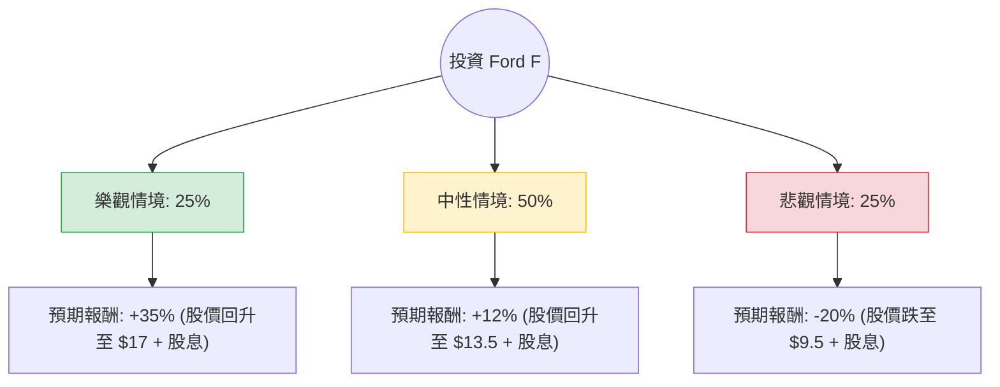

這份分析報告針對美股公司 **Ford Motor Company (F)** 進行評估。我們將結合您提供的財務數據與最新的市場動態（如 Ford Pro 的強勁表現、電動車策略轉向、以及宏觀經濟環境），透過**決策樹**與**期望值分析**來判斷其投資價值。

---

### 1. 核心假設與市場背景分析

在建立決策樹之前，我們基於最新資訊設定以下核心假設：

*   **Ford Pro (商用車) 是增長引擎：** 這是福特目前最賺錢的部門，利潤率高，抵銷了電動車部門的虧損。
*   **Model e (電動車) 轉型陣痛：** 福特已放緩電動車投資，轉向混合動力（Hybrids），這有助於短期現金流，但長期競爭力仍有不確定性。
*   **財務健康度：** 雖然 Debt/Eq 高達 4.61，但這包含其金融服務部門（Ford Credit）的債務，屬產業特性。Forward P/E 僅 6.78，估值處於歷史低位。
*   **宏觀因素：** 高利率環境壓抑消費者購車意願；勞工成本（UAW 合約）增加。

---

### 2. 決策樹分析 (Decision Tree)

以下為未來一年（12個月）投資 Ford 的決策路徑預測：

#### 節點詳細說明：

1.  **樂觀情境 (Bull Case) - 25% 機率**
    *   **條件：** 聯準會降息超預期、混合動力車銷量爆發、Ford Pro 利潤持續創紀錄、電動車虧損縮減速度加快。
    *   **目標價：** $17.00 (接近 2022 年高點)。
    *   **總報酬：** 價差 34.6% + 股息 4.75% ≈ **39.35%**。

2.  **中性情境 (Base Case) - 50% 機率**
    *   **條件：** 經濟軟著陸、銷量持平、股息維持發放。福特成功轉向混合動力策略，抵銷電動車部門的負面影響。
    *   **目標價：** $13.67 (分析師平均目標價)。
    *   **總報酬：** 價差 8.2% + 股息 4.75% ≈ **12.95%**。

3.  **悲觀情境 (Bear Case) - 25% 機率**
    *   **條件：** 經濟衰退、高利率持續更久、電動車價格戰加劇導致虧損擴大、市佔率被特斯拉或中國車廠侵蝕。
    *   **目標價：** $9.50 (52週低點附近)。
    *   **總報酬：** 價差 -24.8% + 股息 4.75% ≈ **-20.05%**。

---

### 3. 期望值計算 (Expected Value Analysis)

我們將各情境的機率與預期報酬相乘，得出整體期望報酬率：

$$EV = (P_{Bull} \times R_{Bull}) + (P_{Base} \times R_{Base}) + (P_{Bear} \times R_{Bear})$$

**計算過程：**
*   樂觀：$0.25 \times 39.35\% = 9.8375\%$
*   中性：$0.50 \times 12.95\% = 6.475\%$
*   悲觀：$0.25 \times (-20.05\%) = -5.0125\%$

**總期望報酬率 (Total EV)：**
$$9.8375\% + 6.475\% - 5.0125\% = \mathbf{11.3\%}$$

---

### 4. 最終結論

#### **判斷：適合投資 (適合價值型與領息投資者)**

**理由：**
1.  **正向期望值：** 11.3% 的預期報酬率優於許多保守型投資工具，且在當前估值極低（Forward P/E 6.78）的情況下，下行風險已部分反映在股價中。
2.  **強大的現金流支撐：** Ford Pro 部門是「隱形冠軍」，其高利潤足以支撐每年 4.75% 的高股息發放，這為投資者提供了良好的安全邊際。
3.  **策略轉向正確：** 放棄激進的純電轉型，改推市場接受度更高的混合動力車，有助於改善 ROE（目前為負值）並優化資本配置。
4.  **估值吸引力：** PEG 僅 0.28，顯示相對於其預期增長，股價被嚴重低估。

**風險提示：**
*   **高槓桿：** Debt/Eq 4.61 仍是隱憂，若利率長期不降，財務壓力會增加。
*   **電動車虧損：** Model e 部門每賣一台車都在虧錢，需觀察其成本控制進度。

**建議操作：**
建議在 $12.00 - $12.50 區間分批佈局，以獲取穩定的股息收益，並等待市場對其混合動力策略的重新估值。