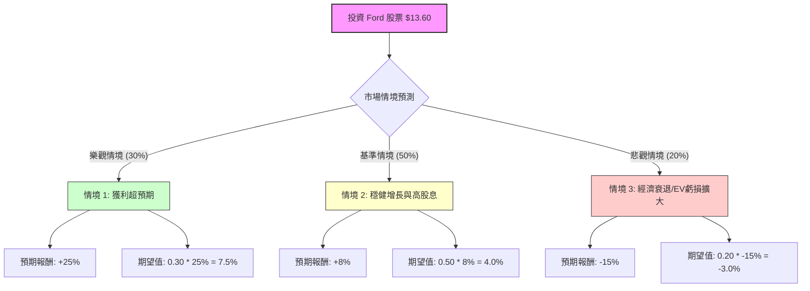

針對美股公司 **Ford Motor Company (F)**，我結合了您提供的基本面數據與最新的市場動態（包含 2024 年第一季財報表現、電動車策略轉向及宏觀經濟環境）進行分析。

以下是基於**決策樹（Decision Tree）**與**期望值（Expected Value）**的投資評估報告。

---

### 一、 核心假設與市場動態分析

在構建決策樹前，我們先釐清影響 Ford 股價的三大核心變數：

1.  **Ford Pro (商用車) 的獲利能力**：這是 Ford 目前的「現金牛」，利潤率極高，抵銷了電動車部門的虧損。
2.  **Model e (電動車) 的虧損與轉型**：Ford 已宣布放緩純電車投資，轉向混合動力（Hybrid），這有助於短期內保護毛利。
3.  **宏觀環境與利率**：高利率環境壓抑汽車貸款需求，但市場預期下半年可能降息，這對汽車業是利多。
4.  **估值與股利**：目前 P/E 約 11.6 倍，Forward P/E 僅 8.9 倍，且有 4.4% 的高殖利率，具備防禦性。

---

### 二、 決策樹分析 (Decision Tree)

我們以 **1 年為投資期限**，預測三種可能的情境：

---

### 三、 計算過程與情境說明

#### 1. 樂觀情境 (Bull Case)
*   **機率**：30%
*   **假設**：Ford Pro 持續爆發性成長；混合動力車銷量抵銷純電虧損；聯準會降息帶動汽車消費潮。
*   **預期報酬計算**：股價回升至 52 週高點以上（約 $16.00）+ 4.4% 股息 ≈ **+25%**。

#### 2. 基準情境 (Base Case)
*   **機率**：50%
*   **假設**：公司維持現狀，EPS 達到預期的 $1.90 - $2.10；電動車虧損控制在預期內；持續發放穩定股息。
*   **預期報酬計算**：股價維持在 $13.5 - $14.0 區間（符合 Target Price $13.52）+ 4.4% 股息 ≈ **+8%**。

#### 3. 悲觀情境 (Bear Case)
*   **機率**：20%
*   **假設**：美國經濟陷入硬著陸；高利率持續更久；與工會（UAW）的成本壓力超乎預期；電動車庫存積壓導致價格戰。
*   **預期報酬計算**：股價回測支撐位（約 $11.50）+ 4.4% 股息 ≈ **-15%**。

#### 4. 總體期望值 (Total Expected Value) 計算：
$$EV = (0.30 \times 25\%) + (0.50 \times 8\%) + (0.20 \times -15\%)$$
$$EV = 7.5\% + 4.0\% - 3.0\% = 8.5\%$$

---

### 四、 綜合基本面數據評估

*   **估值優勢**：Forward P/E 8.9 遠低於標普 500 平均，P/S 0.29 顯示營收含金量被低估。
*   **財務風險**：Debt/Eq 3.47 偏高（雖含 Ford Credit 金融槓桿，但仍需警惕利率風險）。
*   **現金流**：P/FCF 4.56 顯示公司產生現金的能力極強，足以支撐其 4.4% 的股息發放。
*   **技術面**：目前股價 $13.60 略高於分析師平均目標價 $13.52，且位於 SMA200 (+16.43%) 之上，顯示中期趨勢偏多，但短期有過熱回檔風險。

---

### 五、 最終結論

**判斷：適合投資 (建議：分批買入 / 收益型配置)**

#### 理由：
1.  **正向期望值**：經風險加權後的預期報酬率為 **8.5%**，優於無風險利率（美債殖利率）。
2.  **高股息護城河**：4.4% 的殖利率加上 Ford Pro 的強勁現金流，為股價提供了良好的下行支撐（Downside Protection）。
3.  **策略轉型正確**：Ford 主動削減虧損嚴重的純電項目，轉向市場需求更高的混合動力車，這有利於 2024-2025 年的利潤率修復。
4.  **低估值**：目前的 P/S 與 Forward P/E 顯示市場已部分反映了對傳統車企轉型的擔憂，安全邊際較高。

**風險提示**：
*   若美國經濟數據大幅轉弱，汽車作為循環性消費品將首當其衝。
*   需密切關注下一季財報中 Model e 部門的虧損是否如預期縮減。

**建議操作**：
由於目前股價已接近分析師目標價且近期漲幅較大，建議不要一次性梭哈，可於 **$12.5 - $13.0** 區間分批布局，以獲取長期股息與潛在的估值修復收益。