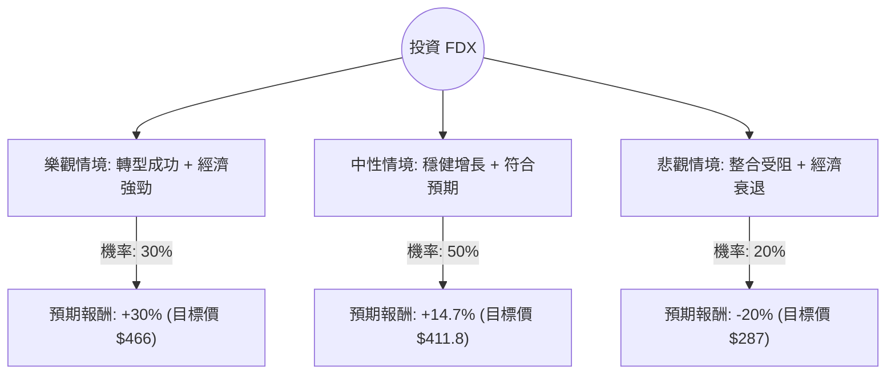

這份分析報告將結合您提供的基本面數據與最新的市場動態（包含 FedEx 的「DRIVE」轉型計畫、整合 Express 與 Ground 業務的進度，以及宏觀經濟環境），利用**決策樹（Decision Tree）**與**期望值（Expected Value）**進行評估。

---

### 一、 核心假設與市場動態分析

在建立決策樹之前，我們基於最新資訊設定以下核心假設：

1.  **內部轉型（DRIVE 計畫）**：FedEx 正處於節省 40 億美元成本的關鍵期。若整合順利（One FedEx），利潤率將顯著提升。
2.  **宏觀經濟**：聯準會（Fed）的利率政策影響消費支出。若經濟軟著陸，電商與工業物流需求將回升。
3.  **競爭壓力**：來自 Amazon 自建物流與 UPS 的價格競爭。
4.  **估值基準**：目前股價 $358.85，分析師平均目標價 $411.80（約 14.7% 漲幅）。Forward P/E 為 16.08，低於歷史高點，顯示市場仍有期待空間。

---

### 二、 決策樹分析 (Decision Tree)

我們將未來一年的表現分為三種情境：**樂觀（Bull）**、**中性（Base）**、**悲觀（Bear）**。

#### 節點詳細說明：

1.  **樂觀情境 (30%)**：
    *   **條件**：DRIVE 計畫超額完成，Express 與 Ground 整合產生的綜效高於預期，且全球貿易復甦。
    *   **預期報酬**：+30%（反映 EPS 增長超預期，P/E 擴張至 20x 以上）。
2.  **中性情境 (50%)**：
    *   **條件**：公司達到分析師預期的 14% EPS 增長，成本控制符合預期。
    *   **預期報酬**：+14.7%（參考 Target Price $411.8）。
3.  **悲觀情境 (20%)**：
    *   **條件**：整合過程出現工會問題或營運中斷，美國經濟陷入衰退導致貨運量大幅下滑。
    *   **預期報酬**：-20%（股價回測 SMA200 以下支撐位）。

---

### 三、 期望值分析 (Expected Value Analysis)

#### 1. 計算過程：
期望值 (EV) = Σ (各情境機率 × 各情境報酬率)

*   **樂觀情境貢獻**：$30\% \times 30\% = 0.09$ (9%)
*   **中性情境貢獻**：$50\% \times 14.7\% = 0.0735$ (7.35%)
*   **悲觀情境貢獻**：$20\% \times (-20\%) = -0.04$ (-4%)

**總期望報酬率 (Total EV)** = $9\% + 7.35\% - 4\% = \mathbf{12.35\%}$

#### 2. 考慮股息後的總回報：
*   目前股息率 (Dividend %) 約為 **1.62%**。
*   **總預期年化回報** = $12.35\% + 1.62\% = \mathbf{13.97\%}$

---

### 四、 綜合基本面評估補充

*   **估值優勢**：Forward P/E 16.08 遠低於當前 P/E 19.1，顯示市場預期明年盈利將大幅改善（EPS next Y 預計增長 14.12%）。
*   **財務健康**：Current Ratio 1.47 顯示流動性無虞，雖然 Debt/Eq 1.41 偏高，但對於資本密集型的物流業尚在可接受範圍。
*   **技術面**：股價目前高於 SMA200 (+32.15%)，顯示長期趨勢向上，但短期 SMA20 為 -2.65%，暗示近期有小幅回檔，是較好的分批進場點。

---

### 五、 最終結論

**判斷：適合投資 (Buy / Overweight)**

#### 理由：
1.  **正向期望值**：經風險加權後的期望報酬率約為 **13.97%**，優於多數保守型投資工具。
2.  **轉型催化劑**：FedEx 的「One FedEx」整合是未來 12-18 個月股價上漲的核心驅動力。只要成本削減計畫持續推進，利潤率（目前僅 7.09%）有極大的提升空間。
3.  **安全邊際**：P/S 僅 0.93，代表市場對其營收的估值仍相當保守。若利潤率改善，股價將迎來「戴維斯雙擊」（盈利與估值倍數同時增長）。
4.  **風險提示**：需密切關注每季財報中的「營運利潤率（Operating Margin）」是否如期改善。若全球經濟數據（如製造業 PMI）大幅走弱，應重新評估悲觀情境的機率。

**建議操作**：考慮到目前股價接近 52 週高點且短期有小幅修正（SMA20 為負），建議採取**分批買入**策略，以降低短期波動風險。