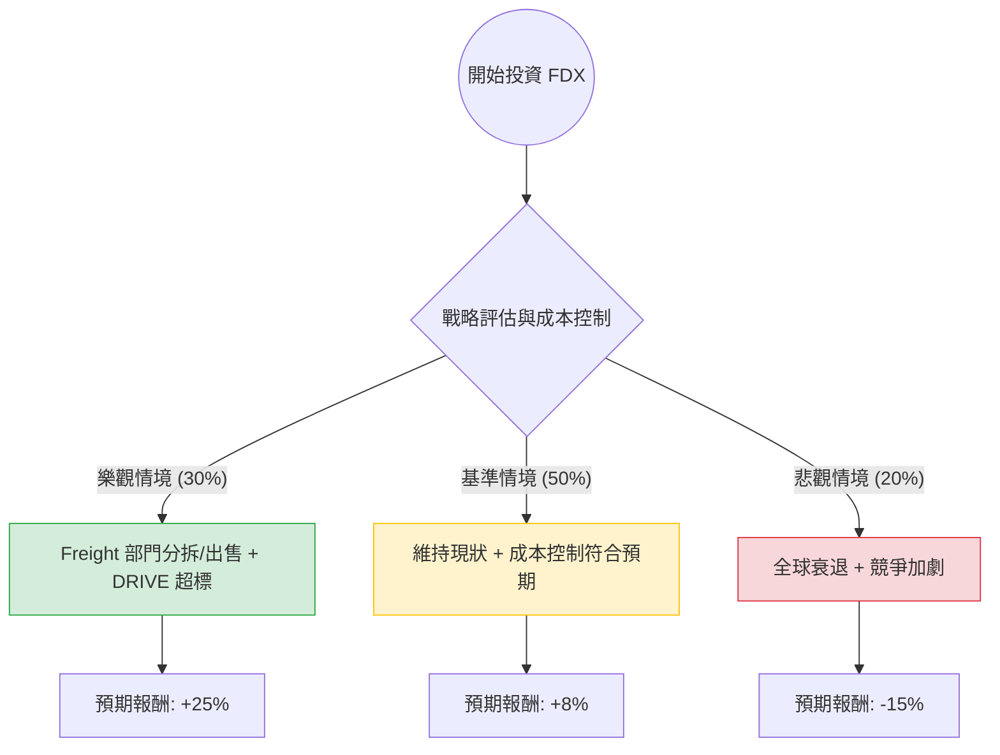

針對美股 **FedEx (FDX)** 的投資評估，我結合了您提供的基本面數據，並整合了最新的市場動態（特別是 2024 年 6 月底發布的財報及後續策略變動）進行分析。

---

### 一、 最新市場動態與核心假設

在進行決策樹分析前，必須納入以下關鍵即時資訊：
1.  **DRIVE 計劃進度**：FedEx 正在執行大規模成本削減計劃（DRIVE），目標在 2025 財年節省 40 億美元。最新財報顯示其利潤率改善優於預期。
2.  **FedEx Freight 策略評估**：公司管理層近期表示正在對「零擔貨運（Freight）」業務進行戰略評估（可能分拆或出售）。這是目前股價最大的催化劑，因為該部門估值被低估。
3.  **總體經濟環境**：全球貿易需求疲軟，但電子商務保持韌性。
4.  **競爭態勢**：UPS 勞資協議後成本上升，給予 FedEx 價格競爭空間。

#### 核心假設：
*   **折現率/風險貼現**：考慮到物流業的週期性，設定基準要求回報率為 9%。
*   **時間維度**：未來 12 個月。
*   **股息收益**：約 1.86%（固定收益部分）。

---

### 二、 決策樹分析 (Decision Tree)

以下為 FDX 未來一年的投資決策模型：

#### 節點詳細說明：

1.  **樂觀情境 (Bull Case) - 機率 30%**
    *   **觸發點**：正式宣佈分拆 FedEx Freight（該部門利潤率高，獨立估值將大幅提升總市值）；DRIVE 計劃提前達成節流目標。
    *   **預期報酬**：+25% (股價挑戰 $380-$400)。

2.  **基準情境 (Base Case) - 機率 50%**
    *   **觸發點**：Freight 部門保留但效率提升；美國經濟軟著陸，包裹量微幅增長。
    *   **預期報酬**：+8% (股價約 $330-$340，略高於目前 Target Price $311)。

3.  **悲觀情境 (Bear Case) - 機率 20%**
    *   **觸發點**：全球經濟進入衰退；燃油價格飆升；UPS 發動價格戰奪回市佔。
    *   **預期報酬**：-15% (股價回落至 $260 附近)。

---

### 三、 期望值分析 (Expected Value Analysis)

#### 1. 計算過程
期望值 (EV) = Σ (各情境機率 × 各情境報酬率)

*   **樂觀情境 EV** = 0.30 × 25% = **7.5%**
*   **基準情境 EV** = 0.50 × 8% = **4.0%**
*   **悲觀情境 EV** = 0.20 × (-15%) = **-3.0%**

**總計預期資本利得 (Expected Capital Gain)** = 7.5% + 4.0% - 3.0% = **8.5%**

#### 2. 總預期報酬率 (Total Expected Return)
除了資本利得，還需加上股息收益：
*   **總預期報酬** = 8.5% (EV) + 1.86% (Dividend) = **10.36%**

---

### 四、 數據解讀與基本面輔助

*   **估值面**：Forward P/E 為 14.59，低於歷史平均與行業對手，顯示股價尚未完全反映 Freight 分拆的潛在價值。
*   **技術面**：SMA200 為 +27.66%，顯示長期趨勢向上；但目前股價接近 52 週高點（-3.34%），短期有回檔壓力。
*   **風險點**：Debt/Eq 1.34 偏高，在高利率環境下財務壓力較大，這解釋了為何其 P/E 無法像科技股那樣擴張。

---

### 五、 最終結論

#### **判斷：適合投資 (Moderate Buy)**

#### **理由：**
1.  **正向期望值**：10.36% 的總預期報酬率高於當前無風險利率（美債 4.3% 左右）及市場平均預期。
2.  **強大的催化劑 (Catalyst)**：FedEx Freight 的戰略評估是「價值釋放」的關鍵。一旦分拆消息坐實，股價將有極大的重估空間（Re-rating）。
3.  **管理層執行力改善**：DRIVE 計劃已在財報中證明能有效提升 Oper. Margin (目前 7.08%)，這在需求疲軟的環境下尤為重要。
4.  **安全邊際**：Forward P/E 僅 14.6 倍，即便在基準情境下，下行風險也相對受控。

**建議操作策略：**
由於目前股價接近 52 週高點且 SMA20 僅 +2.5%，建議**分批買入**或等待股價回測 $295-$300 區間（SMA50 附近）再行加碼，以獲取更高的風險回報比。