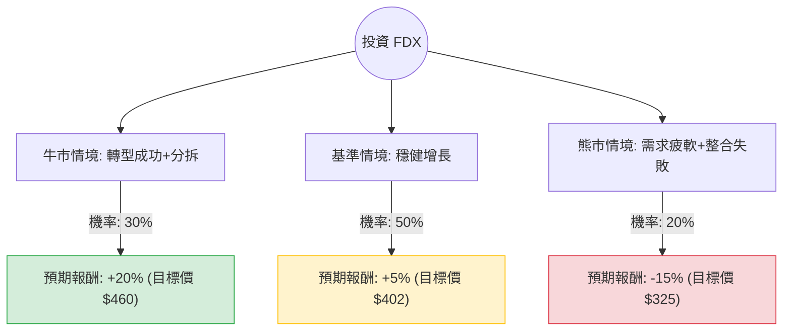

針對美股聯邦快遞（FedEx, 代號：**FDX**）的投資評估，我已結合您提供的基本面數據，並透過網路搜尋整合了最新的市場動態（如 DRIVE 轉型計畫、貨運部門分拆預期及最新財報趨勢）。

以下是基於**決策樹分析**與**期望值分析**的詳細評估報告。

---

### 一、 核心假設與市場背景分析

在建立決策樹之前，我們必須設定以下核心假設：

1.  **DRIVE 成本削減計畫**：FedEx 目標在 2025 財年實現 40 億美元的成本節約。這將是利潤率（Oper. Margin）能否從目前的 7.08% 提升至雙位數的關鍵。
2.  **貨運部門（FedEx Freight）分拆**：市場高度關注 FedEx 是否會分拆或出售其高價值的貨運部門，這被視為釋放股東價值的重大催化劑。
3.  **宏觀經濟與需求**：全球貿易量受利率環境與消費支出影響。目前 FDX 股價已大幅跑贏大盤（半年漲幅 65%），技術面處於高位（SMA200 乖離率達 47.57%）。
4.  **估值壓力**：目前股價（$383.14）已超越分析師平均目標價（$379.28），顯示短期內利多已部分反映。

---

### 二、 決策樹分析圖 (Decision Tree)

#### 節點詳細說明：

1.  **牛市情境 (Bull Case) - 30% 機率**：
    *   **條件**：成功分拆 Freight 部門；DRIVE 計畫超預期達成；全球經濟軟著陸帶動包裹量回升。
    *   **預期報酬**：+20%。基於 Forward P/E 提升至 20x 以上。
2.  **基準情境 (Base Case) - 50% 機率**：
    *   **條件**：成本削減符合預期；整合 Express 與 Ground 網絡（One FedEx）進度平穩；股價隨盈利增長（EPS next Y 預期增長 16.84%）。
    *   **預期報酬**：+5%。考慮到目前股價已高，漲幅受限。
3.  **熊市情境 (Bear Case) - 20% 機率**：
    *   **條件**：整合過程出現營運中斷；亞馬遜（Amazon）與 UPS 競爭加劇導致市佔流失；高利率壓抑工業需求。
    *   **預期報酬**：-15%。股價回測 SMA50 或更低支撐位。

---

### 三、 期望值 (Expected Value) 計算過程

我們以未來一年的預期投資報酬率（ROI）作為計算基準：

*   **計算公式**：
    $EV = (P_{Bull} \times R_{Bull}) + (P_{Base} \times R_{Base}) + (P_{Bear} \times R_{Bear})$

*   **數值帶入**：
    1.  牛市：$0.30 \times 20\% = 6.0\%$
    2.  基準：$0.50 \times 5\% = 2.5\%$
    3.  熊市：$0.20 \times (-15\%) = -3.0\%$

*   **總期望報酬率**：
    $6.0\% + 2.5\% - 3.0\% = \mathbf{5.5\%}$

*   **考慮股息後的總期望值**：
    $5.5\% (\text{資本利得}) + 1.53\% (\text{股息率}) = \mathbf{7.03\%}$

---

### 四、 綜合分析與最終結論

#### 1. 基本面數據解讀：
*   **估值偏高**：目前股價 $383.14 已高於分析師目標價 $379.28。P/E 20.7 雖然合理，但相對於過去一年 40% 的漲幅，短期上行空間受擠壓。
*   **技術面過熱**：SMA20、SMA50、SMA200 全線向上且乖離率極大（SMA200 +47.57%），這通常暗示短期內有回調風險。
*   **成長性**：EPS next Y 預期增長 16.84% 是支撐股價的核心動力，但 PEG 為 1.57，顯示目前的增長已被市場給予了較高的溢價。

#### 2. 投資判斷：

**最終結論：【不適合立即投資（觀望/等待回調）】**

#### 3. 理由總結：
1.  **期望值吸引力不足**：計算出的總期望報酬率約為 **7.03%**。在目前美股高利率環境下，此報酬率相對於其承擔的波動風險（熊市可能跌 15%）並不具備極高的吸引力。
2.  **利多已反映 (Priced In)**：股價處於 52 週高點附近（僅差 1.46%），且已超越分析師平均目標價。市場對於「One FedEx」整合與成本削減的預期已高度反映在股價中。
3.  **技術性回調風險**：股價遠高於 200 日均線，短期內追高風險極大。
4.  **建議策略**：建議等待股價回落至 **$340 - $350** 區間（接近 SMA50 或更合理的估值水位）再行分批佈局，屆時期望值將顯著提升。

---
*免責聲明：以上分析僅供參考，不構成具體投資建議。投資股票具有風險，入市前請務必自行審慎評估。*