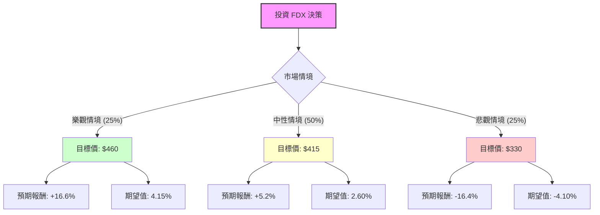

這份分析報告將結合您提供的 FDX（FedEx）基本面數據，以及最新的市場動態（如 DRIVE 轉型計畫、整合快遞與地面業務的「One FedEx」進度、以及近期財報表現），利用**決策樹（Decision Tree）**與**期望值分析（Expected Value Analysis）**評估其投資價值。

---

### 一、 核心假設與市場背景分析

在建立模型前，我們先定義影響 FDX 未來 12 個月股價的核心變數：

1.  **DRIVE 計畫與利潤率改善（內部因素）：** FedEx 正在執行大規模成本削減計畫，目標是到 2025 財年節省 40 億美元。目前數據顯示其營業利潤率（Oper. Margin）為 7.09%，若能提升至 8-10%，將帶動估值上修。
2.  **宏觀經濟與貨運需求（外部因素）：** 全球貿易復甦程度與美國消費力。目前 FDX 的 P/E 為 21，Forward P/E 為 17.43，顯示市場預期明年盈利會增長。
3.  **技術面壓力：** 目前股價（$394.59）極度接近 52 週高點（$395.90），且遠高於 SMA200（+37.8%），短期存在回調風險。

---

### 二、 決策樹分析 (Decision Tree)

我們將未來一年的情境分為三種：**樂觀（Bull）**、**中性（Base）**、**悲觀（Bear）**。

#### 節點詳細說明：

1.  **樂觀情境 (Probability: 25%)**
    *   **條件：** 「One FedEx」整合極其順利，利潤率超預期擴張，聯準會降息刺激電商貨運量大增。
    *   **預估股價：** $460 (給予 Forward P/E 20x)。
    *   **報酬率：** ($460 - $394.59) / $394.59 = **+16.6%**。

2.  **中性情境 (Probability: 50%)**
    *   **條件：** 達到分析師平均目標價（$414.92），成本削減符合預期，但全球經濟增長平緩。
    *   **預估股價：** $415。
    *   **報酬率：** ($415 - $394.59) / $394.59 = **+5.2%**。

3.  **悲觀情境 (Probability: 25%)**
    *   **條件：** 美國經濟陷入衰退，燃料價格飆升，或與 UPS 的競爭導致價格戰。股價回測 SMA200 支撐位。
    *   **預估股價：** $330。
    *   **報酬率：** ($330 - $394.59) / $394.59 = **-16.4%**。

---

### 三、 期望值計算 (Expected Value Calculation)

期望值（EV）是將各情境的報酬率乘以其發生機率的總和：

$$EV = (P_{Bull} \times R_{Bull}) + (P_{Base} \times R_{Base}) + (P_{Bear} \times R_{Bear})$$

*   **計算過程：**
    *   樂觀貢獻：$0.25 \times 16.6\% = 4.15\%$
    *   中性貢獻：$0.50 \times 5.2\% = 2.60\%$
    *   悲觀貢獻：$0.25 \times (-16.4\%) = -4.10\%$
*   **總期望報酬率：**
    $$4.15\% + 2.60\% - 4.10\% = \mathbf{2.65\%}$$

---

### 四、 綜合分析與最新動態補充

1.  **財務健康度：**
    *   FDX 的 **Debt/Eq (1.41)** 偏高，但在資本密集型的物流業尚屬可接受。
    *   **P/FCF (21.54)** 顯示現金流產生能力穩定，足以支持其 **1.47% 的股息**與持續的股票回購。
2.  **最新新聞與趨勢：**
    *   **DRIVE 成果：** 根據最新財報，FedEx 在 Express 部門的結構性成本削減已見成效，即便營收增長緩慢，EPS 仍能維持增長（EPS Q/Q +17.53%）。
    *   **市場情緒：** 股價在過去一年上漲了 92%，這反映了市場已經 Price-in 了大部分的轉型利好。目前股價處於極高位，技術指標（SMA20/50/200 全線向上）顯示強勢，但也暗示了「超買」風險。

---

### 五、 最終結論

**判斷：目前「不適合」立即進場（建議觀望或等待回調）。**

#### 理由：
1.  **期望值過低：** 計算出的期望報酬率僅為 **2.65%**。考慮到目前美股無風險利率（國債收益率）仍在 4% 左右，FDX 的預期風險回報比（Risk-Reward Ratio）並不具吸引力。
2.  **上行空間有限：** 股價已達 $394.59，距離分析師平均目標價 $414.92 僅剩約 5% 的空間，但下行至支撐位（$330-$350）的風險卻高達 10-15%。
3.  **技術面過熱：** 股價偏離 200 日均線（SMA200）達 37.8%，歷史經驗顯示，此類大型工業股在如此高的偏離度下，通常會迎來均值回歸（Mean Reversion）或橫盤整理。
4.  **投資建議：** 
    *   **已持股者：** 建議繼續持有，並設置移動止盈（如 SMA20 跌破則出場）。
    *   **欲進場者：** 建議等待股價回落至 **$360 - $370** 區間（靠近 SMA50 或填補近期跳空缺口）時，屆時期望值將顯著提升，才是更佳的買入時點。

**風險提示：** 若未來財報顯示 DRIVE 計畫節省成本遠超 40 億美元，或聯準會大幅降息引發經濟強勁復甦，則樂觀情境機率將提升，屆時需重新評估。