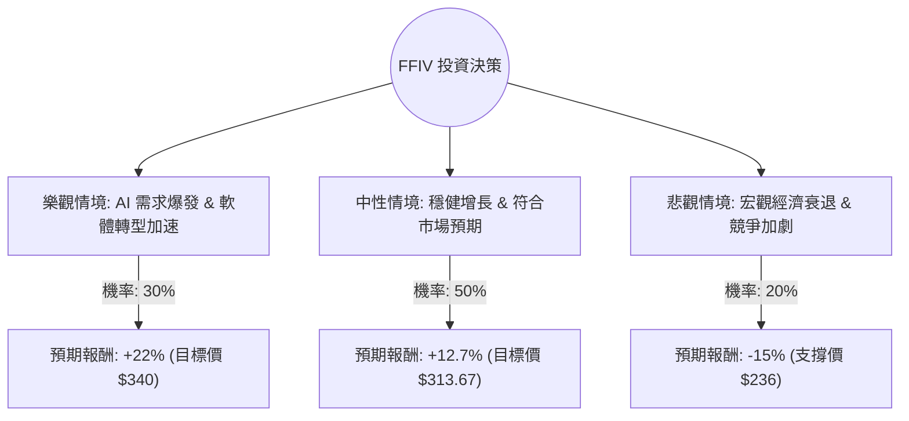

這份分析報告將結合您提供的基本面數據，以及 F5, Inc. (FFIV) 的最新市場動態（包含 2025 財年第一季財報表現與 AI 產業趨勢），利用**決策樹（Decision Tree）**與**期望值分析（Expected Value Analysis）**來評估其投資價值。

---

### 一、 最新市場動態與核心假設

在進行計算前，我們先整合最新的外部資訊：
1.  **強勁財報與展望**：F5 (FFIV) 在最近的 2025 財年第一季財報中表現優於預期，營收達 7 億美元，非 GAAP 每股收益 (EPS) 為 3.44 美元。公司同時上調了全年營收與獲利指引。
2.  **軟體轉型成功**：FFIV 正從傳統硬體轉向軟體與 SaaS 訂閱模式，這有助於提升毛利率（目前已高達 80.13%）。
3.  **AI 驅動需求**：隨著企業部署 AI 應用，對於應用交付控制器 (ADC) 與安全防護的需求增加，FFIV 的分散式雲端服務成為增長引擎。
4.  **估值合理**：預估本益比 (Forward P/E) 僅 16.7，遠低於科技產業平均，且債務極低 (Debt/Eq 0.08)。

---

### 二、 決策樹分析 (Decision Tree)

我們將未來一年的投資情境分為三種：**樂觀（Bull）**、**中性（Base）**、**悲觀（Bear）**。

#### 1. 樂觀情境 (Bull Case) - 機率 30%
*   **假設**：AI 應用帶動大規模流量管理需求，軟體營收增長超過 15%，公司持續回購股票。
*   **目標價**：參考 52 週高點與強勁展望，設定為 **$340**。
*   **預期報酬**：($340 - $278.39) / $278.39 ≈ **+22.1%**。

#### 2. 中性情境 (Base Case) - 機率 50%
*   **假設**：公司達到上調後的指引目標，市場維持目前的估值倍數，宏觀環境平穩。
*   **目標價**：參考分析師平均目標價 **$313.67**。
*   **預期報酬**：($313.67 - $278.39) / $278.39 ≈ **+12.7%**。

#### 3. 悲觀情境 (Bear Case) - 機率 20%
*   **假設**：企業 IT 支出因高利率縮減，雲端服務商（如 AWS/Azure）自研工具替代需求，股價回測支撐位。
*   **目標價**：參考 SMA200 與近期低點，設定為 **$236**。
*   **預期報酬**：($236 - $278.39) / $278.39 ≈ **-15.2%**。

---

### 三、 期望值計算 (Expected Value Analysis)

根據上述決策樹，我們計算投資 FFIV 一年的期望報酬率 (Expected Return, ER)：

$$ER = (P_{Bull} \times R_{Bull}) + (P_{Base} \times R_{Base}) + (P_{Bear} \times R_{Bear})$$

**計算過程：**
1.  **樂觀貢獻**：$0.30 \times 22.1\% = 6.63\%$
2.  **中性貢獻**：$0.50 \times 12.7\% = 6.35\%$
3.  **悲觀貢獻**：$0.20 \times (-15.2\%) = -3.04\%$

**總期望報酬率：**
$$6.63\% + 6.35\% - 3.04\% = 9.94\%$$

---

### 四、 綜合評估與最終結論

#### 1. 核心數據支持
*   **財務穩健性**：ROE 20.84% 且負債比極低 (0.08)，顯示公司具備極強的抗風險能力與資本運用效率。
*   **估值優勢**：Forward P/E 16.7 顯示股價尚未過熱，相較於其 80% 的毛利率，具備價值投資吸引力。
*   **技術面**：股價目前在 SMA20 與 SMA50 之上，顯示短期趨勢偏多，雖低於 SMA200，但近期財報後的跳空上漲已修復技術指標。

#### 2. 風險提示
*   **PEG 較高 (4.76)**：顯示市場對其長期純增長速度的期待較低，股價上漲動力更多來自於獲利能力的改善而非營收暴增。
*   **內部人交易**：Insider Trans 為 -0.1107，需留意內部人減持的訊號。

#### 3. 最終結論：適合投資 (Buy / Overweight)

**理由：**
1.  **期望值為正**：經風險加權後的預期報酬率約為 **9.94%**，優於許多成熟科技股。
2.  **安全邊際高**：極低的債務與高現金流 (P/FCF 18.32) 為股價提供了良好的下行保護。
3.  **產業催化劑明確**：AI 浪潮帶來的應用安全與流量管理需求是實質的業績推動力，而非純粹的題材炒作。
4.  **財報動能**：近期上調指引顯示公司內部對未來 6-12 個月充滿信心。

**建議操作：**
可在 $270 - $280 區間分批布局，首要目標價看 $313，若 AI 需求超預期則可持有至 $340 以上。停損點建議設在 $235 (跌破長期支撐位)。