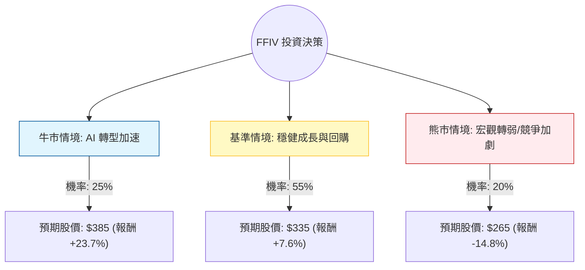

針對美股 **F5, Inc. (FFIV)** 的投資評估，我結合了您提供的基本面數據，並檢索了最新的市場動態（包括 2024 年第四季財報表現與 2025 年展望）進行綜合分析。

---

### 一、 市場最新動態與產業趨勢分析

1.  **財報表現（2024 Q4）**：F5 最近公佈的財報優於預期，非 GAAP 每股收益（EPS）為 3.67 美元，營收達 7.47 億美元。公司成功從硬體轉型為軟體驅動模式，軟體收入佔比持續提升。
2.  **AI 與 API 安全**：F5 積極佈局 AI 應用交付與 API 安全領域。隨著企業部署更多 AI 模型，對於保護 API 流量的需求激增，這成為 FFIV 的新成長引擎。
3.  **財務穩健性**：FFIV 擁有極佳的現金流（P/FCF 20.42）與極低的負債比（Debt/Eq 0.08），並持續進行股票回購（最新宣佈增加 10 億美元回購額度），這為股價提供了下行支撐。
4.  **估值壓力**：目前股價接近 52 週高點，且 PEG 高達 5.3，顯示市場已部分反映其成長預期，短期內大幅溢價的空間受限。

---

### 二、 決策樹分析 (Decision Tree Analysis)

以下決策樹基於未來 12 個月的預期表現：

#### 決策樹節點詳細說明：

| 節點 (情境) | 機率 (P) | 預期目標價 | 預期報酬率 (R) | 說明 |
| :--- | :--- | :--- | :--- | :--- |
| **牛市情境** | 25% | $385 | +23.7% | AI 安全需求爆發，軟體訂閱制成長超預期，本益比擴張。 |
| **基準情境** | 55% | $335 | +7.6% | 符合財報指引，持續回購股票，API 安全市場穩步增長。 |
| **熊市情境** | 20% | $265 | -14.8% | 企業 IT 支出縮減，Cloudflare 等對手競爭加劇，硬體收入衰退過快。 |

---

### 三、 期望值分析 (Expected Value Analysis)

#### 1. 核心假設
*   **當前股價**: $311.18
*   **牛市目標 ($385)**: 基於 Forward P/E 提升至 22x，且 EPS 成長受 AI 驅動超預期。
*   **基準目標 ($335)**: 基於分析師平均目標價 ($314.78) 加上公司回購帶來的股價支撐。
*   **熊市目標 ($265)**: 回測至 SMA200 以下支撐位，反映成長停滯。

#### 2. 計算過程
期望值 (EV) = $\sum (機率 \times 預期股價)$

*   **EV** = $(0.25 \times 385) + (0.55 \times 335) + (0.20 \times 265)$
*   **EV** = $96.25 + 184.25 + 53.00$
*   **EV** = **$333.50**

#### 3. 預期報酬率計算
*   **預期總報酬率** = $(333.50 - 311.18) / 311.18 \approx \mathbf{7.17\%}$

---

### 四、 最終結論

**投資判斷：適合投資 (建議：分批佈局 / 持有)**

#### 理由：
1.  **正向期望值**：計算出的期望值為 **$333.50**，高於當前市價，預期報酬率約 **7.17%**。雖然不是爆發性成長，但在當前高波動市場中具有較好的風險回報比。
2.  **財務防禦力極強**：FFIV 的 **Debt/Eq (0.08)** 極低，且 **Gross Margin (80.13%)** 極高，這代表公司在經濟放緩時有極強的抗壓能力。
3.  **股東回饋**：公司積極的回購政策（Buyback）能有效抵銷股價下行風險，並提升 EPS。
4.  **轉型紅利**：從硬體轉向軟體與安全服務的轉型已見成效，AI 浪潮帶來的 API 安全需求是未來的潛在催化劑。

#### 風險提示：
*   **估值不便宜**：PEG 5.3 顯示目前股價並未低估，若大盤回檔，FFIV 可能隨之修正。
*   **技術面壓力**：目前股價接近 52 週高點，建議不要在突破失敗時追高，可待回調至 **SMA50 ($288 附近)** 進行佈局。

**總結：** FFIV 是一家「高品質、低負債、穩健成長」的公司。對於追求穩健增長而非短期投機的投資者來說，目前是一個適合納入投資組合的標的。