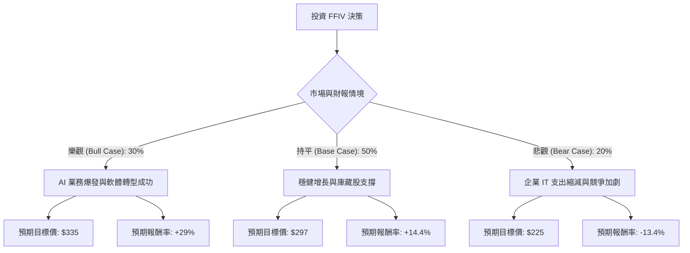

針對美股公司 **F5, Inc. (FFIV)** 的投資評估，我結合了您提供的基本面數據以及最新的市場動態（包含 2025 財年第一季財報表現與 AI 轉型進度），進行決策樹與期望值分析。

---

### 一、 市場動態與核心假設分析

在建立模型前，先彙整最新的關鍵資訊：
1.  **AI 轉型與新產品**：F5 近期推出了 **F5 AI Gateway**，並與 NVIDIA 深度合作，旨在解決企業部署大型語言模型（LLM）時的安全與流量管理問題。這是目前推升股價的核心動能。
2.  **財務表現**：最新財報顯示軟體收入增長強勁，且公司上調了 2025 全年的營收與 EPS 指引。
3.  **估值分析**：目前 Forward P/E 約 16.23 倍，低於軟體產業平均，但 PEG 高達 8.12，顯示市場對其長期「高成長性」仍有疑慮。
4.  **財務穩健度**：債務股本比（Debt/Eq）僅 0.07，現金流充沛（P/FCF 17.0），具備極強的抗風險能力。

---

### 二、 決策樹分析 (Decision Tree)

以下決策樹基於未來 12 個月的預期表現：

#### 節點詳細說明：

1.  **樂觀情境 (30%)**：
    *   **假設**：AI Gateway 成為產業標準，軟體訂閱制轉型速度超預期，毛利率維持在 80% 以上。
    *   **預期股價**：$335（接近 52 週高點並突破）。
2.  **持平情境 (50%)**：
    *   **假設**：符合分析師平均預期（Target Price $297），AI 貢獻尚小但傳統安全業務穩健，公司持續進行庫藏股回購。
    *   **預期股價**：$297。
3.  **悲觀情境 (20%)**：
    *   **假設**：宏觀經濟導致企業延後 AI 投資，硬體業務萎縮速度快於軟體增長，競爭對手（如 Cloudflare, Akamai）搶佔份額。
    *   **預期股價**：$225（回測 52 週低點支撐）。

---

### 三、 期望值分析 (Expected Value Analysis)

#### 1. 計算過程
我們以當前股價 **$259.70** 為基準，計算一年後的預期價值（Expected Value, EV）：

*   **樂觀情境期望值**：$335 \times 0.30 = \$100.5$
*   **持平情境期望值**：$297 \times 0.50 = \$148.5$
*   **悲觀情境期望值**：$225 \times 0.20 = \$45.0$

**總期望價值 (EV)** = $100.5 + 148.5 + 45.0 = \mathbf{\$294.0}$

#### 2. 預期報酬率計算
*   **預期獲利空間**：$(\$294.0 - \$259.7) / \$259.7 = \mathbf{13.2\%}$

#### 3. 核心假設依據
*   **獲利能力**：ROE 20.6% 與 Gross Margin 80% 顯示其在同業中具備極高的營運效率。
*   **安全邊際**：Forward P/E 16.23 倍顯示股價並未過度泡沫化，且低負債比提供良好的下行保護。
*   **技術面**：SMA50 > SMA200（雖然目前 SMA200 為 -0.07，但近期 SMA50 已轉強），顯示短期趨勢正在修復。

---

### 四、 最終結論

**評估結果：適合投資 (Moderate Buy)**

#### 理由：
1.  **期望值為正**：計算出的期望股價為 **$294**，較現價有約 **13.2%** 的預期漲幅，且高於目前多數保守型投資工具。
2.  **AI 催化劑**：F5 不再只是傳統的負載平衡廠商，其在 AI 推論階段的安全與流量管理（AI Gateway）具有獨特卡位優勢，這部分尚未完全反映在目前的 Forward P/E 中。
3.  **財務極度穩健**：0.07 的負債比與強勁的自由現金流（P/FCF 17.0），使其在市場波動或高利率環境下比其他高成長科技股更具韌性。
4.  **風險提示**：PEG 較高（8.12）反映了市場對其 EPS 增長速度的擔憂，因此這是一項**價值成長型**投資，而非純粹的高速成長投機。

**建議操作**：
目前股價 $259.7 接近持平情境與樂觀情境的過渡區，建議可在 $250-$260 區間分批布局，首要目標價看分析師共識的 **$297**，若 AI 業務數據在下一季財報有顯著貢獻，可上調至 **$330** 以上。