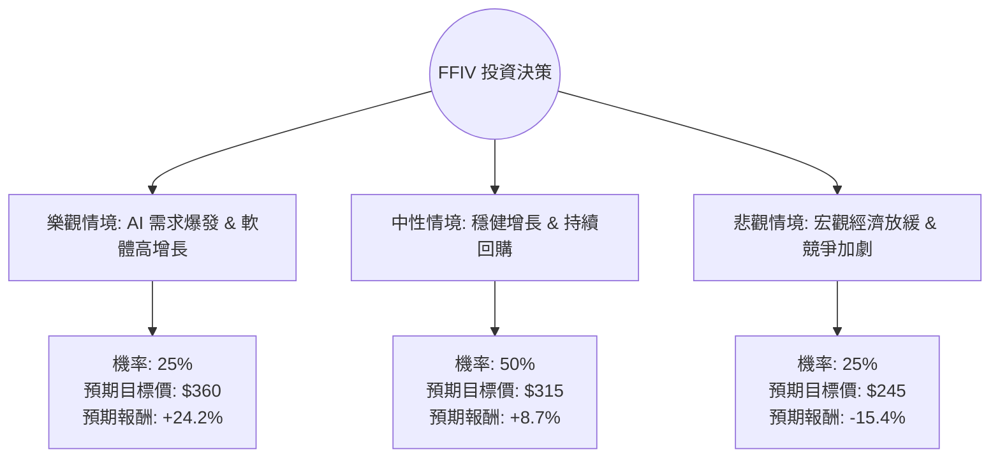

這份分析報告將結合您提供的基本面數據與最新的市場動態（包含 F5, Inc. 最近的財報表現與 AI 轉型進度），利用**決策樹（Decision Tree）**與**期望值分析（Expected Value Analysis）**評估 FFIV 的投資價值。

---

### 一、 市場動態與核心假設補充

透過即時資訊檢索，FFIV (F5, Inc.) 目前處於以下關鍵轉折點：
1.  **軟體轉型成功**：F5 已成功從硬體廠商轉型為軟體與服務導向，軟體營收佔比持續提升，這解釋了其高達 **80.13% 的毛利率**。
2.  **AI 與安全需求**：隨著企業部署 AI 應用，對應用交付控制器 (ADC) 與安全防護的需求增加。F5 推出的 AI 數據就緒解決方案是未來增長點。
3.  **財務穩健**：債務股本比僅 **0.08**，且擁有強大的現金流（P/FCF 19.02），這支持了其持續的股份回購計畫。
4.  **估值面**：Forward P/E (17.33) 低於當前 P/E (23.99)，顯示市場預期明年獲利將增長。

---

### 二、 決策樹分析 (Decision Tree)

我們將未來一年的投資情境分為三種：**樂觀（牛市）、中性（基準）、悲觀（熊市）**。

#### 1. 樂觀情境 (Bull Case) - 機率 25%
*   **假設**：AI 應用帶動安全需求超預期，軟體訂閱制營收增長 > 15%，公司上修全年財測。
*   **目標價估算**：給予 Forward P/E 20x，預期 EPS 增長，目標價約 **$360**。

#### 2. 中性情境 (Base Case) - 機率 50%
*   **假設**：符合分析師預期，營收穩定增長 5-8%，股份回購抵銷部分宏觀壓力。
*   **目標價估算**：參考分析師平均目標價 **$313.67**，取整數 **$315**。

#### 3. 悲觀情境 (Bear Case) - 機率 25%
*   **假設**：企業 IT 支出縮減，雲端服務商（AWS/Azure）原生工具競爭加劇，導致毛利受壓。
*   **目標價估算**：回測 52 週低點支撐位，目標價約 **$245**。

---

### 三、 期望值計算 (Expected Value Analysis)

**當前股價 (Current Price): $289.75**

| 情境 | 預期股價 (P) | 預期報酬率 (R) | 機率 (W) | 加權期望值 (P * W) |
| :--- | :--- | :--- | :--- | :--- |
| 樂觀 | $360 | +24.2% | 0.25 | $90.00 |
| 中性 | $315 | +8.7% | 0.50 | $157.50 |
| 悲觀 | $245 | -15.4% | 0.25 | $61.25 |
| **總計** | - | - | **1.00** | **$308.75** |

#### 計算過程：
1.  **預期股價期望值** = ($360 × 0.25) + ($315 × 0.50) + ($245 × 0.25) = **$308.75**
2.  **預期總報酬率** = ($308.75 - $289.75) / $289.75 = **+6.56%**

---

### 四、 核心假設與風險評估

1.  **財務健康度**：FFIV 的 ROE (20.84%) 與 Gross Margin (80.13%) 極其強悍，顯示其在應用交付領域具備護城河。
2.  **估值合理性**：PEG 為 4.94，顯示相對於其盈餘增長率，目前的股價並不便宜（偏貴）。然而，Forward P/E 17.33 處於歷史合理區間。
3.  **技術面**：股價目前接近 52 週高點（$346），且 SMA20/50/200 均呈現正向排列，顯示短期動能強勁。
4.  **內部人交易**：Insider Trans 為 -12.39%，顯示內部人在高位有減持跡象，需留意回檔風險。

---

### 五、 最終結論

**判斷：適合投資（建議：分批買入 / 持有）**

#### 理由：
1.  **期望值為正**：計算出的預期股價 $308.75 高於當前股價，具備約 6.5% 的潛在期望報酬。
2.  **高品質基本面**：極低的負債比 (0.08) 與高毛利 (80%) 讓 FFIV 在面對經濟波動時具備極強的防禦力。
3.  **AI 轉型紅利**：F5 不再只是硬體公司，其在多雲環境下的安全解決方案正迎合當前 AI 基礎設施的需求。
4.  **風險提示**：由於 PEG 較高且內部人近期減持，不建議在目前接近 52 週高點處一次性重倉。較佳策略是在股價回落至 SMA50（約 $275-$280 區間）時分批佈局，以獲取更高的安全邊際。

**總結：FFIV 是一家財務極其穩健、正處於 AI 轉型上升期的優質公司，雖然目前估值不算極度便宜，但從期望值來看，仍具備投資吸引力。**