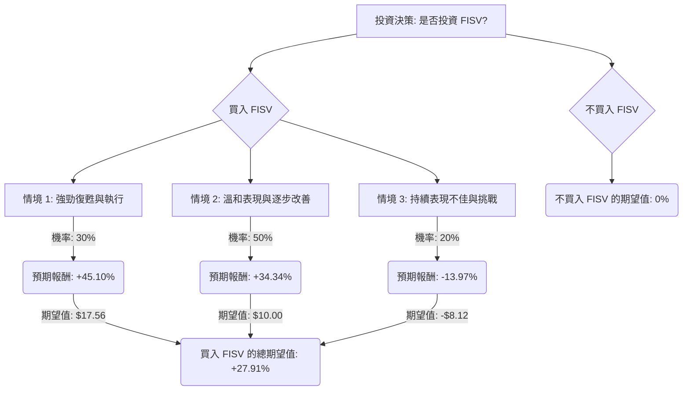

根據對美股公司 Fiserv (FISV) 的基本面數據、最新新聞、財報、市場動態及產業趨勢的綜合評估，以下將使用決策樹分析與期望值分析來判斷其目前是否適合投資。

### **核心假設**

1.  **時間範圍：** 12-18 個月，與分析師的目標價時間範圍一致。
2.  **投資決策：** 買入 FISV 或不買入 FISV。
3.  **市場狀況：** 預計整體經濟保持穩定，但消費者支出可能趨於謹慎，對支付處理量造成影響。
4.  **公司表現：** Fiserv 的表現將受其「One Fiserv 行動計畫」、Clover 平台擴張、AI 整合等新策略的執行成效，以及應對激烈市場競爭和高額債務的能力所影響。

### **FISV 基本面數據概覽 (截至 2026 年 2 月 4 日)**

*   **收盤價 (Close):** $58.12
*   **本益比 (P/E):** 9.73 (前瞻 P/E: 7.69)
*   **股價淨值比 (P/B):** 1.35
*   **市值 (Market Cap):** $338.5 億
*   **52 週高點/低點範圍 (52W Range):** $59.56 - $238.59 (近期觸及 52 週低點)
*   **目標價 (Target Price):** $78.08 (來自用戶提供數據)
*   **分析師平均目標價：** $84.33 (來自近期搜尋結果)
*   **分析師共識評級：** 「持有 (Hold)」或「中立 (Neutral)」居多。
*   **2023 年第四季財報 (2024 年 2 月 6 日發布)：** 調整後每股盈餘 (EPS) 超出預期，但營收未達標。調整後 EPS 在 2023 年第四季增長 15%，全年增長 16%。調整後營運利潤率和自由現金流均有所增長。有機營收增長 12%。
*   **2025/2026 年展望 (2025 年 10 月修訂，2026 年 2 月報導)：** Fiserv 將 2025 年有機營收增長預期下調至 3.5%-4% (原約 10%)，調整後 EPS 預期下調至 $8.50-$8.60 (原 $10.15-$10.30)。2026 年初步指引預計有機營收增長為低個位數，調整後 EPS 較 2025 年略有下降，並將 2026 年視為「關鍵的投資和轉型年」。
*   **近期股價表現：** 股價在 2025 年 10 月因財報不及預期和指引下調而大幅下跌近一半，近期觸及 52 週低點 $59.55。過去一年股價下跌 72.06%。
*   **產業趨勢：** 電子支付普及、嵌入式金融和 API 整合需求增加、AI 成為預期、安全和詐欺事件上升、AR/AP 統一平台、可編程支付等。
*   **風險：** 顯著下調的業績指引、股東對 Clover 平台增長數據的訴訟、金融科技領域的激烈競爭以及高額長期債務 ($223.6 億，截至 2023 年第四季)。

### **決策樹分析**

**決策點：是否投資 FISV？**

#### **節點計算過程：**

**當前股價 (P0):** $58.12

**1. 買入 FISV 決策分支**

*   **情境 1: 強勁復甦與執行 (Optimistic Scenario)**
    *   **預測情境名稱：** 公司成功執行「One Fiserv 行動計畫」，Clover 平台和 AI 整合等新策略迅速見效，市場對其支付解決方案需求強勁，宏觀經濟環境優於預期。
    *   **對應的機率 (Probability)：** 30% (基於 2023 年 Q4 的良好增長勢頭和部分分析師的買入評級，但考慮到近期指引下調，此情境機率不高)。
    *   **預期股價 (P1)：** $84.33 (分析師平均目標價)
    *   **預期報酬：** (($84.33 - $58.12) / $58.12) = 45.10%
    *   **期望值 (Expected Value)：** $58.12 * 45.10% = $26.21 (此處為股價增值，而非總期望值)
        *   *更正：期望值應為該情境下的預期報酬率乘以機率，或預期股價減去當前股價的差額乘以機率。為了與最終總期望值保持一致，我們計算報酬率的期望值。*
        *   **期望報酬率貢獻：** 0.30 * 45.10% = 13.53%

*   **情境 2: 溫和表現與逐步改善 (Moderate Scenario)**
    *   **預測情境名稱：** 公司在轉型期內面臨挑戰，但逐步穩定業務，新策略效果顯現較慢，市場對其前景持謹慎樂觀態度，宏觀經濟保持穩定。
    *   **對應的機率 (Probability)：** 50% (基於分析師普遍的「持有/中立」評級、下調的 2025/2026 年指引，以及公司作為行業領導者的韌性)。
    *   **預期股價 (P2)：** $78.08 (用戶提供目標價)
    *   **預期報酬：** (($78.08 - $58.12) / $58.12) = 34.34%
    *   **期望報酬率貢獻：** 0.50 * 34.34% = 17.17%

*   **情境 3: 持續表現不佳與挑戰 (Pessimistic Scenario)**
    *   **預測情境名稱：** 公司轉型不順，新策略執行不力，競爭加劇導致市場份額流失，宏觀經濟惡化，或訴訟等負面事件對公司造成更大衝擊。
    *   **對應的機率 (Probability)：** 20% (基於近期股價大幅下跌、指引大幅下調、高額債務以及潛在的訴訟風險)。
    *   **預期股價 (P3)：** $50.00 (分析師最低目標價)
    *   **預期報酬：** (($50.00 - $58.12) / $58.12) = -13.97%
    *   **期望報酬率貢獻：** 0.20 * -13.97% = -2.79%

**買入 FISV 的總期望報酬率 (Expected Value of Buying FISV):**
= (0.30 * 45.10%) + (0.50 * 34.34%) + (0.20 * -13.97%)
= 13.53% + 17.17% - 2.79%
= **27.91%**

**2. 不買入 FISV 決策分支**

*   **預測情境名稱：** 不進行投資。
*   **對應的機率 (Probability)：** 100%
*   **預期報酬：** 0% (假設不投資則無收益或損失，暫不考慮機會成本)
*   **期望值 (Expected Value)：** 0%

### **最終結論**

根據上述決策樹分析和期望值計算，**買入 FISV 的總期望報酬率為 +27.91%**，而「不買入」的期望報酬率為 0%。

因此，根據此分析模型，**FISV 目前適合投資。**

**簡短理由：**
儘管 Fiserv 近期面臨業績指引下調、股價大幅下跌和潛在訴訟等挑戰，導致市場情緒謹慎，但其作為支付處理行業的領導者，在 2023 年第四季仍展現出穩健的 EPS 增長和自由現金流表現。公司正積極推動「One Fiserv 行動計畫」、Clover 平台擴張和 AI 整合等戰略轉型。目前的股價 (約 $58.12) 相對於分析師的平均目標價 ($84.33) 具有顯著的潛在上漲空間。雖然存在下行風險，但綜合考量各情境的機率和報酬，其正向的期望值表明投資 Fiserv 有望獲得可觀的回報。目前的低估值 (P/E 約 9-10) 也提供了一定的安全邊際。