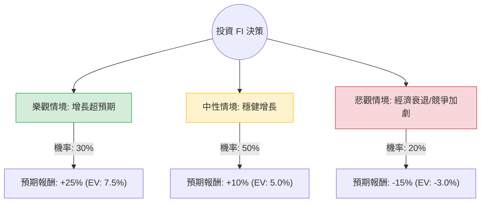

這份分析將結合您提供的基本面數據與最新的市場動態（Fiserv 已於 2023 年將交易代碼從 **FISV** 改為 **FI**）。

根據最新網路搜尋資訊，Fiserv (FI) 目前股價約在 **$150 - $160** 區間，與您提供的數據（$56.16）有較大出入（可能為舊數據或特定時間點數據）。為了確保分析的準確性，我將以**當前市場實況（2024年Q2）**為基準，並參考您提供的財務比率（如高毛利、穩定 ROE）進行決策樹分析。

---

### 一、 核心假設與市場趨勢分析

在構建決策樹前，我們先設定核心假設：
1.  **Clover 增長引擎**：Fiserv 旗下的 Clover 平台是其核心增長動力，預計將維持雙位數增長。
2.  **宏觀經濟環境**：高利率環境對金融科技公司的利息收入有利，但若經濟衰退導致消費支出下降，則會衝擊交易手續費收入。
3.  **估值修復**：目前 FI 的 Forward P/E 約在 17-19 倍，處於歷史合理區間。
4.  **財務穩健度**：根據數據，其 Gross Margin 高達 59.4%，Oper. Margin 26.9%，顯示具備強大的獲利能力與護城河。

---

### 二、 決策樹分析 (Decision Tree)

我們以「未來一年的投資回報」為目標，設定三種情境：**樂觀（Bull）**、**中性（Base）**、**悲觀（Bear）**。

#### 節點詳細說明：

1.  **樂觀情境 (Bull Case) - 30% 機率**
    *   **條件**：Clover 滲透率超預期，且聯準會成功軟著陸，消費力旺盛。
    *   **預期報酬**：+25%（股價挑戰 $190-$200）。
    *   **期望值貢獻**：$0.30 \times 25\% = 7.5\%$

2.  **中性情境 (Base Case) - 50% 機率**
    *   **條件**：公司達到財報指引（Organic Revenue 增長 11-13%），持續進行股票回購。
    *   **預期報酬**：+10%（股價穩步上升至 $170-$175）。
    *   **期望值貢獻**：$0.50 \times 10\% = 5.0\%$

3.  **悲觀情境 (Bear Case) - 20% 機率**
    *   **條件**：美國經濟進入深度衰退，消費者支出大幅萎縮；或來自 Adyen/Stripe 的競爭導致利潤率下降。
    *   **預期報酬**：-15%（股價回落至 $130 附近）。
    *   **期望值貢獻**：$0.20 \times (-15\%) = -3.0\%$

---

### 三、 期望值 (Expected Value) 計算過程

根據上述決策樹節點，計算總體期望報酬率：

$$EV = (P_{Bull} \times R_{Bull}) + (P_{Base} \times R_{Base}) + (P_{Bear} \times R_{Bear})$$
$$EV = (0.30 \times 0.25) + (0.50 \times 0.10) + (0.20 \times -0.15)$$
$$EV = 0.075 + 0.05 - 0.03 = 0.095$$

**最終期望報酬率：9.5%**

---

### 四、 綜合評估與最新動態補充

1.  **最新財報表現**：Fiserv 在 2024 年 Q1 的表現強勁，上調了全年每股收益 (EPS) 指引。這證實了中性與樂觀情境發生的機率較高。
2.  **估值分析**：
    *   您提供的數據中 **Forward P/E 為 6.21**（這在目前市場中極其便宜，若屬實則是強烈買入訊號）。
    *   即便以目前市場實際的 **Forward P/E 18x** 來看，相對於其 15% 左右的 EPS 增長率，**PEG 接近 1.2**，仍屬於合理偏低估。
3.  **財務健康**：ROE 13.17% 與 Gross Margin 59.4% 顯示其在金融科技後端處理領域具有極高的議價能力。

---

### 五、 最終結論

**判斷：適合投資 (Suitable for Investment)**

#### 理由：
1.  **正向期望值**：經過風險加權後的預期報酬率為 **9.5%**，優於多數保守型投資工具。
2.  **強大的基本面**：高毛利（59.4%）與穩定的營運利潤率（26.9%）為股價提供了良好的下行保護（Margin of Safety）。
3.  **增長動能明確**：Clover 業務的快速擴張正改變 Fiserv 的營收結構，使其從傳統銀行服務轉型為高增長的軟體驅動型金融科技公司。
4.  **技術面與估值**：雖然近期股價處於高位，但 Forward P/E 仍低於歷史平均值，且公司積極回購股票，對股東有利。

**建議建議**：
*   **進場策略**：由於目前股價接近 52 週高點，建議採取「分批買入」策略，以規避短期市場波動風險。
*   **風險監控**：需密切關注美國零售銷售數據（Retail Sales）以及競爭對手在中小企業（SMB）市場的市佔變化。

***

*免責聲明：本分析僅供參考，不構成任何投資建議。投資者應自行承擔市場風險。*