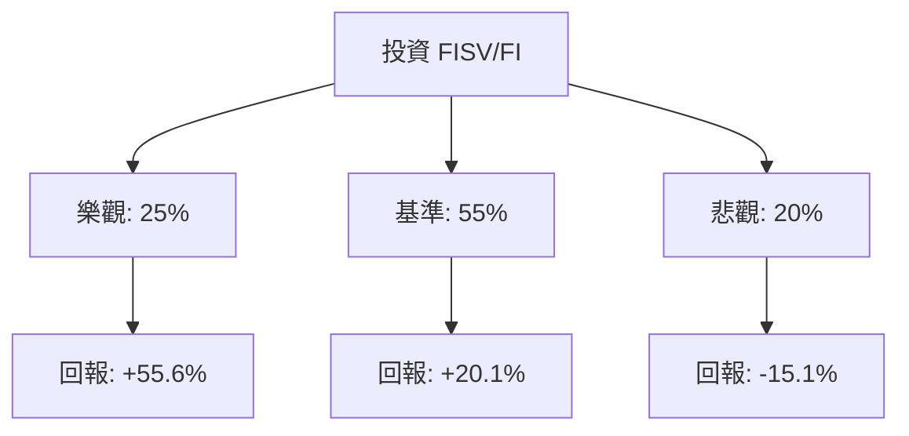

作為一名量化投資分析師，我將結合您提供的數據（顯示該標的目前處於顯著的價值區間，P/E 僅 9.71，且較 52 週高點大幅回落）與當前 Fiserv (現代碼為 **FI**) 的市場動態進行概率建模。

### 1. 核心驅動因素與風險 (Drivers & Risks)

#### **關鍵催化劑 (Catalysts)**
1.  **Clover 生態系統的持續擴張**：Clover 是 Fiserv 的高增長引擎（SMB 支付處理）。若其營收增速維持在 20%-30% 以上，將帶動整體利潤率（目前 Oper. Margin 24.5%）進一步提升，觸發估值修復。
2.  **金融機構數位轉型需求**：隨著銀行加速核心系統現代化，Fiserv 的金融分部（Financial Segment）簽約量若超預期，將提供穩定的現金流支撐。
3.  **資本配置優化（庫藏股回購）**：公司具備強大的自由現金流（P/FCF 僅 7.31），若管理層利用目前低估值環境加速回購，將直接推升 EPS 並改善市場情緒。

#### **主要風險點 (Risks)**
1.  **宏觀經濟放緩與消費支出下降**：作為支付處理商，其營收與交易量高度相關。若美國經濟進入衰退，商戶交易額下降將直接衝擊業績。
2.  **金融科技競爭加劇**：來自 Adyen、Stripe 及 Block (Square) 的競爭可能導致手續費率（Take Rate）承壓，壓縮毛利（目前 Gross Margin 58.09%）。
3.  **高槓桿與利率風險**：債務權益比（Debt/Eq）為 1.12，在長期高利率環境下，債務展期成本增加可能侵蝕淨利潤。

---

### 2. 情境設定與機率賦予 (Scenario Modeling)

基於目前 **Forward P/E 6.39** 的極低水位與 **Target Price 67.92**，設定以下 12 個月情境：

#### **樂觀情境 (Bull Case)**
*   **發生條件**：Clover 增長超預期，且宏觀環境實現「軟著陸」；公司宣佈大規模回購計畫；估值回歸至歷史均值（P/E ~15x）。
*   **預估機率**：25%
*   **目標價格與預期回報**：$88.00 (+55.6%)

#### **基準情境 (Base Case)**
*   **發生條件**：業務穩定增長，EPS 達到分析師預期的 10% 增長；市場情緒修復至分析師平均目標價。
*   **預估機率**：55%
*   **目標價格與預期回報**：$67.92 (+20.1%)

#### **悲觀情境 (Bear Case)**
*   **發生條件**：美國經濟衰退導致交易量萎縮；競爭對手大幅奪取市場份額；股價下探至 52 週低點支撐區。
*   **預估機率**：20%
*   **目標價格與預期回報**：$48.00 (-15.1%)

---

### 3. 期望值計算與決策樹 (EV Calculation & Decision Tree)

#### **決策樹結構**

#### **總期望值計算**
*   **EV** = (0.25 * 0.556) + (0.55 * 0.201) + (0.20 * -0.151)
*   **EV** = 0.139 + 0.1105 - 0.0302 = **0.2193 (21.93%)**

#### **風險回報比分析**
*   **上行潛力**：平均約 +30% (加權樂觀與基準)
*   **下行空間**：-15.1%
*   **風險回報比**：約 **1 : 2**。這顯示目前的投資具備不對稱性，贏面顯著大於輸面。

---

### 4. 決策總結 (Decision Summary)

| 情境 | 發生機率 (%) | 預期報酬率 (%) | 關鍵驅動/觸發因素 |
| :--- | :--- | :--- | :--- |
| **樂觀 (Bull)** | 25% | +55.6% | Clover 爆發性增長，估值倍數修復至 15x P/E |
| **基準 (Base)** | 55% | +20.1% | 達到分析師目標價，EPS 穩定增長 10% |
| **悲觀 (Bear)** | 20% | -15.1% | 宏觀衰退，交易量萎縮，下探 52 週低點 |
| **整體期望值** | **100%** | **+21.93%** | **加權平均預期回報** |

**最終結論：**
1.  **投資建議**：**買入 (Buy)**
2.  **核心逻辑**：FISV 目前的估值（Forward P/E 6.39）已極度壓縮，反映了過度悲觀的預期。21.93% 的期望回報率遠高於市場平均水平，且 P/FCF 顯示其現金流極其強勁，具備極高的安全邊際。
3.  **風控建議**：若股價跌破 **$52.00**（52 週低點附近）且伴隨交易量放大，說明基本面發生結構性惡化（如重大客戶流失），應執行止損。同時關注每季 Oper. Margin 是否跌破 20%。

【結束指令】