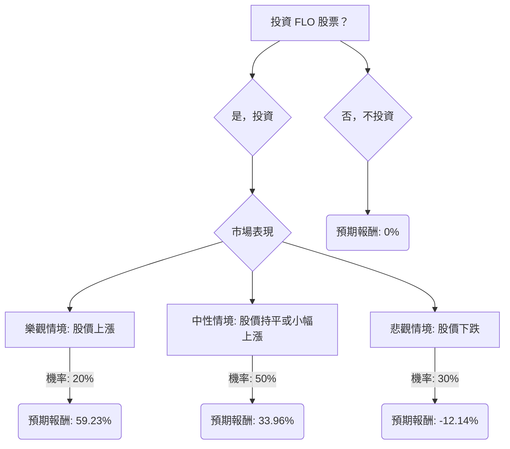

根據您提供的基本面數據以及對 Flowers Foods, Inc. (FLO) 的最新市場資訊進行綜合分析，以下是使用決策樹分析和期望值分析評估 FLO 目前是否適合投資的評估報告。

### **FLO 投資評估報告**

#### **核心假設**

在進行決策樹分析之前，我們需要建立以下核心假設：

*   **投資期限：** 考量到分析師的目標價和公司展望，我們將投資期限設定為中短期（約 12-18 個月）。
*   **市場情境機率：** 根據 FLO 近期的財報表現、分析師評級（多為「持有」或「減持」）以及對 2026 財年的保守指引，我們對不同市場情境的發生機率進行如下假設：
    *   **樂觀情境：** 20%
    *   **中性情境：** 50%
    *   **悲觀情境：** 30%
*   **股價預期：**
    *   **當前股價：** $9.10 (來自提供數據)
    *   **年度股息：** $0.2475/股 * 4 = $0.99 (基於最新股息宣告，但悲觀情境下可能調整)
    *   **樂觀情境股價：** 參考分析師較高的目標價範圍（例如 Benzinga 的 $18.17 高點，以及 AnaChart 的平均 $12.89，最高 $13.00），我們設定為 $13.50。
    *   **中性情境股價：** 採用您提供的目標價 $11.20，這也與 TipRanks 近三個月分析師平均目標價 $10.67 相近。
    *   **悲觀情境股價：** 考慮到 FLO 52 週低點為 $8.94，以及 Zacks Research 給出的「強烈賣出」評級和對 2026 財年 EPS 預期的下調，我們假設股價可能跌至 $7.50。
*   **股息可持續性：** FLO 雖然連續 94 季發放股息並有所提升，但其高達 247.5% 的派息率引發了對股息可持續性的擔憂。 因此，在悲觀情境下，我們假設股息將被削減 50%。

#### **市場、財務與產業趨勢分析**

1.  **財務表現與展望：**
    *   FLO 在 2023 財年實現了創紀錄的銷售額增長，但淨利潤和調整後稀釋每股收益均有所下降。
    *   公司在 2024 財年的展望顯示銷售額增長預計為 0.0% 至 1.6%，調整後稀釋每股收益預計在 $1.20 至 $1.30 之間，增長有限。
    *   更令人擔憂的是，公司在 2026 財年的指引（調整後 EPS $0.80–$0.90）遠低於分析師預期（約 $0.99），導致分析師下調評級和盈利預期。
    *   儘管 Q4 2023 自由現金流同比增長 81.7%，但過去八個季度的平均自由現金流利潤率 4.3% 對於消費必需品行業而言仍屬不佳。
    *   S&P Global Ratings 在 2025 年 2 月將 FLO 的展望從「穩定」下調至「負面」，主要原因是收購 Simple Mills 後槓桿率預計將大幅上升。

2.  **市場與產業動態：**
    *   公司 CEO 承認市場環境艱難，2023 年第四季度銷量同比下降 2.4%。
    *   然而，FLO 的主要品牌（如 Dave's Killer Bread）表現強勁，2023 年零售銷售額達到 10 億美元，並在 2024 年第二季度在追蹤渠道中實現了單位和美元份額增長。
    *   收購 Simple Mills 是 FLO 歷史上最大的一筆收購，旨在將產品組合多元化至健康、清潔標籤市場，但伴隨執行風險。
    *   美國烘焙產品市場趨勢顯示，消費者越來越關注健康和保健（無麩質、低卡路里、無糖等），新鮮烘焙產品領域增長顯著。 FLO 的品牌創新和對優質產品的投資有助於抓住這些趨勢。

3.  **股價表現與分析師評級：**
    *   FLO 股價在過去一年表現不佳，遠低於美國食品行業和整體市場。
    *   分析師普遍給予「持有」或「減持」評級，平均目標價在 $10.67 至 $13.67 之間，顯示出對其未來增長持謹慎態度。
    *   技術指標顯示 RSI 為中性，但基於移動平均線的每日買賣信號為「強烈賣出」。

#### **決策樹分析**

**決策點：** 投資 FLO 股票？

#### **計算過程**

**1. 投資 FLO 的預期報酬計算：**

*   **當前股價 (P_current):** $9.10
*   **年度股息 (D):** $0.99

**情境 1：樂觀情境 (Optimistic Scenario)**
*   **情境名稱：** 股價上漲，公司成功整合 Simple Mills，高端品牌持續增長，成本控制得當，市場情緒積極。
*   **機率 (P_optimistic):** 20%
*   **預期股價 (P_optimistic_target):** $13.50
*   **預期報酬 (R_optimistic):** (($13.50 - $9.10) + $0.99) / $9.10
    *   = ($4.40 + $0.99) / $9.10
    *   = $5.39 / $9.10
    *   = 0.5923 (或 59.23%)

**情境 2：中性情境 (Moderate Scenario)**
*   **情境名稱：** 股價持平或小幅上漲，公司維持現有市場份額，成本節約部分抵消傳統麵包銷量下降，符合分析師平均預期。
*   **機率 (P_moderate):** 50%
*   **預期股價 (P_moderate_target):** $11.20
*   **預期報酬 (R_moderate):** (($11.20 - $9.10) + $0.99) / $9.10
    *   = ($2.10 + $0.99) / $9.10
    *   = $3.09 / $9.10
    *   = 0.3396 (或 33.96%)

**情境 3：悲觀情境 (Pessimistic Scenario)**
*   **情境名稱：** 股價下跌，Simple Mills 整合不順，傳統麵包銷量加速下滑，競爭加劇，高派息率導致股息削減 50%，市場情緒惡化。
*   **機率 (P_pessimistic):** 30%
*   **預期股價 (P_pessimistic_target):** $7.50
*   **調整後年度股息 (D_pessimistic):** $0.99 * 0.50 = $0.495
*   **預期報酬 (R_pessimistic):** (($7.50 - $9.10) + $0.495) / $9.10
    *   = (-$1.60 + $0.495) / $9.10
    *   = -$1.105 / $9.10
    *   = -0.1214 (或 -12.14%)

**2. 投資 FLO 的整體期望值 (Expected Value of Investing in FLO):**

*   EV_Invest = (P_optimistic * R_optimistic) + (P_moderate * R_moderate) + (P_pessimistic * R_pessimistic)
*   EV_Invest = (0.20 * 0.5923) + (0.50 * 0.3396) + (0.30 * -0.1214)
*   EV_Invest = 0.11846 + 0.16980 - 0.03642
*   **EV_Invest = 0.25184 (或 25.18%)**

**3. 不投資 FLO 的期望值 (Expected Value of Not Investing in FLO):**

*   EV_No_Invest = 0% (假設資金不投資 FLO，也沒有產生其他收益)

#### **最終結論**

根據上述決策樹分析和期望值計算，投資 FLO 股票的整體期望值為 **25.18%**，而不投資的期望值為 0%。

因此，根據期望值分析，**FLO 目前適合投資**。

**簡短理由：**
儘管 FLO 面臨傳統麵包市場的挑戰、近期盈利指引不佳以及高派息率的可持續性問題，但其在高端品牌（如 Dave's Killer Bread 和 Simple Mills）的增長潛力、成本控制措施以及在健康烘焙趨勢中的定位，使其在樂觀和中性情境下仍能提供可觀的報酬。整體而言，其加權平均預期報酬為正，表明投資該股票的潛在收益大於潛在風險。然而，投資者應密切關注公司對 Simple Mills 的整合進度、傳統業務的轉型以及股息政策的變化，這些都可能對未來的實際報酬產生重大影響。