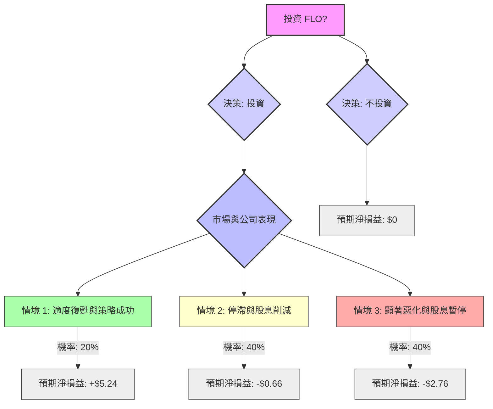

根據對美股公司 Flowers Foods (FLO) 的基本面數據、最新新聞、財報、市場動態及產業趨勢的綜合評估，以下將使用決策樹分析與期望值分析來判斷目前是否適合投資。

### 核心假設

在進行決策樹分析之前，我們基於所提供的基本面數據和即時網路搜尋結果，建立以下核心假設：

*   **市場趨勢：** 包裝食品行業面臨結構性挑戰，包括消費者偏好轉變、自有品牌競爭加劇以及通膨帶來的成本壓力（例如油價和柴油成本上漲）。傳統烘焙產品的需求持續疲軟，而健康和高端產品線（如 Dave's Killer Bread 和 Simple Mills）是公司成長的潛在動力。
*   **財務狀況：** Flowers Foods 的盈利能力較低（ROE 6.18%, ROA 2.12%, 淨利率 1.59%），債務水平相對較高（負債權益比 1.6，淨債務/EBITDA 達 3.3 倍）。 儘管 2025 年第四季度 EPS 超出預期，但整體淨收入和 EPS 趨勢仍為負值。
*   **股息可持續性：** 公司目前約 12% 的股息收益率極高，但其派息率高達 247% 至 249.69%，遠超盈利能力，被分析師明確指出為「不可持續」。 因此，股息削減或暫停的可能性非常高，這將對股價產生顯著的負面影響。
*   **管理層與策略：** 管理層正努力轉向高端產品並優化營運，但近期高階主管離職和執行長出售股份等事件，為公司前景增添了不確定性，並被視為「缺乏信心」的負面催化劑。
*   **分析師評級與目標價：** 分析師普遍給予「減持 (Reduce)」或「持有 (Hold)」評級。 平均目標價約為 11.17 美元，但最低目標價為 7.00 美元，最高為 16.00 美元。

### 決策樹分析

我們將評估投資 Flowers Foods (FLO) 的決策，並設定三種情境，每種情境都有其對應的機率和預期報酬（以每股淨損益計算）。目前股價為 8.26 美元。

#### 決策樹圖

#### 情境定義與計算

**初始投資：** 每股 8.26 美元

**1. 情境 1：適度復甦與策略成功 (Moderate Recovery & Strategic Success)**
*   **預測情境名稱：** 適度復甦與策略成功
*   **核心假設：** 公司轉型策略奏效，高端產品線表現強勁，市場對股息削減的反應溫和，或公司在營運效率上取得顯著突破。
*   **機率 (Probability)：** 20%
*   **預期股價 (1 年後)：** 13.00 美元 (接近分析師高目標價但考慮到整體逆風)
*   **預期股息 (1 年後)：** 0.50 美元 (假設股息大幅削減，但仍有部分派發)
*   **預期報酬 / 期望值 (Expected Value) 計算：**
    *   每股總價值 = 13.00 (股價) + 0.50 (股息) = 13.50 美元
    *   每股淨損益 = 13.50 - 8.26 (初始投資) = **+5.24 美元**

**2. 情境 2：停滯與股息削減 (Stagnation & Dividend Cut)**
*   **預測情境名稱：** 停滯與股息削減
*   **核心假設：** 市場逆風持續，公司轉型效果不彰，傳統產品銷售持續下滑。公司被迫削減股息，導致股價小幅下跌。
*   **機率 (Probability)：** 40%
*   **預期股價 (1 年後)：** 7.50 美元 (低於目前股價，反映股息削減和市場壓力)
*   **預期股息 (1 年後)：** 0.10 美元 (假設股息大幅削減至象徵性水平)
*   **預期報酬 / 期望值 (Expected Value) 計算：**
    *   每股總價值 = 7.50 (股價) + 0.10 (股息) = 7.60 美元
    *   每股淨損益 = 7.60 - 8.26 (初始投資) = **-0.66 美元**

**3. 情境 3：顯著惡化與股息暫停 (Significant Deterioration & Full Dividend Suspension)**
*   **預測情境名稱：** 顯著惡化與股息暫停
*   **核心假設：** 市場逆風加劇，公司營運持續惡化，盈利能力進一步受損。公司因財務壓力暫停派發股息，導致股價大幅下跌。管理層變動和內部人士減持加劇了市場的悲觀情緒。
*   **機率 (Probability)：** 40%
*   **預期股價 (1 年後)：** 5.50 美元 (遠低於分析師最低目標價，反映嚴重負面影響)
*   **預期股息 (1 年後)：** 0.00 美元 (假設股息完全暫停)
*   **預期報酬 / 期望值 (Expected Value) 計算：**
    *   每股總價值 = 5.50 (股價) + 0.00 (股息) = 5.50 美元
    *   每股淨損益 = 5.50 - 8.26 (初始投資) = **-2.76 美元**

### 整體期望值計算

根據上述情境的機率和預期淨損益，計算投資 Flowers Foods 的整體期望值：

整體期望值 = (情境 1 淨損益 × 情境 1 機率) + (情境 2 淨損益 × 情境 2 機率) + (情境 3 淨損益 × 情境 3 機率)
整體期望值 = (5.24 美元 × 0.20) + (-0.66 美元 × 0.40) + (-2.76 美元 × 0.40)
整體期望值 = 1.048 美元 - 0.264 美元 - 1.104 美元
**整體期望值 = -0.32 美元**

### 最終結論

根據決策樹分析和期望值計算，投資 Flowers Foods (FLO) 的整體期望值為 **-0.32 美元**。

由於計算出的整體期望值為負數，這表示在考慮了各種可能情境及其機率後，預期每股投資將平均帶來 0.32 美元的損失。

**因此，根據本次分析，Flowers Foods (FLO) 目前不適合投資。**

**簡短理由：**
儘管公司在某些季度表現超出預期，且有轉型高端產品的策略，但其面臨的產業逆風強勁、盈利能力低下、債務水平較高以及最關鍵的「不可持續」的股息派發率，都構成了重大的投資風險。股息削減幾乎是必然事件，這將可能引發市場的負面反應，導致股價進一步下跌。綜合考量下，潛在的下行風險大於上行潛力。