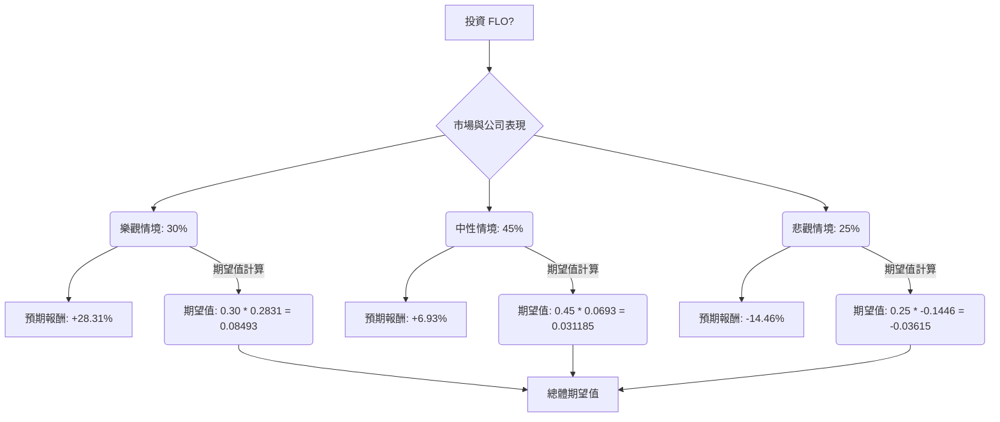

為了評估美股公司 FLO (Flowers Foods Inc.) 目前是否適合投資，我們將結合其基本面數據、最新的市場資訊，並運用決策樹分析與期望值分析。

首先，我們需要獲取 FLO 的最新新聞、財報、市場動態和產業趨勢等即時資訊，以補充提供的基本面數據。

## 決策樹分析與期望值分析：評估美股公司 FLO (Flowers Foods Inc.) 投資機會

### 公司概覽與最新動態

Flowers Foods Inc. (NYSE: FLO) 是一家美國領先的烘焙食品公司，旗下擁有 Nature's Own、Dave's Killer Bread、Wonder Bread 等知名品牌。公司主要透過直接門市配送 (DSD) 和倉儲配送系統服務全國客戶。

**最新資訊與市場動態：**

*   **領導層變動與營運優化 (2026年2月9日)**：Flowers Foods 任命 David Roach 為新設立的 DSD 營運長，負責 DSD 業務的盈虧，旨在加強執行力、提高效率和問責制。同時，公司將其蛋糕業務整合為一個新部門，由 Dan Scott 領導，以加速績效並推動獲利增長。這些舉措反映了公司在動態零售環境中追求更高速度和效率的策略。
*   **分析師評級與目標價 (截至2026年2月12日)**：
    *   多數分析師對 FLO 的共識評級為「持有 (Hold)」。
    *   平均12個月目標價約為 $12.00 至 $13.33，相較於目前股價 $11.69 有約 1.52% 至 11.95% 的潛在漲幅。
    *   最高目標價為 $25.00 (Stephens & Co., 2023年8月11日)，最低目標價為 $10.00 (Truist Securities, 2025年11月13日)。
    *   近期有分析師下調目標價，例如 Truist Securities 將目標價從 $15 降至 $10 (2025年11月13日)，Deutsche Bank 將目標價從 $15 降至 $13 (2025年11月10日)。
*   **財報預告 (2026年1月28日)**：Flowers Foods 將於2026年2月12日收盤後公布2025財年第四季度及全年財報。 (註：由於當前時間為2026年2月12日，財報結果尚未公布，因此分析將基於預期和過往趨勢。)
*   **2025財年展望 (2025年2月7日)**：公司預計2025財年調整後每股盈餘 (EPS) 將低於市場預期，但銷售額將有所增長。
*   **產業趨勢 (2026年)**：
    *   美國包裝食品市場預計在2026年至2033年間以約 5.5% 的複合年增長率 (CAGR) 增長，主要受消費者忙碌的生活方式、對便利性的偏好以及電子商務的普及推動。
    *   健康和保健趨勢持續影響食品產業，消費者傾向於更健康、加工較少的食品，對清潔標籤、天然風味和功能性成分（如蛋白質和益生菌）的需求很高。
    *   GLP-1 減肥藥物的興起正在重塑食品消費模式，使用 GLP-1 藥物的家庭在雜貨上的支出減少，尤其是在加工食品和含糖食品方面。
    *   行業內存在整合和戰略拆分並存的趨勢，大型公司透過收購進入快速增長的利基市場，同時也將非核心資產剝離以提高專注度。
    *   消費者尋求價值導向的購買行為，這對甜點烘焙食品和某些零食類別的銷售造成壓力。
    *   Flowers Foods 在 Q3 2024 報告中指出，儘管消費者尋求價值的行為帶來挑戰，但其主要品牌表現穩健，並透過戰略創新，特別是在健康和保健領域以及新產品形式方面進行投資。

### 核心假設

1.  **市場環境 (Market Conditions)**：
    *   **穩定增長 (Stable Growth)**：美國包裝食品市場將保持穩健增長，受便利性需求和健康趨勢推動。
    *   **競爭加劇/挑戰 (Increased Competition/Challenges)**：GLP-1 藥物影響、消費者價值導向行為以及私人品牌競爭將對公司營收和利潤率造成壓力。
2.  **公司財務表現 (Company Financial Performance)**：
    *   **優於預期 (Outperform Expectations)**：新領導層的營運優化措施 (DSD 效率提升、蛋糕業務整合) 成功，成本控制良好，新產品 (如 Dave's Killer Bread) 表現強勁，推動營收和利潤增長。
    *   **符合預期 (Meet Expectations)**：公司業績符合分析師預期，營收小幅增長，但利潤率受成本壓力和競爭影響。
    *   **低於預期 (Underperform Expectations)**：營運優化效果不彰，GLP-1 藥物影響超預期，原材料成本持續上升，導致營收增長停滯甚至下滑，利潤率承壓。
3.  **產業趨勢影響 (Industry Trend Impact)**：
    *   **積極影響 (Positive Impact)**：公司成功抓住健康、有機和植物基產品趨勢，透過創新和收購擴大市場份額。
    *   **中性影響 (Neutral Impact)**：公司能適應產業變化，但未能顯著受益於新趨勢，或受負面趨勢影響有限。
    *   **負面影響 (Negative Impact)**：公司未能有效應對健康趨勢和 GLP-1 藥物影響，傳統產品需求持續下降，轉型緩慢。

### 決策樹分析與期望值計算

我們將考慮「投資 FLO」這個決策，並根據上述假設設定情境、機率和預期報酬。

**當前股價 (Close):** $11.69
**分析師平均目標價 (Average Target Price):** $12.00 - $13.33
**52週高點 (52W High):** $20.23 (基於 52W Range: "9.93 - 20.23")
**52週低點 (52W Low):** $9.93 (基於 52W Range: "9.93 - 20.23")

為了簡化模型，我們將預期報酬設定為未來12個月的股價變化百分比。

**情境設定與預期報酬估計：**

*   **樂觀情境 (Optimistic Scenario)**：
    *   **機率 (Probability)**：30%
    *   **描述**：公司營運效率顯著提升，新產品線表現優異，成功應對市場挑戰，並受益於包裝食品市場的穩定增長。分析師上調評級和目標價。
    *   **預期股價**：達到或略高於分析師平均目標價的高端，甚至接近歷史高點。我們假設股價達到 $15.00。
    *   **預期報酬**：($15.00 - $11.69) / $11.69 = 28.31%
*   **中性情境 (Neutral Scenario)**：
    *   **機率 (Probability)**：45%
    *   **描述**：公司業績符合預期，營運改善效果溫和，市場競爭和成本壓力持續存在，但整體穩定。股價在分析師平均目標價附近波動。
    *   **預期股價**：達到分析師平均目標價的低端至中端。我們假設股價達到 $12.50。
    *   **預期報酬**：($12.50 - $11.69) / $11.69 = 6.93%
*   **悲觀情境 (Pessimistic Scenario)**：
    *   **機率 (Probability)**：25%
    *   **描述**：營運改善不及預期，GLP-1 藥物對傳統烘焙食品需求影響加劇，原材料成本大幅上漲，導致盈利能力下降。分析師下調評級和目標價。
    *   **預期股價**：跌至分析師最低目標價或接近52週低點。我們假設股價跌至 $10.00。
    *   **預期報酬**：($10.00 - $11.69) / $11.69 = -14.46%

---

#### 決策樹 (Decision Tree)

---

#### 計算過程

1.  **樂觀情境期望值 (Expected Value for Optimistic Scenario)**
    *   機率 = 0.30
    *   預期報酬 = 28.31% = 0.2831
    *   期望值 = 0.30 * 0.2831 = **0.08493**

2.  **中性情境期望值 (Expected Value for Neutral Scenario)**
    *   機率 = 0.45
    *   預期報酬 = 6.93% = 0.0693
    *   期望值 = 0.45 * 0.0693 = **0.031185**

3.  **悲觀情境期望值 (Expected Value for Pessimistic Scenario)**
    *   機率 = 0.25
    *   預期報酬 = -14.46% = -0.1446
    *   期望值 = 0.25 * -0.1446 = **-0.03615**

4.  **總體期望值 (Overall Expected Value)**
    *   總體期望值 = 樂觀情境期望值 + 中性情境期望值 + 悲觀情境期望值
    *   總體期望值 = 0.08493 + 0.031185 + (-0.03615) = **0.079965**

### 最終結論

根據決策樹分析和期望值計算，投資 FLO 的總體期望值為 **+7.9965%**。

**判斷：適合投資**

**簡短理由：**
儘管 FLO 面臨 GLP-1 藥物對傳統烘焙食品需求的潛在影響、消費者價值導向行為以及激烈的市場競爭等挑戰，但公司正積極透過領導層變動和營運優化來提升效率和盈利能力。其在健康、有機產品領域的戰略投資 (如 Dave's Killer Bread) 也符合市場趨勢。 分析師的共識評級為「持有」，且平均目標價顯示出一定的上漲空間。 綜合考量，在當前股價水平下，FLO 具有正向的期望報酬，表明其在風險調整後仍具備一定的投資吸引力。然而，投資者應密切關注即將公布的2025財年第四季度及全年財報，以及公司在應對產業逆風方面的實際執行效果。