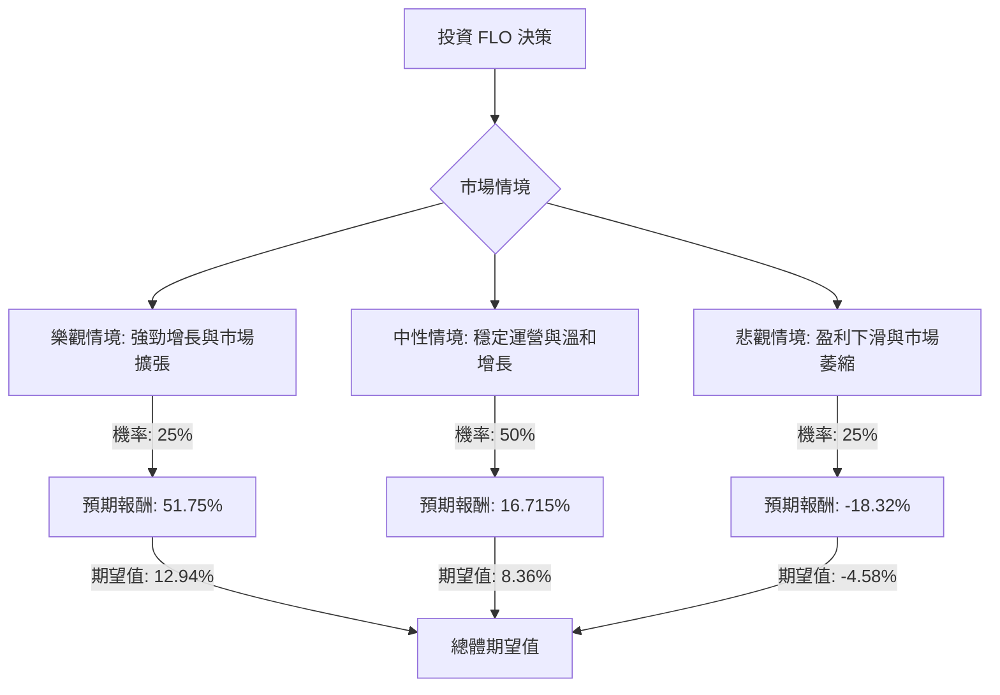

根據對美股公司 **FLO (Flowers Foods, Inc.)** 的基本面數據和最新市場資訊的綜合分析，以下將使用決策樹分析和期望值分析來評估其目前的投資適合性。

**核心假設：**

*   **市場趨勢：** 2026年市場預計將呈現溫和增長但伴隨偶發性波動的態勢，價值股可能繼續跑贏成長股。消費者必需品行業（如包裝食品）通常被視為防禦性資產，但在通脹壓力下，消費者情緒可能趨於謹慎。
*   **財務狀況：** Flowers Foods在2025年第四季度出現淨收入大幅轉負、EPS下降、毛利率下滑的情況，顯示盈利能力面臨壓力。公司債務股本比相對較高（1.6）。儘管如此，公司仍保持了季度營收增長（QoQ +6.8%）和穩定的股息支付歷史，但其高股息率在當前盈利狀況下可持續性存疑。
*   **產業趨勢：** 包裝烘焙食品行業面臨銷量增長疲軟、定價能力有限和行業成本壓力等挑戰。然而，戰略性收購（如Dave's Killer Bread）和潛在的行業整合、促銷活動減少以及定價能力提升，可能為公司帶來增長機會。勞資關係（如Modesto司機的工會協議）可能影響未來的勞動成本。

**當前股價：** $8.57 (截至2026年5月8日)
**分析師目標價範圍：** $7.00 (低) 至 $14.00 (高)，中位數為 $9.50。

---

### 1. 決策樹分析 (Decision Tree Analysis)

我們將設定三個主要情境來評估 FLO 的未來表現：

*   **樂觀情境 (Optimistic Scenario)：** 市場復甦強勁，公司新產品成功推出，成本管理有效，並從行業整合中獲益。
*   **中性情境 (Neutral Scenario)：** 當前趨勢持續，包裝食品需求穩定，但仍面臨一定的成本壓力。
*   **悲觀情境 (Pessimistic Scenario)：** 經濟狀況惡化，競爭加劇，通脹成本顯著上升，勞資問題或訴訟產生負面影響，導致盈利能力進一步下滑。

**節點計算方式：**

*   **預期報酬 (Expected Return) = 資本利得率 + 股息收益率**
    *   資本利得率 = (預期股價 - 當前股價) / 當前股價
    *   股息收益率：基於當前股息率 11.73% 進行調整。

**情境設定與預期報酬計算：**

1.  **樂觀情境 (Optimistic Scenario)**
    *   **預測情境名稱：** 強勁增長與市場擴張
    *   **對應的機率 (Probability)：** 25%
    *   **核心假設：** 成功應對成本壓力，新產品線表現優異，市場份額擴大，分析師高目標價得以實現。
    *   **預期股價：** $12.00 (接近分析師高目標價 $14.00，但考慮到近期表現略保守)
    *   **資本利得率：** ($12.00 - $8.57) / $8.57 = 40.02%
    *   **股息收益率：** 11.73% (假設維持)
    *   **預期報酬：** 40.02% + 11.73% = 51.75%
    *   **期望值 (Expected Value)：** 0.25 * 51.75% = 12.94%

2.  **中性情境 (Neutral Scenario)**
    *   **預測情境名稱：** 穩定運營與溫和增長
    *   **對應的機率 (Probability)：** 50%
    *   **核心假設：** 公司維持現有市場地位，盈利能力略有改善，但仍受成本和競爭影響。分析師中位數目標價得以實現。
    *   **預期股價：** $9.50 (分析師中位數目標價)
    *   **資本利得率：** ($9.50 - $8.57) / $8.57 = 10.85%
    *   **股息收益率：** 5.865% (假設股息減半，以反映盈利壓力)
    *   **預期報酬：** 10.85% + 5.865% = 16.715%
    *   **期望值 (Expected Value)：** 0.50 * 16.715% = 8.36%

3.  **悲觀情境 (Pessimistic Scenario)**
    *   **預測情境名稱：** 盈利下滑與市場萎縮
    *   **對應的機率 (Probability)：** 25%
    *   **核心假設：** 宏觀經濟惡化，成本壓力無法有效轉嫁，競爭加劇，Q4 2025的負面盈利趨勢持續，股息可能被削減。
    *   **預期股價：** $7.00 (分析師低目標價)
    *   **資本利得率：** ($7.00 - $8.57) / $8.57 = -18.32%
    *   **股息收益率：** 0% (假設股息完全取消，以應對嚴峻的財務狀況)
    *   **預期報酬：** -18.32% + 0% = -18.32%
    *   **期望值 (Expected Value)：** 0.25 * -18.32% = -4.58%

---

### 2. 繪製完整的決策樹 (使用 Markdown)

---

### 3. 期望值分析 (Expected Value Analysis)

**總體期望值計算：**

總體期望值 = (樂觀情境期望值) + (中性情境期望值) + (悲觀情境期望值)
總體期望值 = 12.94% + 8.36% + (-4.58%)
總體期望值 = 16.72%

---

### 4. 最終結論

根據上述決策樹分析和期望值計算，FLO 的總體期望值為 **16.72%**。

**判斷：** 適合投資

**簡短理由：**
儘管 Flowers Foods (FLO) 面臨盈利能力下滑、高債務股本比以及行業成本壓力等挑戰，且分析師普遍持「中性/持有」評級，但其作為消費必需品公司的防禦性特質、穩定的營收增長以及潛在的行業整合機會，使其在特定情境下仍具備增長潛力。

雖然我們假設在悲觀情境下股息可能被取消，在中性情境下股息減半，但即使在這些保守假設下，整體期望值仍為正值。這表明在當前股價 $8.57 的基礎上，投資 FLO 仍有機會獲得正向回報。然而，投資者應密切關注公司即將發布的2026年第一季度財報、其成本控制能力以及高股息政策的可持續性。考慮到其近期股價表現不佳（過去12個月下跌52.0%），以及管理層變動和新增貸款等因素，投資者應將 FLO 視為一項具有中等風險和潛在回報的投資。