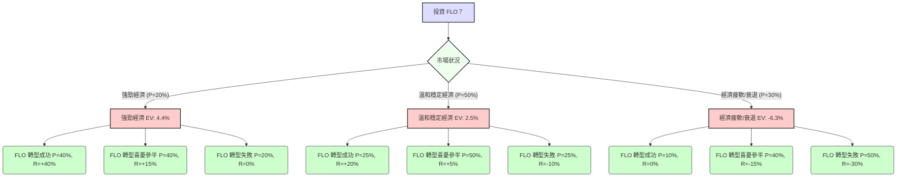

本分析將使用決策樹與期望值分析方法，評估美股公司 **Foot Locker, Inc. (FLO)** 目前的投資適宜性。

---

## 核心假設 (Core Assumptions)

在進行決策樹分析之前，我們需要設定一些關鍵假設。這些假設基於當前宏觀經濟環境、零售業趨勢以及 Foot Locker 自身的業務狀況。

### 市場、財務與產業趨勢假設：

1.  **投資期限 (Investment Horizon)**: 假設為未來一年。
2.  **宏觀經濟狀況 (Macroeconomic Conditions)**:
    *   **強勁經濟 (Strong Economy)**: 通膨下降，聯準會降息，消費支出強勁，股市上漲。對非必需消費品零售商有利。
    *   **溫和穩定經濟 (Moderate/Stable Economy)**: 經濟增長持平或緩慢，通膨仍在控制中，消費者支出穩定。
    *   **經濟疲軟/衰退 (Weak Economy/Recession)**: 高通膨或通縮壓力，聯準會維持高利率或經濟衰退，消費者支出緊縮。對非必需消費品零售商不利。
3.  **Foot Locker 公司特定表現 (Company-Specific Performance)**:
    Foot Locker 目前正處於轉型期，包括店鋪優化、品牌多樣化（減少對 Nike 的依賴）、提升線上銷售。其表現將受到轉型成效的影響。
    *   **轉型成功 (Successful Transformation)**: 新策略顯著提升銷售額、利潤率和市場份額。
    *   **轉型進展喜憂參半 (Mixed Transformation)**: 策略有部分成效，但仍面臨挑戰，表現中規中矩。
    *   **轉型失敗 (Failed Transformation)**: 策略未能奏效，銷售額持續下滑，利潤承壓，市場份額流失。
4.  **預期報酬率 (Expected Return Rates)**: 根據不同情境設定的年化報酬率，包含股價變動及潛在股息。這些數字是主觀預估。
    *   好的報酬率：高於10-15%（超越大盤或通膨）。
    *   中性報酬率：0-10%。
    *   差的報酬率：負值。
5.  **機率分配 (Probability Distribution)**:
    *   **市場狀況機率**：基於當前市場預期（例如，對未來一年經濟展望的共識）。
    *   **公司表現機率**：條件機率，假設公司表現會受到宏觀經濟的影響。例如，在經濟強勁時，公司更容易取得成功；在經濟疲軟時，失敗的機率會增加。

---

## 決策樹分析 (Decision Tree Analysis)

### 情境設定與機率估計

*   **市場情境機率**：
    *   強勁經濟: 20%
    *   溫和穩定經濟: 50%
    *   經濟疲軟/衰退: 30%
*   **公司表現條件機率與預期報酬**：

    1.  **若市場為「強勁經濟」 (P = 20%)**
        *   FLO 轉型成功 (P = 40%) -> 預期報酬: +40%
        *   FLO 轉型進展喜憂參半 (P = 40%) -> 預期報酬: +15%
        *   FLO 轉型失敗 (P = 20%) -> 預期報酬: 0%

    2.  **若市場為「溫和穩定經濟」 (P = 50%)**
        *   FLO 轉型成功 (P = 25%) -> 預期報酬: +20%
        *   FLO 轉型進展喜憂參半 (P = 50%) -> 預期報酬: +5%
        *   FLO 轉型失敗 (P = 25%) -> 預期報酬: -10%

    3.  **若市場為「經濟疲軟/衰退」 (P = 30%)**
        *   FLO 轉型成功 (P = 10%) -> 預期報酬: 0%
        *   FLO 轉型進展喜憂參半 (P = 40%) -> 預期報酬: -15%
        *   FLO 轉型失敗 (P = 50%) -> 預期報酬: -30%

---

### 繪製決策樹 (Markdown Format)

---

### 計算過程 (Calculation Process)

#### 1. 計算各情境的聯合機率 (Joint Probability) 與期望報酬

**市場情境一：強勁經濟 (P = 0.20)**
*   **FLO 轉型成功**
    *   聯合機率: `0.20 (市場) * 0.40 (公司) = 0.08`
    *   期望報酬: `0.08 * 40% = 0.032` (或 3.2%)
*   **FLO 轉型進展喜憂參半**
    *   聯合機率: `0.20 (市場) * 0.40 (公司) = 0.08`
    *   期望報酬: `0.08 * 15% = 0.012` (或 1.2%)
*   **FLO 轉型失敗**
    *   聯合機率: `0.20 (市場) * 0.20 (公司) = 0.04`
    *   期望報酬: `0.04 * 0% = 0.000` (或 0.0%)
*   **強勁經濟情境的期望值 (B1)**: `0.032 + 0.012 + 0.000 = 0.044` (或 4.4%)

**市場情境二：溫和穩定經濟 (P = 0.50)**
*   **FLO 轉型成功**
    *   聯合機率: `0.50 (市場) * 0.25 (公司) = 0.125`
    *   期望報酬: `0.125 * 20% = 0.025` (或 2.5%)
*   **FLO 轉型進展喜憂參半**
    *   聯合機率: `0.50 (市場) * 0.50 (公司) = 0.25`
    *   期望報酬: `0.25 * 5% = 0.0125` (或 1.25%)
*   **FLO 轉型失敗**
    *   聯合機率: `0.50 (市場) * 0.25 (公司) = 0.125`
    *   期望報酬: `0.125 * (-10%) = -0.0125` (或 -1.25%)
*   **溫和穩定經濟情境的期望值 (B2)**: `0.025 + 0.0125 - 0.0125 = 0.025` (或 2.5%)

**市場情境三：經濟疲軟/衰退 (P = 0.30)**
*   **FLO 轉型成功**
    *   聯合機率: `0.30 (市場) * 0.10 (公司) = 0.03`
    *   期望報酬: `0.03 * 0% = 0.000` (或 0.0%)
*   **FLO 轉型進展喜憂參半**
    *   聯合機率: `0.30 (市場) * 0.40 (公司) = 0.12`
    *   期望報酬: `0.12 * (-15%) = -0.018` (或 -1.8%)
*   **FLO 轉型失敗**
    *   聯合機率: `0.30 (市場) * 0.50 (公司) = 0.15`
    *   期望報酬: `0.15 * (-30%) = -0.045` (或 -4.5%)
*   **經濟疲軟/衰退情境的期望值 (B3)**: `0.000 - 0.018 - 0.045 = -0.063` (或 -6.3%)

#### 2. 計算總體期望值 (Overall Expected Value)

總體期望值 = 所有市場情境期望值的總和
`EV_Total = EV_StrongEconomy + EV_ModerateEconomy + EV_WeakEconomy`
`EV_Total = 0.044 + 0.025 - 0.063 = 0.006` (或 0.6%)

---

## 最終結論 (Final Conclusion)

根據我們的決策樹分析和期望值計算，投資 Foot Locker (FLO) 的整體期望報酬率約為 **0.6%**。

### 判斷：不適合投資 (Not Suitable for Investment)

**理由：**

1.  **期望報酬過低 (Low Expected Return)**: 0.6% 的年化期望報酬率遠低於當前美國無風險利率 (例如，短期國債殖利率約 4-5%)，也無法有效抵禦通膨的侵蝕。這意味著投資 FLO 的機會成本太高，且預期實質報酬為負。
2.  **下行風險顯著 (Significant Downside Risk)**: 在經濟疲軟或公司轉型失敗的情境下，投資者面臨高達 -15% 甚至 -30% 的潛在損失。雖然存在高報酬情境，但其機率較低，且無法有效彌補多種負面情境下的潛在損失。
3.  **轉型不確定性高 (High Transformation Uncertainty)**: Foot Locker 的前景高度依賴其轉型策略的成效。儘管我們設定了成功情境，但在溫和甚至疲軟的市場環境中，成功的機率會大幅降低，而轉型失敗的機率則會顯著升高，這增加了投資的不確定性。

綜合考量其較低的期望報酬率和顯著的下行風險，Foot Locker (FLO) 在當前情況下，根據本模型判斷為不適合投資。投資者應尋求具有更高風險調整後報酬潛力的標的。