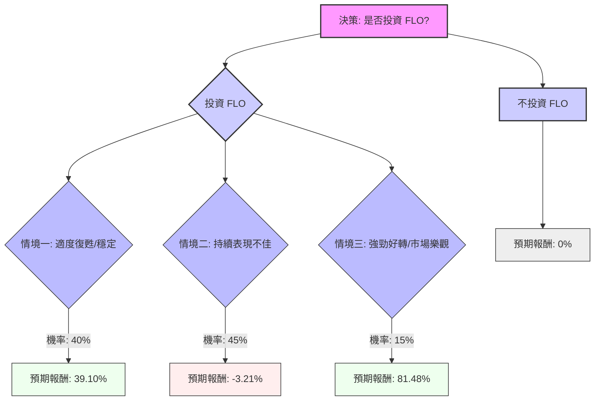

根據您提供的基本面數據以及最新的市場資訊，我們將對美股公司 **FLO (Flowers Foods, Inc.)** 進行決策樹分析與期望值分析，以評估其目前的投資適合性。

**核心假設：**

1.  **市場環境假設：**
    *   消費者必需品（Consumer Staples）板塊在2026年被視為市場領先者，反映出在不確定性增加時的防禦性投資趨勢。
    *   然而，通脹壓力、油價上漲可能導致食品投入和分銷成本增加，對公司盈利能力構成威脅。
    *   整體市場波動性依然存在，受地緣政治緊張局勢和通脹影響。
2.  **公司財務與營運假設：**
    *   **優勢：** FLO擁有強大的品牌組合（如Nature's Own, Dave's Killer Bread, Simple Mills），並透過策略性收購擴大產品線，專注於高端和健康導向產品。公司具有穩定的現金流。
    *   **挑戰：** 傳統麵包產品銷量持續疲軟，面臨整個品類的消費壓力。2025財年因無形資產減值產生了顯著的非現金費用，導致淨利潤大幅下降。2026財年的EPS和銷售預期被下調，且低於分析師預期。股息支付率高達247.50%，顯示其不可持續性，儘管預計未來一年會降至76.74%，但仍有疑慮。公司還面臨與員工分類訴訟相關的法律成本和客戶庫存去化問題。
    *   **管理層行動：** 公司正在進行全面的營運審查，並計劃增加品牌投資和優化供應鏈，以應對挑戰並推動未來增長。
3.  **分析師情緒假設：**
    *   分析師普遍給予「減持 (Reduce)」或「持有 (Hold)」評級。
    *   平均目標價介於10.67美元至12.60美元之間，相較於目前股價有27.48%至50.27%的潛在漲幅。
    *   然而，近期分析師對其2026年EPS預期進行了下調。
    *   目前股價接近52週低點（8.17美元），而52週高點為20.23美元。

---

### 決策樹分析 (Decision Tree Analysis)

**決策點：** 是否投資 FLO 股票？

**當前股價 (P0)：** 8.26 美元

**年度股息：** 0.2475 美元/股 * 4 = 0.99 美元

---

---

### 計算過程與期望值 (Expected Value Analysis)

**1. 情境定義與預期報酬計算：**

*   **情境一：適度復甦/穩定 (Moderate Recovery/Stabilization)**
    *   **情境描述：** 公司成功實施營運審查和品牌投資，高端品牌持續增長，傳統麵包銷量下降速度減緩，消費者必需品市場保持穩定或略有改善。
    *   **預期股價 (P1)：** 10.50 美元 (介於分析師平均目標價的低端與中端之間，反映部分成功)。
    *   **預期年度股息：** 0.99 美元 (假設維持當前股息)。
    *   **預期報酬 (Return1)：** ((P1 - P0) + 年度股息) / P0
        *   ((10.50 - 8.26) + 0.99) / 8.26 = (2.24 + 0.99) / 8.26 = 3.23 / 8.26 = **39.10%**
    *   **機率 (Probability1)：** 40% (考慮到公司面臨的挑戰和分析師的謹慎態度，但管理層有積極行動)。

*   **情境二：持續表現不佳 (Continued Underperformance)**
    *   **情境描述：** 營運改善緩慢，傳統麵包銷量加速下滑，通脹壓力持續，高股息支付率成為沉重負擔，可能導致股息削減或進一步的財務壓力。市場環境依然充滿挑戰。
    *   **預期股價 (P2)：** 7.50 美元 (股價可能跌至接近或略低於52週低點，反映負面消息和市場信心不足)。
    *   **預期年度股息：** 0.495 美元 (假設股息削減50%，即0.99美元 * 0.5)。
    *   **預期報酬 (Return2)：** ((P2 - P0) + 年度股息) / P0
        *   ((7.50 - 8.26) + 0.495) / 8.26 = (-0.76 + 0.495) / 8.26 = -0.265 / 8.26 = **-3.21%**
    *   **機率 (Probability2)：** 45% (鑑於分析師普遍「減持/持有」評級、EPS預期下調以及股息可持續性問題，此情境發生的可能性較高)。

*   **情境三：強勁好轉/市場樂觀 (Strong Turnaround/Market Optimism)**
    *   **情境描述：** 公司轉型努力顯著超出預期，高端品牌實現大幅增長，成本效率迅速提升，且整體市場情緒轉為高度樂觀，推動股票重新估值。
    *   **預期股價 (P3)：** 14.00 美元 (接近分析師目標價的高端，甚至可能因市場情緒而更高，但仍遠低於52週高點20.23美元，保持一定保守性)。
    *   **預期年度股息：** 0.99 美元 (假設維持當前股息)。
    *   **預期報酬 (Return3)：** ((P3 - P0) + 年度股息) / P0
        *   ((14.00 - 8.26) + 0.99) / 8.26 = (5.74 + 0.99) / 8.26 = 6.73 / 8.26 = **81.48%**
    *   **機率 (Probability3)：** 15% (雖然有潛力，但考慮到當前挑戰和分析師的謹慎態度，此情境發生的可能性較低)。

**2. 投資 FLO 的整體期望值 (Expected Value of Investing in FLO)：**

期望值 = (Return1 * Probability1) + (Return2 * Probability2) + (Return3 * Probability3)
期望值 = (0.3910 * 0.40) + (-0.0321 * 0.45) + (0.8148 * 0.15)
期望值 = 0.1564 + (-0.0144) + 0.1222
期望值 = **0.2642 或 26.42%**

**3. 不投資 FLO 的期望值：**

期望值 = **0%** (假設資金投入無風險資產或保持現金，不產生收益或損失)。

---

### 最終結論

根據決策樹分析和期望值計算，投資 FLO 股票的整體期望值為 **26.42%**。

**判斷：適合投資**

**理由：**
儘管 Flowers Foods (FLO) 面臨傳統產品銷量下滑、高股息支付率不可持續以及近期盈利預期下調等多重挑戰，且分析師普遍持謹慎態度（「減持」或「持有」評級），但其目前的股價（8.26美元）已接近52週低點。分析師的平均目標價仍有顯著的潛在漲幅（27.48% - 50.27%）。

更重要的是，公司正在積極採取措施，包括進行全面的營運審查、增加品牌投資（特別是高端和健康產品線如Dave's Killer Bread和Simple Mills）以及優化供應鏈。這些努力若能成功，將有助於改善其長期表現。

綜合考慮，即使在「持續表現不佳」的情境下，潛在損失也相對有限（-3.21%），而「適度復甦」和「強勁好轉」情境下的潛在收益則相當可觀。整體正向的期望值（26.42%）表明，在當前股價水平下，FLO 具有一定的投資吸引力，尤其對於願意承擔一定風險並相信公司轉型潛力的投資者而言。然而，投資者應密切關注公司營運審查的進展、品牌投資的效果以及股息政策的變化。