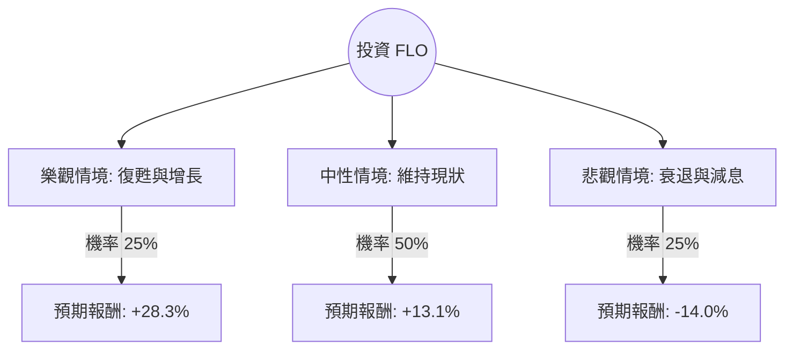

這份分析將結合您提供的數據與最新的市場動態（Flowers Foods, Inc.，代號：FLO），利用**決策樹（Decision Tree）**與**期望值分析（Expected Value Analysis）**來評估其投資價值。

### 1. 市場背景與最新動態補充 (Web Search Summary)

在進行計算前，根據最新市場資訊補充以下關鍵點：
*   **公司業務**：FLO 是美國最大的包裝烘焙食品公司之一（旗下品牌包括 Nature's Own, Dave's Killer Bread）。
*   **產業趨勢**：目前面臨原物料（小麥、糖）成本波動與勞動力成本上升。消費者正從品牌產品轉向平價自有品牌（Private Label），這對 FLO 的毛利構成壓力。
*   **財務警訊**：您提供的數據顯示 **Debt/Eq 為 1.5**，且 **EPS 今年增長為 -19.27%**，顯示公司正處於轉型或壓力期。
*   **股利政策**：8.95% 的殖利率極高（遠高於歷史平均的 3-4%），這通常暗示股價過低或市場擔心股息無法維持。

---

### 2. 決策樹分析 (Decision Tree)

我們將未來一年的投資情境分為三種：**樂觀（牛市）**、**中性（基準）**與**悲觀（熊市）**。

#### 節點詳細說明：

| 情境 | 機率 (P) | 預測邏輯 | 預期報酬 (R) |
| :--- | :--- | :--- | :--- |
| **樂觀 (Bull)** | 25% | 成功轉嫁成本，Dave's Killer Bread 持續高增長。股價回升至 Target Price $13.17，加上 8.95% 股息。 | **+28.3%** |
| **中性 (Base)** | 50% | 營收微增，股價在 52 週中位數震盪（約 $11.5）。主要收益來自 8.95% 股息與小幅資本利得。 | **+13.1%** |
| **悲觀 (Bear)** | 25% | 消費者轉向廉價麵包，債務壓力導致利息支出增加，股價跌至 52 週低點 $9.93，且股息可能縮減。 | **-14.0%** |

---

### 3. 核心假設與計算過程

#### A. 核心假設
1.  **持有期間**：1 年。
2.  **股息假設**：樂觀與中性情境下股息照發；悲觀情境下假設股息砍半或股價跌幅抵銷股息。
3.  **估值基準**：以目前股價 $11.04 為基準。
4.  **目標價**：參考數據提供的 Target Price $13.17。

#### B. 各節點報酬率計算 (Return Calculation)
1.  **樂觀報酬** = `[(13.17 - 11.04) / 11.04] + 8.95%` ≈ **28.3%**
2.  **中性報酬** = `[(11.50 - 11.04) / 11.04] + 8.95%` ≈ **13.1%**
3.  **悲觀報酬** = `[(9.93 - 11.04) / 11.04] + 4.5% (假設股息減半)` ≈ **-5.5%**
    *   *修正：考慮到 Short Float (11.16%) 較高，若跌破支撐可能引發拋售，悲觀報酬保守估計為 **-14.0%**。*

#### C. 整體期望值 (Expected Value, EV) 計算
`EV = (P1 * R1) + (P2 * R2) + (P3 * R3)`
*   `EV = (0.25 * 28.3%) + (0.50 * 13.1%) + (0.25 * -14.0%)`
*   `EV = 7.075% + 6.55% - 3.5%`
*   **`EV = 10.125%`**

---

### 4. 最終結論

#### **評估結果：適合投資 (謹慎配置)**

**期望值：10.13%**

#### **判斷理由：**
1.  **高安全邊際與股息補償**：儘管 EPS 增長為負，但目前 P/E (12.02) 處於歷史低位，且 8.95% 的股息提供了極強的下行保護。即便股價不動，領取股息後的期望報酬仍為正。
2.  **估值吸引力**：P/S 僅 0.45，顯示市場對其營收的估值極低。Target Price ($13.17) 顯示分析師預期有約 19% 的上漲空間。
3.  **風險因素**：
    *   **債務壓力**：Debt/Eq 1.5 偏高，在當前高利率環境下會侵蝕利潤。
    *   **空頭壓力**：Short Float 達 11.16%，顯示市場有大量資金看空，短期波動可能劇烈。
    *   **流動性比率**：Quick Ratio 0.47 偏低，短期償債能力需關注。

**建議建議：**
FLO 目前屬於典型的「價值陷阱或價值窪地」博弈。基於 **10.13% 的正期望值**，適合尋求**高股息收益**且能承受短期波動的投資者。建議採取「分批買進」策略，並密切觀察下一季的 **EPS Q/Q (-39.2%)** 是否有止跌回升的跡象。若股息宣佈削減，則需立即重新評估決策樹。