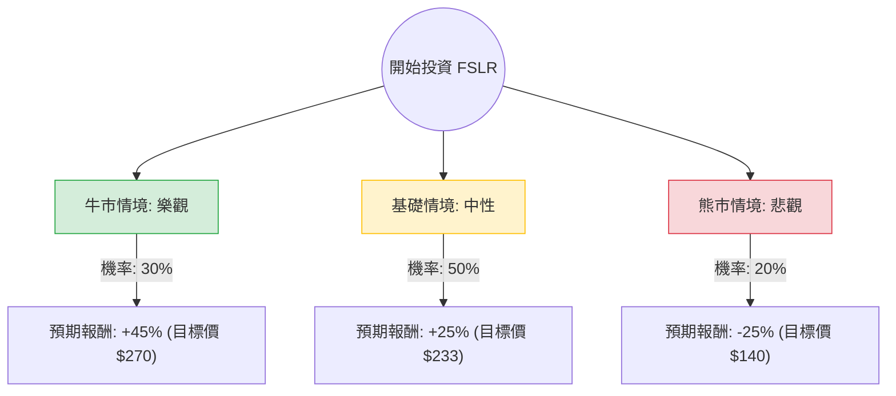

這份分析報告將結合您提供的財務數據與最新的市場動態（包含美國大選影響、AI 數據中心需求、以及 IRA 補貼政策），利用**決策樹（Decision Tree）**與**期望值分析（Expected Value Analysis）**評估 First Solar (FSLR) 的投資價值。

---

### 一、 核心假設與市場背景分析

在建立模型前，我們先定義影響 FSLR 股價的三大核心變數：

1.  **政策環境（IRA 補貼）**：FSLR 是《通膨削減法案》(IRA) 45X 稅收抵免的最大受益者。美國大選結果（川普 vs. 賀錦麗）對綠能補貼的存續至關重要。
2.  **AI 與數據中心需求**：大型科技公司（如 Google, Amazon, Microsoft）承諾使用 100% 再生能源，這為 FSLR 的薄膜太陽能板提供了長期穩定的訂單。
3.  **估值與技術面**：目前 Forward P/E 僅 7.78，PEG 0.29，顯示股價相對於盈餘成長極度低估；但技術面上股價處於 SMA200 以下，短期趨勢偏弱。

---

### 二、 決策樹分析 (Decision Tree)

以下決策樹模擬未來 12 個月內可能發生的三種主要情境：

#### 節點詳細說明：

1.  **牛市情境 (Bull Case) - 30% 機率**：
    *   **條件**：賀錦麗勝選或川普保留 45X 補貼（因 FSLR 工廠多在共和黨選區）；AI 數據中心簽署超大型採購協議；聯準會降息超預期。
    *   **預期報酬**：股價回升至歷史高點附近（約 $270），漲幅約 45%。
2.  **基礎情境 (Base Case) - 50% 機率**：
    *   **條件**：政策維持現狀，雖然有政治雜音但實質補貼未動；FSLR 產能持續擴張，EPS 達成預期的 33% 成長。
    *   **預期報酬**：回歸分析師平均目標價（$246.85），保守取 $233，漲幅約 25%。
3.  **熊市情境 (Bear Case) - 20% 機率**：
    *   **條件**：川普完全廢除 IRA 補貼；全球太陽能板供過於求導致價格崩跌；技術面跌破 52 週低點。
    *   **預期報酬**：股價下探支撐位（約 $140），跌幅約 25%。

---

### 三、 期望值計算 (Expected Value Calculation)

我們根據上述情境與目前股價 **$186.61** 進行計算：

| 情境 | 預期報酬率 (R) | 發生機率 (P) | 加權期望值 (R × P) |
| :--- | :--- | :--- | :--- |
| **牛市 (Bull)** | +45% | 0.30 | +13.5% |
| **基礎 (Base)** | +25% | 0.50 | +12.5% |
| **熊市 (Bear)** | -25% | 0.20 | -5.0% |
| **總計期望報酬** | | **1.00** | **+21.0%** |

**計算公式：**
$EV = (0.30 \times 45\%) + (0.50 \times 25\%) + (0.20 \times -25\%) = 13.5\% + 12.5\% - 5\% = 21.0\%$

---

### 四、 核心數據分析與補充資訊

1.  **極低的估值 (PEG 0.29)**：
    *   通常 PEG < 1 被視為低估，FSLR 的 0.29 顯示市場對其未來的成長潛力（EPS 下一年預計成長 33.8%）給予了極大的折扣，這主要是由於政治不確定性。
2.  **強大的資產負債表**：
    *   Debt/Eq 僅 0.07，在資本密集型的綠能產業中極為罕見。這意味著即使面臨高利率環境或政策波動，FSLR 也有極強的抗風險能力。
3.  **貿易保護壁壘**：
    *   最新動態顯示，美國商務部正對東南亞四國（中資企業避稅地）進行反傾銷調查。這對 FSLR 這種純美國本土製造商是重大利多，能維持其較高的毛利率 (40.88%)。
4.  **技術面警訊**：
    *   SMA20, 50, 200 均為負值，且股價 YTD 下跌 28.56%。這顯示目前市場情緒極度悲觀，雖然基本面好，但短期內可能仍有下行壓力。

---

### 五、 最終結論

#### **判斷：適合投資 (Buy on Weakness)**

**理由：**
1.  **期望值為正 (21%)**：即便考慮了 20% 的極端悲觀情境（補貼取消），整體的期望報酬率依然高達 21%，具備良好的風險回報比。
2.  **安全邊際高**：Forward P/E 僅 7.78 倍，幾乎是科技與成長股中的地板價。即便未來補貼縮減，其強大的訂單積壓（Backlog）也能支撐數年的營收。
3.  **AI 能源轉型受益者**：FSLR 不僅是綠能股，更是「AI 基礎設施股」。數據中心對穩定、本土清潔能源的需求是不可逆的趨勢。

**建議策略：**
由於目前技術面處於空頭排列（SMA200 以下），建議採取**分批買進（Dollar Cost Averaging）**策略，以應對大選前的波動。若股價進一步跌向 $160-$170 區間，將是極佳的長線佈局點。

---
*免責聲明：本分析僅供參考，不構成投資建議。投資者應自行承擔市場風險。*