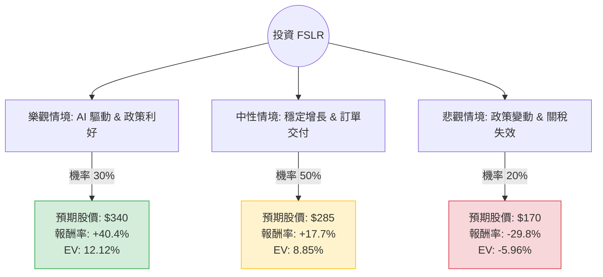

這份分析報告將結合您提供的 **First Solar (FSLR)** 基本面數據，以及最新的市場動態（包含政策影響、AI 數據中心需求、財報表現）進行綜合評估。

---

### 一、 市場動態與產業趨勢分析（網路搜尋補充）

在進入決策樹之前，我們先整理當前影響 FSLR 的核心外部因素：

1.  **政策紅利（IRA 法案）**：FSLR 是《通膨削減法案》（IRA）中 Section 45X 生產稅收抵免的最大受益者。這為其提供了極高的利潤護城河。
2.  **AI 與數據中心需求**：科技巨頭（如 Google, Amazon, Microsoft）承諾使用 100% 再生能源，AI 數據中心的爆發式電力需求轉化為對大型地面電站（Utility-scale）組件的強勁訂單，而這正是 FSLR 的主戰場。
3.  **貿易保護政策**：美國政府近期對東南亞四國及中國的太陽能產品加徵關稅，這減少了廉價進口產品的競爭，有利於 FSLR 這種美國本土製造商。
4.  **2024 美國大選風險**：這是目前最大的不確定性。若川普當選，市場擔心其可能廢除或削減 IRA 補貼，雖然完全廢除難度大，但情緒面會造成股價劇烈波動。

---

### 二、 決策樹分析（Decision Tree）

我們將未來一年的情境分為三種：**樂觀（AI 需求爆發+政策穩固）**、**中性（穩健增長）**、**悲觀（政策轉向+競爭加劇）**。

---

### 三、 核心假設與期望值計算

#### 1. 核心假設
*   **當前股價 ($P_0$)**：$242.11
*   **樂觀情境 ($P_{bull} = \$340$)**：AI 數據中心訂單超預期，且 2024 大選後 IRA 補貼確認安全。EPS 增長達到預期的上限（Forward P/E 降至 10 以下）。
*   **中性情境 ($P_{base} = \$285$)**：接近分析師平均目標價（$285.79）。公司按計畫擴產，毛利率維持在 40% 左右，訂單積壓（Backlog）持續增加。
*   **悲觀情境 ($P_{bear} = \$170$)**：大選後政策面出現極端不利消息，或全球多晶矽價格崩跌導致薄膜電池競爭力下降。股價回測 52 週低點附近。

#### 2. 期望值 (Expected Value, EV) 計算過程
期望值 = $\sum (機率 \times 報酬率)$

*   **樂觀情境 EV**：$0.30 \times \frac{340 - 242.11}{242.11} = 0.30 \times 40.43\% = 12.13\%$
*   **中性情境 EV**：$0.50 \times \frac{285 - 242.11}{242.11} = 0.50 \times 17.71\% = 8.86\%$
*   **悲觀情境 EV**：$0.20 \times \frac{170 - 242.11}{242.11} = 0.20 \times (-29.78\%) = -5.96\%$

**總體期望報酬率** = $12.13\% + 8.86\% - 5.96\% = \mathbf{15.03\%}$

---

### 四、 財務數據深度解讀（結合提供數據）

*   **極低的 PEG (0.31)**：這是一個非常強大的買入訊號。通常 PEG < 1 被視為低估，0.31 顯示市場嚴重低估了 FSLR 未來 55.98% 的 EPS 增長潛力。
*   **獲利能力強悍**：Gross Margin (40.32%) 與 Profit Margin (27.73%) 在太陽能製造業中屬於頂尖水準，這得益於其獨特的薄膜技術與補貼。
*   **資產負債表極其健康**：Debt/Eq 僅 0.1，Current Ratio 1.91。在利率高企的環境下，FSLR 幾乎沒有財務壓力，這與許多高負債的再生能源公司形成鮮明對比。
*   **技術面壓力**：SMA20 (-6.02%) 與 SMA50 (-6.64%) 顯示短期處於修正回檔，但 SMA200 (+19.9%) 顯示長期趨勢依然向上。目前股價處於 52 週高點回落約 15% 的位置，提供了較好的切入點。

---

### 五、 最終結論

**判斷：適合投資 (Buy / Overweight)**

#### 理由總結：
1.  **期望值為正**：經風險加權後的預期報酬率約為 **15.03%**，優於標普 500 指數的歷史平均表現。
2.  **估值極具吸引力**：Forward P/E 僅 10.61 倍，配合超過 50% 的增長率，PEG 0.31 顯示股價具有極高的安全邊際。
3.  **結構性需求**：AI 數據中心對綠電的剛性需求是未來 3-5 年的強大催化劑，這尚未完全反映在目前的股價中。
4.  **風險可控**：雖然有大選政策風險，但 FSLR 作為美國本土製造業龍頭，符合「美國製造」的政治正確，即便政黨輪替，完全取消補貼的機率較低。

**建議操作策略：**
由於短期技術指標（SMA20/50）偏弱，建議採取**分批買入**策略。目前 $242 附近已具備投資價值，若股價因大選情緒波動回落至 $210-$220 區間，則是更佳的加碼機會。