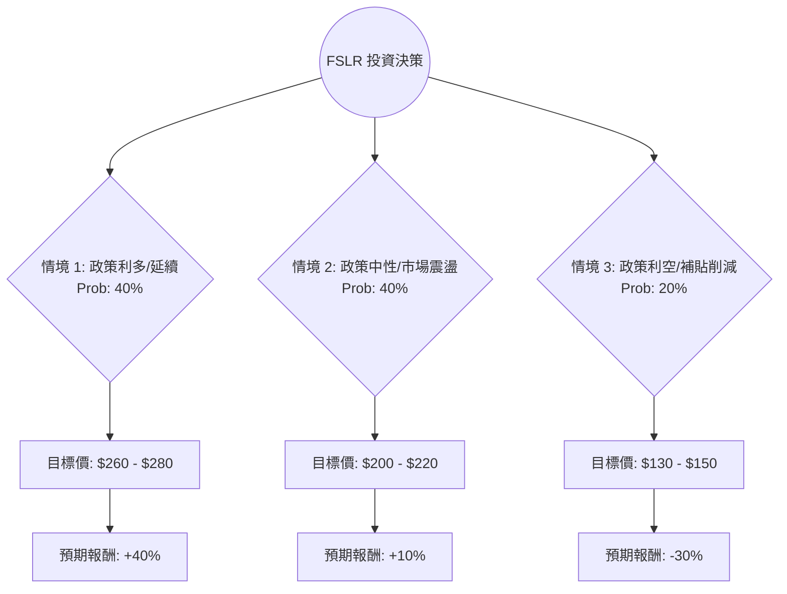

這份分析報告將結合您提供的基本面數據與最新的市場動態（包含 2024 年 Q3 財報、美國大選影響及 IRA 政策趨勢），利用**決策樹（Decision Tree）**與**期望值分析（Expected Value Analysis）**評估 First Solar (FSLR) 的投資價值。

---

### 一、 核心假設與市場背景分析

在建立決策樹之前，我們必須考慮影響 FSLR 的三大核心變數：

1.  **政治環境（美國大選）**：FSLR 是《通膨削減法案》(IRA) 的最大受益者。川普若勝選可能削弱補貼；賀錦麗勝選則維持現狀。
2.  **財務表現與產能**：FSLR 近期下調了 2024 全年營收指引（從 44-46 億降至 41-42.5 億），主因是產品保固問題與終端市場延遲。
3.  **估值水平**：目前 Forward P/E 僅 8.06，PEG 0.28，顯示市場已部分反映了政治風險，估值處於歷史低位。

---

### 二、 決策樹分析 (Decision Tree)

以下決策樹模擬未來 12 個月的可能情境：

#### 節點詳細說明：

| 節點 | 情境名稱 | 發生機率 (P) | 預期報酬 (R) | 說明 |
| :--- | :--- | :--- | :--- | :--- |
| **A** | **樂觀情境 (Bull Case)** | 40% | +40% | 賀錦麗勝選，IRA 補貼穩固，數據中心對太陽能需求爆發，解決保固問題。 |
| **B** | **基準情境 (Base Case)** | 40% | +10% | 大選結果膠著但 IRA 難以完全廢除，公司產能如期擴張，估值修復至平均水平。 |
| **C** | **悲觀情境 (Bear Case)** | 20% | -30% | 川普勝選並成功廢除部分稅收抵免，關稅政策導致成本上升，需求放緩。 |

---

### 三、 期望值計算 (Expected Value Calculation)

我們根據上述決策樹節點進行期望值計算：

**1. 計算公式：**
$$EV = (P_A \times R_A) + (P_B \times R_B) + (P_C \times R_C)$$

**2. 帶入數值：**
*   $EV = (0.40 \times 0.40) + (0.40 \times 0.10) + (0.20 \times -0.30)$
*   $EV = 0.16 + 0.04 - 0.06$
*   $EV = 0.14$ (即 **14%**)

**3. 核心假設依據：**
*   **財務面**：FSLR 的 ROE (17.45%) 與 Gross Margin (40.88%) 極其強勁，且幾乎沒有長期負債 (Debt/Eq 0.07)，這提供了極高的抗風險能力（安全邊際）。
*   **估值面**：PEG 0.28 顯示股價被嚴重低估。即便在悲觀情境下，其強大的現金流與技術領先地位也能支撐股價不至於歸零。
*   **產業面**：AI 數據中心對綠能的強烈需求是除了政策外的第二增長引擎。

---

### 四、 最終結論

#### **評估結果：適合投資 (Buy / Overweight)**

**判斷理由：**

1.  **期望值為正且具吸引力**：計算出的預期報酬率為 **14%**，優於多數保守型投資工具。考慮到目前股價已從高點回落約 32% (52W High -0.3258)，下行風險已得到部分釋放。
2.  **極高的安全邊際**：FSLR 擁有極低的負債比 (0.07) 與充沛的現金流。即便政策環境惡化，其作為美國本土最大薄膜太陽能製造商的戰略地位，使其在關稅保護下仍具競爭力。
3.  **估值極具優勢**：Forward P/E 僅 8 倍，對於一家 EPS 增長預期超過 30% 的公司來說，這屬於「價值陷阱」的可能性較低，更多是受政治不確定性壓制的「暫時性低估」。
4.  **技術面超賣**：SMA20, 50, 200 均線皆為負值，顯示短期處於超賣區間，適合分批布局。

**風險提示：**
*   **短期波動**：11 月美國大選前，股價可能因民調波動而劇烈震盪。
*   **政策風險**：若 IRA 補貼被完全廢除（雖然機率較低，因共和黨州亦受益於此），FSLR 的盈利模式將面臨結構性挑戰。

**建議策略：**
建議採取**分批進場**策略，利用目前 $190 附近的價位建立基本倉位，若大選後不確定性消除且股價站回 SMA50，再行加碼。