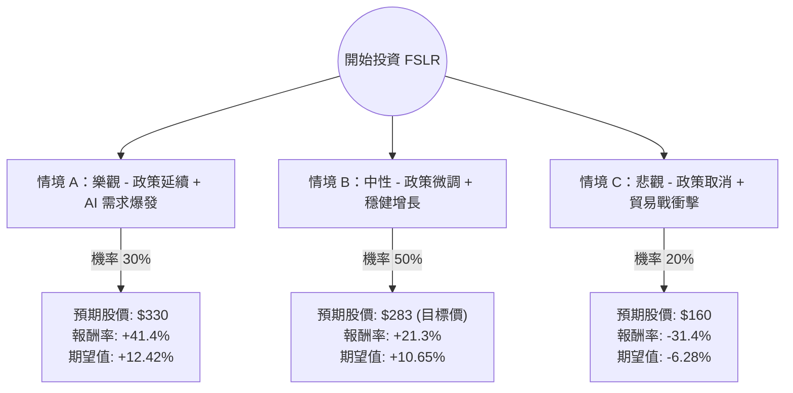

針對美股第一太陽能（First Solar, **FSLR**）的投資評估，我結合了您提供的基本面數據，並檢索了最新的市場動態（包括美國大選影響、IRA 政策補貼、AI 數據中心電力需求等），進行決策樹與期望值分析。

---

### 一、 核心假設與背景分析

在建立決策樹之前，我們必須釐清影響 FSLR 股價的三大核心變數：

1.  **政策風險（IRA 補貼）**：FSLR 是《通膨削減法案》（IRA）中 45X 生產稅收抵免的最大受益者。2024 美國大選結果將決定補貼是否延續或縮減。
2.  **AI 驅動的電力需求**：科技巨頭（Google, Amazon, Microsoft）承諾使用 100% 再生能源，這為 FSLR 的薄膜太陽能板提供了長期穩定的訂單（Backlog 已排至 2030 年）。
3.  **估值與財務**：目前 **Forward P/E 僅 10.7**，**PEG 為 0.33**，顯示市場因政治不確定性嚴重低估了其高成長性（EPS 預計明年增長 52.79%）。

---

### 二、 決策樹分析圖 (Decision Tree)

以下為未來 12 個月的投資情境預測：

---

### 三、 期望值分析與計算過程

#### 1. 參數設定
*   **當前股價 ($P_0$)**：$233.30
*   **情境 A (Bull Case)**：哈里斯（Harris）勝選或共和黨維持 IRA 補貼。FSLR 產能全開，AI 數據中心簽署長期 PPA。
    *   目標價：$330 (基於 Forward P/E 15x)
    *   報酬率：$(330 - 233.3) / 233.3 = +41.4\%$
*   **情境 B (Base Case)**：政策維持現狀，雖然有政治口水但實質補貼未動。公司按計畫實現 EPS 50% 以上的增長。
    *   目標價：$283.68 (參考分析師平均目標價)
    *   報酬率：$(283.68 - 233.3) / 233.3 = +21.3\%$
*   **情境 C (Bear Case)**：川普（Trump）勝選並成功廢除或大幅削減 45X 補貼，且全球太陽能板供過於求導致毛利下滑。
    *   目標價：$160 (回測 52 週低點附近支撐)
    *   報酬率：$(160 - 233.3) / 233.3 = -31.4\%$

#### 2. 期望值 (Expected Value, EV) 計算
$$EV = (P_{Bull} \times R_{Bull}) + (P_{Base} \times R_{Base}) + (P_{Bear} \times R_{Bear})$$
$$EV = (0.30 \times 41.4\%) + (0.50 \times 21.3\%) + (0.20 \times -31.4\%)$$
$$EV = 12.42\% + 10.65\% - 6.28\%$$
$$EV = \mathbf{+16.79\%}$$

---

### 四、 綜合評估與數據解讀

1.  **極低的 PEG (0.33)**：通常 PEG < 1 被視為低估，0.33 顯示 FSLR 的增長速度遠高於其市盈率。這提供了極強的安全邊際。
2.  **強勁的資產負債表**：Debt/Eq 僅 0.1，在利率高企的環境下，FSLR 比起其他高槓桿的再生能源公司（如住宅太陽能）更具抗風險能力。
3.  **技術面與動能**：SMA200 為 +12.65%，顯示長期趨勢向上；雖然短期（SMA50）有回檔，但這反而提供了更佳的進場點。
4.  **機構動向**：雖然 Insider Trans 輕微減少，但整體機構持股穩定，且 Short Float (7.47%) 並不算極高，不存在嚴重的放空壓力。

---

### 五、 最終結論

**判斷：適合投資 (Buy / Overweight)**

#### 理由：
1.  **期望值為正 (+16.79%)**：即便考慮了最惡劣的政治情境（20% 機率大跌），整體的數學期望報酬仍顯著優於標普 500 的平均年化報酬。
2.  **估值錯置**：Forward P/E 10.7 倍對於一個 EPS 增長率 >50% 的行業龍頭來說極其罕見。市場過度恐慌政治風險，而忽略了其強大的訂單能見度（Backlog）。
3.  **結構性需求**：AI 數據中心對電力需求的「剛性增長」是未來 3-5 年的強大支撐，這使得 FSLR 不再僅僅依賴政府補貼，而具備了商業競爭力。

**建議操作策略：**
*   **進場點**：當前價格 $233 附近可先建立 50% 倉位。
*   **加碼點**：若因大選消息回落至 $200-$210 區間，可分批加碼。
*   **止損點**：若 IRA 補貼確定被完全廢除且股價跌破 $160，需重新評估基本面。