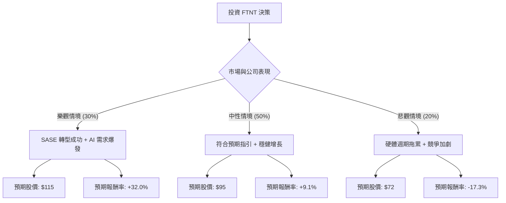

這份分析報告將結合您提供的基本面數據，以及最新的市場動態（包含 2024 年 Q3 財報表現與產業趨勢），利用**決策樹（Decision Tree）**與**期望值分析（Expected Value Analysis）**評估 Fortinet (FTNT) 的投資價值。

---

### 一、 最新市場動態與產業趨勢補充

根據最新網路資訊與財報（2024 Q3）：
1.  **財報表現亮眼**：FTNT 最近一季營收達 15.1 億美元（年增 13%），營業利益率（Operating Margin）達到創紀錄的 36%，遠高於預期。
2.  **轉型策略**：公司正從傳統的防火牆硬體轉向 **Unified SASE**（安全存取服務邊緣）與 **SecOps**（安全營運）。這兩個領域的訂單（Billings）增長強勁，抵銷了硬體需求放緩的壓力。
3.  **上修指引**：公司上調了 2024 全年的營收與利潤指引，顯示管理層對未來幾季持樂觀態度。
4.  **競爭環境**：面臨 Palo Alto Networks (PANW) 與 CrowdStrike (CRWD) 的激烈競爭，但 FTNT 憑藉自研 ASIC 晶片的成本優勢，在毛利（80.46%）上保持領先。

---

### 二、 決策樹分析 (Decision Tree)

我們以未來 12 個月的投資回報為目標，設定三種情境：**樂觀（Bull）**、**中性（Base）**、**悲觀（Bear）**。

#### 節點詳細說明：
1.  **樂觀情境 (30%)**：FTNT 在 SASE 市場份額快速擴張，且企業因 AI 安全需求加大防火牆更新力道。預期股價挑戰歷史高點附近（約 $115）。
2.  **中性情境 (50%)**：公司維持目前 10-15% 的營收增長，利潤率保持高位。股價隨大盤與產業平均本益比波動，目標價略高於目前分析師平均目標（約 $95）。
3.  **悲觀情境 (20%)**：硬體銷售進入長期停滯，且 SASE 轉型速度不如預期，導致估值修正（P/E 回落至 20x 左右）。股價回測 52 週低點附近（約 $72）。

---

### 三、 期望值分析與計算過程

#### 1. 核心假設
*   **當前股價 ($P_0$)**：$87.09
*   **時間維度**：12 個月。
*   **估值邏輯**：
    *   **樂觀**：Forward P/E 升至 35x（成長加速）。
    *   **中性**：Forward P/E 維持在 28x-30x（穩定成長）。
    *   **悲觀**：Forward P/E 降至 22x（成長放緩）。

#### 2. 期望報酬率計算
計算公式：$E(R) = \sum (Probability_i \times Return_i)$

*   **樂觀報酬 ($R_{bull}$)**：$(115 - 87.09) / 87.09 = +32.05\%$
*   **中性報酬 ($R_{base}$)**：$(95 - 87.09) / 87.09 = +9.08\%$
*   **悲觀報酬 ($R_{bear}$)**：$(72 - 87.09) / 87.09 = -17.33\%$

**期望值計算：**
$$E(R) = (0.30 \times 32.05\%) + (0.50 \times 9.08\%) + (0.20 \times -17.33\%)$$
$$E(R) = 9.615\% + 4.54\% - 3.466\%$$
$$E(R) = 10.689\%$$

#### 3. 期望股價計算
$$E(Price) = 87.09 \times (1 + 10.689\%) \approx \$96.40$$

---

### 四、 綜合評估與最終結論

#### 數據分析要點：
*   **高獲利能力**：ROE (135.72%) 與 Gross Margin (80.46%) 極其強悍，顯示公司具備極高的營運效率與護城河。
*   **估值合理性**：Forward P/E 為 26.35，相較於其歷史水平與同業（如 PANW 的 50+ P/E），FTNT 目前不算太貴。
*   **技術面**：股價位於 SMA20/50/200 之上，呈現多頭排列，短期動能強勁。
*   **風險點**：P/B (52.29) 極高，反映資產結構輕量化但對溢價敏感；PEG (2.64) 顯示相對於增長速度，目前股價已反映大部分利多。

#### 最終結論：**適合投資 (建議分批買入)**

**理由：**
1.  **期望值為正**：計算出的預期報酬率約為 **10.69%**，優於無風險利率及多數保守型資產。
2.  **轉型成效顯現**：最新財報證明了 FTNT 從硬體轉向軟體服務（SASE）的邏輯成立，這將提升未來收入的穩定性（訂閱制）。
3.  **利潤率護城河**：在競爭激烈的資安市場，FTNT 擁有 30% 以上的營業利益率，具備極強的抗風險能力與現金流產生能力（P/FCF 28.95 屬合理）。
4.  **投資策略建議**：由於目前股價已接近分析師平均目標價 ($87.4)，且短期漲幅較大（Perf Week 9.35%），建議不要一次性追高，而是在股價回測 $82 - $85 區間時分批佈局，以獲取更高的安全邊際。

**風險提示**：需密切關注下一季的 **Billings（訂單額）** 增長是否放緩，以及宏觀經濟是否導致企業 IT 支出縮減。