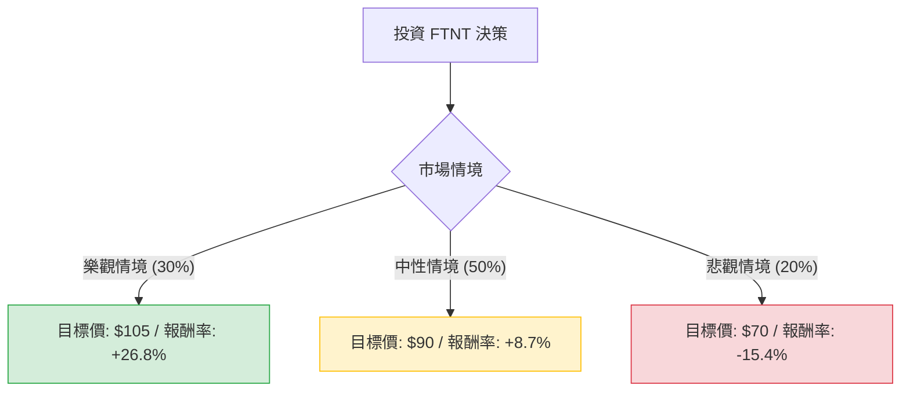

這份分析報告將結合您提供的基本面數據，以及最新的市場動態（包含 2024 年第三季財報表現與產業趨勢），利用**決策樹（Decision Tree）**與**期望值分析（Expected Value Analysis）**評估 Fortinet (FTNT) 的投資價值。

---

### 1. 最新市場動態與背景分析 (Context)

在進行決策樹分析前，整合最新資訊如下：
*   **強勁的 Q3 財報**：Fortinet 最近公佈的 2024 Q3 財報顯示，營收成長 13%，非 GAAP 營運利潤率達到創紀錄的 36%。
*   **策略轉型**：公司正從傳統的防火牆硬體轉向 **SASE (安全存取服務邊緣)** 與 **SecOps (安全營運)**。這兩塊領域是目前網路安全的高成長區。
*   **財務穩健**：ROE 高達 135.7%，毛利率 80.46%，顯示其在產業中擁有極強的定價權與獲利能力。
*   **估值**：Forward P/E 約 25 倍，相較於同行 Palo Alto Networks (PANW) 或 CrowdStrike (CRWD) 較為「便宜」，但帳面價值比 (P/B) 極高，反映市場對其無形資產與品牌溢價的認可。

---

### 2. 決策樹分析 (Decision Tree)

我們將未來一年的投資情境分為三種：**樂觀（Bull）**、**中性（Base）**、**悲觀（Bear）**。

#### 節點詳細說明：

| 情境 | 機率 (P) | 預期股價 | 預期報酬率 (R) | 說明 |
| :--- | :--- | :--- | :--- | :--- |
| **樂觀 (Bull)** | 30% | $105 | +26.8% | SASE 轉型極為成功，AI 安全需求爆發，營收成長加速回升至 20% 以上。 |
| **中性 (Base)** | 50% | $90 | +8.7% | 符合分析師平均目標價 ($88.58)，維持穩定獲利，防火牆更新週期平穩。 |
| **悲觀 (Bear)** | 20% | $70 | -15.4% | 企業 IT 支出縮減，競爭對手 (PANW) 搶佔市佔，硬體需求持續疲軟。 |

---

### 3. 期望值計算過程 (Expected Value Calculation)

#### A. 核心假設：
1.  **現價**：$82.77 (基準值)。
2.  **樂觀假設**：基於 52 週高點 ($109) 附近的壓力位，考量 SASE 成長動能，給予 $105 目標。
3.  **中性假設**：參考分析師平均目標價 $88.58，取整數 $90。
4.  **悲觀假設**：參考 52 週低點 ($70.12) 作為強力支撐位。

#### B. 計算公式：
$EV = (P_{Bull} \times R_{Bull}) + (P_{Base} \times R_{Base}) + (P_{Bear} \times R_{Bear})$

#### C. 計算步驟：
1.  **樂觀貢獻**：$0.30 \times 26.8\% = 8.04\%$
2.  **中性貢獻**：$0.50 \times 8.7\% = 4.35\%$
3.  **悲觀貢獻**：$0.20 \times (-15.4\%) = -3.08\%$

**總期望報酬率 (Total Expected Return) = 8.04% + 4.35% - 3.08% = 9.31%**

---

### 4. 綜合評估與最終結論

#### 核心數據支持：
*   **獲利能力**：Operating Margin (30.51%) 與 Gross Margin (80.46%) 極其優異，遠高於軟體業平均。
*   **估值合理性**：PEG 為 2.51，雖然不算極度便宜，但 Forward P/E 25x 對於一家在網路安全領域領先且高獲利的公司來說屬於合理區間。
*   **技術面**：股價目前在 SMA20 與 SMA50 之上，顯示短期趨勢偏多，但仍低於 SMA200，代表長期大趨勢仍在修復中。

#### 最終判斷：適合投資 (適合分批佈局)

**理由：**
1.  **正向期望值**：9.31% 的預期報酬率優於現金部位，且在網路安全產業中，FTNT 的下行風險（悲觀情境）相對受控，因為其擁有強大的現金流與高回購能力。
2.  **轉型紅利**：市場目前尚未完全定價其 SASE 業務的成功。若 2025 年 SASE 營收佔比持續提升，估值有機會上修（Re-rating）。
3.  **財務韌性**：1.35 的 ROE 與穩定的 Current Ratio (1.17) 顯示公司在宏觀經濟波動時具有較強的抗風險能力。

**建議策略：**
由於目前股價接近中性目標價，建議**不要一次性歐印 (All-in)**。可在 $80-$82 區間分批進場，若股價回測 $75 附近可加碼，首波獲利了結目標設在 $90-$95 之間。

---
*免責聲明：以上分析僅供參考，不構成具體投資建議。投資美股具有風險，請根據個人風險承受能力做出決策。*