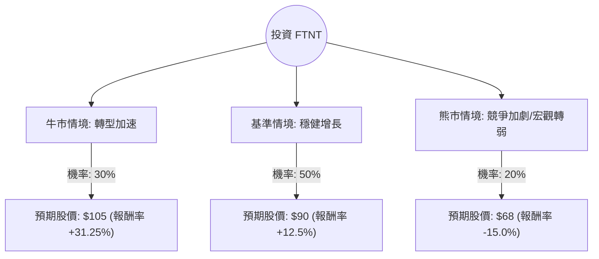

針對美股網路安全巨頭 **Fortinet (FTNT)**，我結合了您提供的基本面數據，並檢索了最新的市場動態（包括 2024 年 Q3 財報表現與產業趨勢），進行以下決策樹與期望值分析。

---

### 一、 核心假設與市場背景分析

在建立模型前，我們先釐清影響 FTNT 股價的三大核心變數：

1.  **產品轉型（SASE 與 SecOps）**：Fortinet 正從傳統的防火牆硬體轉向高毛利的軟體服務（SASE）與安全營運（SecOps）。最新財報顯示服務收入增長強勁，抵銷了硬體需求放緩的壓力。
2.  **獲利能力與現金流**：FTNT 擁有極高的毛利率 (82.3%) 與營運利潤率 (30.5%)，且 P/FCF (27.29) 顯示其產生現金的能力優於多數成長型科技股。
3.  **估值水平**：目前 Forward P/E 約 24.74 倍，相較於歷史平均與競爭對手（如 Palo Alto Networks），估值處於相對合理的區間。

---

### 二、 決策樹分析 (Decision Tree)

以下為 FTNT 未來 12 個月的投資決策模型：

#### 節點詳細說明：

1.  **牛市情境 (Bull Case) - 30% 機率**：
    *   **條件**：SASE 業務增長超預期，企業防火牆更新週期提前啟動，聯準會降息帶動科技股估值擴張。
    *   **預期報酬**：股價挑戰歷史高點區域，約 $105。
2.  **基準情境 (Base Case) - 50% 機率**：
    *   **條件**：符合公司指引（Guidance），營收維持 10-15% 增長，利潤率保持穩定。市場消化目前的 P/E 估值。
    *   **預期報酬**：接近分析師平均目標價 $89.4，約 $90。
3.  **熊市情境 (Bear Case) - 20% 機率**：
    *   **條件**：硬體需求持續疲軟，競爭對手（如 Palo Alto 或 CrowdStrike）大幅侵蝕市佔率，宏觀經濟衰退導致企業縮減 IT 支出。
    *   **預期報酬**：回測 52 週低點支撐位，約 $68。

---

### 三、 期望值分析 (Expected Value Analysis)

#### 1. 計算過程
我們以目前股價 **$80.00** 為基準，計算未來一年的預期報酬率期望值：

*   **牛市期望值**：$31.25\% \times 0.30 = 9.375\%$
*   **基準期望值**：$12.50\% \times 0.50 = 6.25\%$
*   **熊市期望值**：$-15.00\% \times 0.20 = -3.00\%$

**總體期望報酬率 (Total EV)** = $9.375\% + 6.25\% - 3.00\% = \mathbf{12.625\%}$

#### 2. 核心財務指標支持
*   **PEG 2.48**：雖然略高，但考量到其 **ROE (1.3572)** 極高且 **ROI (1.0688)** 表現優異，顯示公司資本利用效率極佳。
*   **Forward P/E (24.74)**：低於當前 P/E (33.66)，預示市場預期未來一年盈餘將顯著增長。
*   **SMA 指標**：目前股價在 SMA50 之上但低於 SMA200，顯示短期趨勢轉強，但長期仍有回升空間。

---

### 四、 最終結論

**投資建議：適合投資 (Buy / Overweight)**

#### 判定理由：
1.  **正向期望值**：經機率加權後的預期報酬率為 **12.625%**，優於標普 500 指數的長期平均回報（約 8-10%），具有投資吸引力。
2.  **財務護城河穩固**：82.3% 的高毛利與強勁的自由現金流（P/FCF 27.29）為股價提供了良好的下行保護（Downside Protection）。
3.  **估值修復空間**：目前股價 ($80) 距離分析師目標價 ($89.4) 仍有約 11.7% 的上漲空間，且 Forward P/E 顯示估值並未過熱。
4.  **產業趨勢利好**：網路安全是企業 IT 支出中最具韌性的部分。Fortinet 在 SASE 領域的成功轉型將成為未來 1-2 年的股價催化劑。

**風險提示**：需密切關注每季的「帳單金額 (Billings)」增長率，若該指標連續下滑，則需重新評估熊市情境的機率。