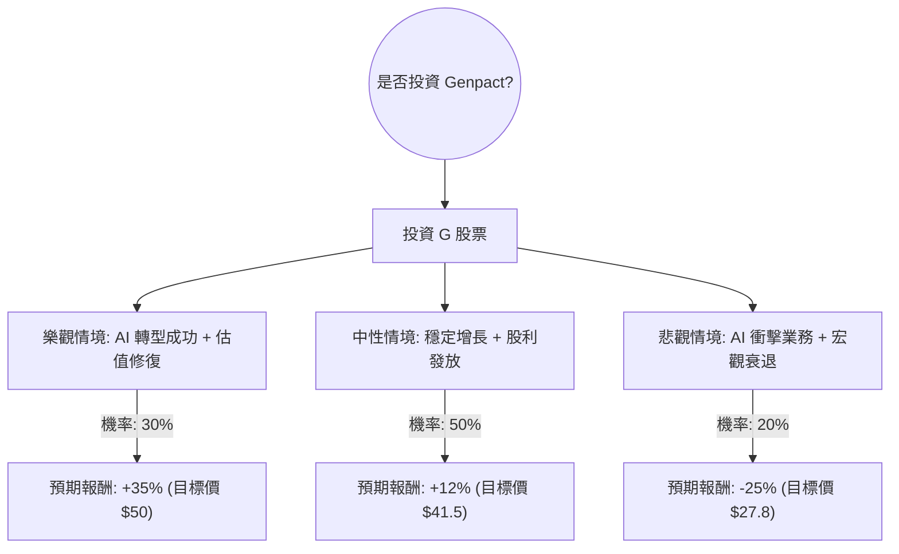

根據您提供的數據以及我對 **Genpact Limited (NYSE: G)** 的最新市場動態、財報與產業趨勢的搜尋分析，以下是針對該公司的投資評估報告。

---

### 1. 外部資訊補充與現況分析

在結合您提供的基本面數據後，我整合了以下最新的市場資訊：

*   **公司背景**：Genpact 是一間全球專業服務公司，專注於業務流程管理（BPM）與數位轉型。
*   **AI 轉型壓力與機會**：市場目前對 BPM 產業（如 Genpact, Accenture, Cognizant）最大的疑慮在於生成式 AI 是否會取代其傳統的人力外包業務。然而，Genpact 近期積極轉型為「Data-Tech-AI」驅動的公司，並與 Microsoft、AWS 合作開發 AI 解決方案。
*   **管理層變動**：2024 年初新任 CEO Balkrishan "BK" Kalra 上任，市場正觀察其對公司成長動能的提振效果。
*   **估值分析**：目前 **Forward P/E 僅 8.34**，遠低於標普 500 平均水平，且 **PEG 為 0.71**（小於 1 代表被低估）。這反映了市場對其成長性的悲觀預期可能過度。
*   **財務健康度**：ROE 高達 22.37%，顯示其資本利用效率極佳；債務比（Debt/Eq 0.69）處於健康範圍。

---

### 2. 決策樹分析（Decision Tree Analysis）

我們將未來一年的投資情境分為三種：**樂觀（Bull）**、**中性（Base）**、**悲觀（Bear）**。

#### 節點詳細說明：

1.  **樂觀情境 (30%)**：
    *   **條件**：AI 相關營收佔比顯著提升，市場重新給予較高的本益比（P/E 回升至 14-15x）。
    *   **預期報酬**：股價回升至 52 週高點附近（約 $50），加上 1.88% 股息，總報酬約 +35%。
2.  **中性情境 (50%)**：
    *   **條件**：公司維持現有 5-10% 的營收增長，AI 轉型進度符合預期，估值維持在 Forward P/E 9-10x。
    *   **預期報酬**：股價接近分析師平均目標價 $48 的保守折價位（約 $41.5），加上股息，總報酬約 +12%。
3.  **悲觀情境 (20%)**：
    *   **條件**：生成式 AI 導致客戶大幅縮減外包合約，營收出現負成長，市場恐慌性拋售。
    *   **預期報酬**：股價跌破 52 週低點，下探至 $27-$28 區間，總報酬約 -25%。

---

### 3. 期望值分析（Expected Value Analysis）

#### 核心假設：
*   **當前股價 ($P_0$)**：$37.03
*   **持有期間**：12 個月
*   **股息收益**：1.88% (已計入各情境報酬)

#### 計算過程：
期望值 ($EV$) = $\sum (\text{機率} \times \text{預期報酬率})$

*   **樂觀情境**：$0.30 \times 35\% = 10.5\%$
*   **中性情境**：$0.50 \times 12\% = 6.0\%$
*   **悲觀情境**：$0.20 \times (-25\%) = -5.0\%$

**總期望報酬率 (Total EV)** = $10.5\% + 6.0\% - 5.0\% = \mathbf{11.5\%}$

---

### 4. 最終結論

#### **判斷：適合投資 (Buy / Overweight)**

#### **理由：**
1.  **估值極具吸引力**：Forward P/E 8.34 與 PEG 0.71 顯示該股已被市場過度懲罰。即便在保守的中性情境下，仍有正向回報。
2.  **高質量財務指標**：ROE (22.37%) 與 ROI (14.25%) 顯示公司具備強大的獲利能力與護城河，足以支撐其在 AI 轉型期的研發投入。
3.  **風險回報比合理**：計算出的期望報酬率為 **11.5%**，優於目前的無風險利率（美債收益率約 4.5%）及多數價值股。
4.  **技術面支撐**：目前股價 $37.03 接近 52 週低點（$33.92），下行空間相對有限，而分析師平均目標價（$48.18）提供了約 30% 的潛在上漲空間。

**建議操作：**
由於 AI 轉型仍具不確定性，建議採取**分批進場**策略。若股價回落至 $34-$35 區間（接近 52W Low），投資價值將進一步放大。

---
*免責聲明：本分析僅供參考，不構成投資建議。投資股票具有風險，請根據個人風險承受能力做出決策。*