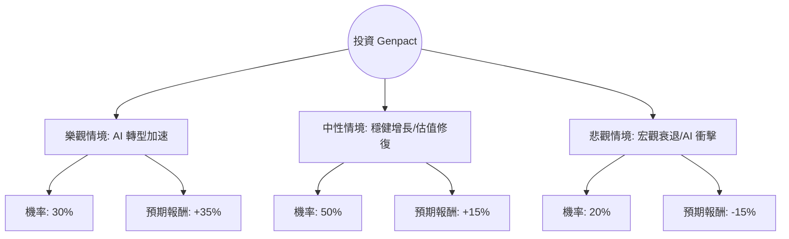

根據您提供的數據以及對 **Genpact (NYSE: G)** 的最新市場動態分析，以下是針對該公司的投資評估報告。

---

### 1. 市場背景與最新動態分析 (Market Context)

**Genpact (G)** 是一家全球專業服務公司，專注於業務流程管理 (BPM) 和數位轉型。
*   **最新財報表現**：Genpact 在最近的 2024 年第三季度財報中表現優異，營收與 EPS 均超出市場預期。公司上調了全年業績指引，顯示出強勁的營運韌性。
*   **AI 轉型趨勢**：Genpact 正積極將生成式 AI (GenAI) 整合至其服務中。雖然市場曾擔心 AI 會取代傳統 BPO 業務，但目前數據顯示 AI 反而推動了客戶對數據清洗與流程自動化的需求。
*   **估值優勢**：目前 **Forward P/E 僅 8.72**，遠低於行業平均水平。**PEG 0.76** 顯示其股價相對於增長潛力被低估。
*   **技術面**：股價過去一年表現疲軟 (-21.72%)，目前處於低位反彈階段，距離 52 週高點仍有較大空間。

---

### 2. 決策樹分析 (Decision Tree Analysis)

我們將未來一年的投資預期分為三種情境：**樂觀 (Bull)**、**中性 (Base)**、**悲觀 (Bear)**。

#### 決策樹節點詳細說明：

| 情境 | 機率 (P) | 預期報酬 (R) | 說明 |
| :--- | :--- | :--- | :--- |
| **樂觀 (Bull)** | 30% | +35% | AI 專案貢獻顯著，營收增長超預期，股價回歸 Target Price ($48.64) 以上。 |
| **中性 (Base)** | 50% | +15% | 業務穩定增長，Forward P/E 從 8.7 倍修復至歷史平均約 11-12 倍。 |
| **悲觀 (Bear)** | 20% | -15% | 全球經濟衰退導致企業縮減支出，或 AI 導致傳統外包訂單流失。 |

---

### 3. 期望值分析 (Expected Value Analysis)

#### A. 核心假設
1.  **當前股價 ($P_0$)**: $38.70
2.  **目標價 ($P_{target}$)**: 分析師平均目標價為 $48.64 (約 +25.7%)。
3.  **估值修復**: 考慮到其 ROE 高達 22.37%，目前的低 P/E 具有極強的安全邊際。
4.  **股利收益**: 1.8% 的股息率提供額外的現金流回報。

#### B. 計算過程
期望值 (EV) = $\sum (機率 \times 預期報酬)$

*   **樂觀情境貢獻**: $0.30 \times 35\% = 10.5\%$
*   **中性情境貢獻**: $0.50 \times 15\% = 7.5\%$
*   **悲觀情境貢獻**: $0.20 \times (-15\%) = -3.0\%$

**總期望報酬率 (Expected Return)** = $10.5\% + 7.5\% - 3.0\% = \mathbf{15.0\%}$

#### C. 期望價值 (Expected Stock Price)
$38.70 \times (1 + 15.0\%) = \mathbf{\$44.50}$

---

### 4. 綜合評估與最終結論

#### 財務數據亮點總結：
*   **超低估值**：Forward P/E 8.72 與 PEG 0.76 顯示該股極具吸引力。
*   **高獲利能力**：ROE 22.37% 與 ROI 14.25% 證明管理層資本利用效率極高。
*   **財務穩健**：Current Ratio 1.66，債務水平 (Debt/Eq 0.69) 尚在合理範圍。
*   **技術面反轉**：雖然過去一年跌幅大，但近期 (Perf Week +1.04%) 已有止跌跡象，且股價遠低於分析師目標價。

#### 最終判斷：**適合投資 (Suitable for Investment)**

#### 理由：
1.  **正向期望值**：15% 的預期報酬率顯著高於無風險利率，且風險回報比 (Risk/Reward Ratio) 優異。
2.  **安全邊際高**：目前的 P/E 處於歷史低位，即便在悲觀情境下，其強勁的現金流 (P/FCF 8.95) 與股息也能提供支撐。
3.  **AI 催化劑**：Genpact 不僅是傳統 BPO，更是數據服務商。在 AI 時代，企業需要 Genpact 協助整理數據，這將成為長期增長引擎。
4.  **分析師共識**：Recom 指數 2.13 (介於買入與持有之間)，目標價 $48.64 提供了明確的上行空間。

**建議操作：**
可在 $38 - $39 區間分批建倉，首個目標價設為 $45 (估值修復)，長期目標價 $48.64。需留意宏觀經濟放緩對企業 IT 支出的影響。