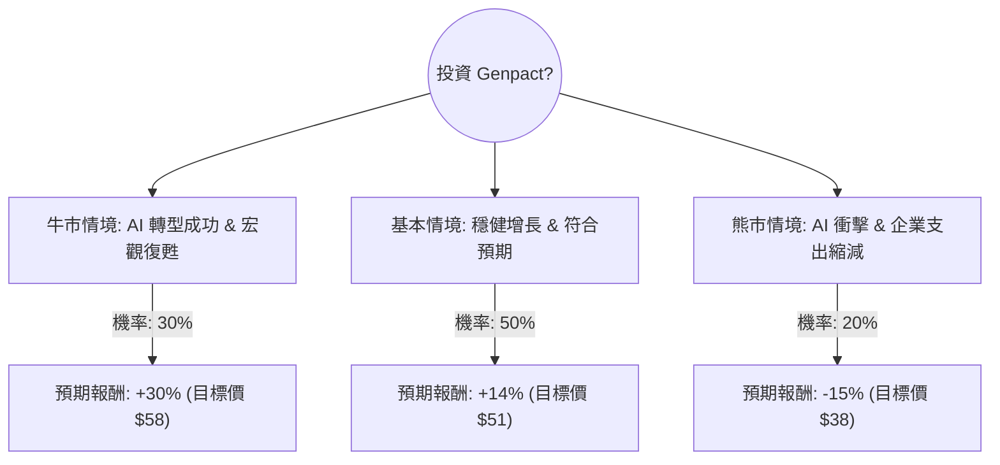

根據您提供的數據以及對 **Genpact Limited (G)** 的最新市場動態、財報表現及產業趨勢的檢索分析，以下是使用「決策樹」與「期望值分析」進行的投資評估。

---

### 1. 背景資訊與核心假設

**公司概況：**
Genpact (G) 是一家全球專業服務公司，專注於業務流程管理 (BPM) 和數位轉型。目前正積極將生成式 AI (GenAI) 整合至其服務中。

**核心假設：**
1.  **AI 轉型影響：** AI 是雙面刃。若成功整合，可提高利潤率；若進度落後，可能被自動化工具取代現有勞動力業務。
2.  **宏觀經濟：** 企業支出預算受利率環境影響。若 2025 年降息路徑明確，企業數位轉型支出將增加。
3.  **估值基準：** 目前 P/E (14.57) 低於行業平均，Forward P/E (11.44) 顯示市場預期增長，目標價 $50.91 提供約 13.7% 的潛在漲幅。

---

### 2. 決策樹分析 (Decision Tree)

以下決策樹模擬未來一年的三種主要情境：

#### 決策樹節點詳細說明：

| 情境節點 | 發生機率 (P) | 預期報酬 (R) | 說明 |
| :--- | :--- | :--- | :--- |
| **牛市情境 (Bull)** | 30% | +30% | AI 服務收入超預期，利潤率因自動化大幅提升，估值修復至 P/E 18x。 |
| **基本情境 (Base)** | 50% | +14% | 達到分析師目標價 $50.91。營收穩定增長 6-8%，維持現有派息。 |
| **熊市情境 (Bear)** | 20% | -15% | 傳統 BPM 業務被 AI 侵蝕速度過快，企業縮減外包預算，股價回測 52 週低點。 |

---

### 3. 期望值分析 (Expected Value Analysis)

#### 計算過程：
期望值 (EV) = Σ (各情境機率 × 各情境報酬)

*   **牛市貢獻：** $0.30 \times 30\% = 9\%$
*   **基本貢獻：** $0.50 \times 14\% = 7\%$
*   **熊市貢獻：** $0.20 \times (-15\%) = -3\%$

**總期望報酬率 (Total EV) = 9% + 7% - 3% = 13%**

#### 財務數據支持點：
1.  **盈利能力：** ROE 22.32% 極為強勁，顯示公司利用股東資本效率高。
2.  **估值安全邊際：** PEG 1.1 接近 1，顯示股價相對於增長率並未過度泡沫。
3.  **現金流：** P/FCF 12.01 顯示公司產生現金能力強，足以支撐股息與 AI 研發投入。
4.  **技術面：** 目前股價 ($44.75) 低於 SMA200 (2.16% 偏離)，且近期經歷了 5.7% 的月回檔，提供了較好的切入點。

---

### 4. 最終結論

**評估結果：適合投資 (Suitable for Investment)**

#### 判斷理由：
1.  **正向期望值：** 13% 的預期報酬率優於多數保守型投資工具，且風險回報比 (Risk/Reward Ratio) 合理。
2.  **估值優勢：** Forward P/E 僅 11.44 倍，在科技服務領域屬於低估區間，具備防禦性。
3.  **財務穩健：** 債務股本比 (Debt/Eq) 0.56 處於健康水平，流動比率 1.51 顯示短期無財務壓力。
4.  **AI 轉型潛力：** 雖然 AI 帶來挑戰，但 Genpact 擁有深厚的客戶流程數據，這是訓練企業級 AI 模型的核心資產，具備競爭護城河。

**建議操作：**
*   **進場點：** 目前價格 $44.75 接近支撐位，可考慮分批進場。
*   **止損位：** 若股價跌破 $37.5 (52W Low)，需重新評估 AI 是否對其核心業務造成結構性破壞。
*   **持有期限：** 建議中長期持有（6-12 個月），以觀察 AI 整合對毛利率 (Gross Margin) 的實質貢獻。

***

**免責聲明：** 本分析僅供參考，不構成任何投資建議。投資者應自行承擔市場風險。