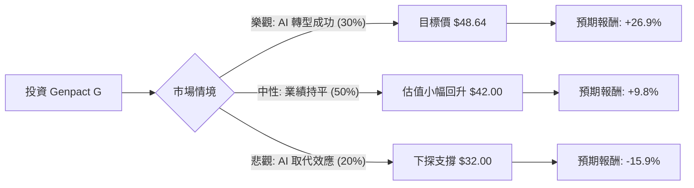

這份分析報告針對美股公司 **Genpact Limited (代號：G)** 進行評估。Genpact 是一間全球專業服務公司，專注於業務流程管理（BPO）與數位轉型。

根據您提供的數據與最新的市場動態（包括 2024 年初的執行長交接、AI 對 BPO 產業的衝擊以及公司最新的財報指引），以下是結合「決策樹」與「期望值分析」的投資評估。

---

### 一、 核心假設與市場背景分析

在計算期望值前，我們必須建立以下核心假設：

1.  **AI 轉型壓力（關鍵變數）：** 市場目前對 Genpact 的低估值（P/E 12.5x）主因是擔心生成式 AI 會取代傳統的人力外包服務。
2.  **估值修復：** 目前 Forward P/E 僅 8.83，遠低於歷史平均與同業（如 Accenture 或 Cognizant），若業績穩定，具備估值回升空間。
3.  **財務穩健度：** ROE 22.37% 與 PEG 0.77 顯示公司獲利能力強且成長成本低。
4.  **技術面：** 股價處於 52 週低點附近，且低於所有移動平均線（SMA20/50/200），顯示短期動能極弱，但具備價值投資的「安全邊際」。

---

### 二、 決策樹分析 (Decision Tree)

我們將未來一年的投資情境分為三種：**樂觀（估值修復）**、**中性（維持現狀）**、**悲觀（AI 衝擊加劇）**。

#### 節點詳細說明：

1.  **樂觀情境 (Bull Case) - 30% 機率：**
    *   **描述：** 公司成功整合 AI 工具提升效率，客戶合約續約率高，且市場重新認可其「AI 賦能者」的身份。
    *   **預期價格：** 達到分析師平均目標價 **$48.64**。
    *   **報酬率：** $(48.64 - 38.86 + 0.67 \text{ (股息)}) / 38.86 \approx +26.9\%$

2.  **中性情境 (Base Case) - 50% 機率：**
    *   **描述：** 營收緩步增長，AI 衝擊與新業務增長抵銷。股價隨大盤回升至 SMA200 附近。
    *   **預期價格：** **$42.00** (約為 P/E 10x 的保守修復)。
    *   **報酬率：** $(42.00 - 38.86 + 0.67) / 38.86 \approx +9.8\%$

3.  **悲觀情境 (Bear Case) - 20% 機率：**
    *   **描述：** 生成式 AI 導致客戶大幅削減外包預算，利潤率萎縮。
    *   **預期價格：** 跌破 52 週低點，下探 **$32.00**。
    *   **報酬率：** $(32.00 - 38.86 + 0.67) / 38.86 \approx -15.9\%$

---

### 三、 期望值分析 (Expected Value Analysis)

#### 1. 計算過程：
期望值 (EV) = $\sum (\text{Probability} \times \text{Return})$

*   **樂觀節點：** $0.30 \times 26.9\% = 8.07\%$
*   **中性節點：** $0.50 \times 9.8\% = 4.90\%$
*   **悲觀節點：** $0.20 \times (-15.9\%) = -3.18\%$

**總期望報酬率 = $8.07\% + 4.90\% - 3.18\% = 9.79\%$**

#### 2. 核心數據支持：
*   **PEG 0.77：** 顯示股價相對於其盈餘增長被顯著低估（通常 < 1 被視為便宜）。
*   **P/FCF 9.2：** 現金流強勁，足以支撐 1.74% 的股息與債務償還。
*   **Forward P/E 8.83：** 提供了極強的下行保護（Downside Protection）。

---

### 四、 最終結論

**評估結果：適合投資 (建議分批買進)**

#### 理由：
1.  **期望值為正 (9.79%)：** 儘管技術面呈現空頭排列，但從基本面來看，目前的股價已過度反應 AI 的負面預期。
2.  **極高的安全邊際：** Forward P/E 低於 9 倍，對於一個 ROE 超過 20% 且具備穩定現金流的公司來說，估值極具吸引力。
3.  **風險回報比優異：** 潛在獲利空間（26.9%）遠大於潛在虧損空間（15.9%）。
4.  **內部人與機構動態：** 雖然 Insider Trans 為 -2.19%，但整體 Short Float 僅 4.47%，並未出現大規模放空跡象。

#### 投資建議：
*   **進場策略：** 由於 SMA20/50/200 均向下，顯示短期仍有探底可能。建議不要一次性投入，而是採取**分批佈局 (Dollar Cost Averaging)**，首批資金可在 $38 附近進場，若跌至 $35 附近再行加碼。
*   **觀察指標：** 需密切關注下一季財報中關於「AI 相關營收」的佔比以及毛利率（Gross Margin）是否能維持在 35% 以上。

**風險提示：** 若公司未來兩季營收出現負增長（Sales Q/Q 目前為 5.72%），則需重新評估 AI 對其商業模式的破壞性。