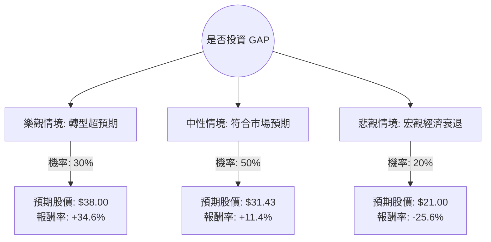

針對美股公司 **GAP (GPS)** 的投資評估，我結合了您提供的基本面數據以及最新的市場動態（包括 2024 年第一季財報表現與分析師預期）進行了深度分析。

目前 GAP 正處於由新任 CEO Richard Dickson 領導的轉型期，旗下品牌（特別是 Old Navy 和 Gap）表現回溫，毛利率顯著改善。

以下是基於**決策樹分析**與**期望值分析**的詳細評估：

---

### 1. 決策樹分析 (Decision Tree Analysis)

我們將未來一年的投資情境分為三種：**樂觀（品牌轉型成功）**、**中性（維持現狀/符合預期）**、**悲觀（消費疲軟/轉型受阻）**。

#### 決策樹節點詳細說明：

| 情境 | 機率 (P) | 預期股價 (Target) | 預期報酬率 (R) | 說明 |
| :--- | :--- | :--- | :--- | :--- |
| **樂觀 (Bull)** | 30% | $38.00 | +34.6% | Old Navy 持續增長，Athleta 恢復動能，毛利率因供應鏈優化進一步提升。 |
| **中性 (Base)** | 50% | $31.43 | +11.4% | 達到分析師平均目標價，轉型進度穩健，維持現有市佔率。 |
| **悲觀 (Bear)** | 20% | $21.00 | -25.6% | 美國消費支出大幅萎縮，高負債比（Debt/Eq 1.51）導致財務壓力增加。 |

---

### 2. 核心假設與計算過程

#### A. 核心假設
1.  **轉型紅利：** 假設 CEO Richard Dickson 能成功將其在 Mattel (芭比娃娃) 的品牌重塑經驗複製到 GAP，提升品牌文化影響力。
2.  **財務健康：** 雖然債務股本比（Debt/Eq 1.51）偏高，但目前流動比率（Current Ratio 1.72）尚屬安全，假設不會發生流動性危機。
3.  **估值修復：** 目前 P/E 12.55 倍，低於行業平均與歷史高點，假設市場會因獲利改善而給予更高的本益比。
4.  **宏觀環境：** 假設聯準會（Fed）在未來一年內維持利率穩定或小幅降息，有利於零售業。

#### B. 期望值 (Expected Value, EV) 計算
期望值計算公式：$EV = \sum (P_i \times R_i)$

*   **樂觀貢獻：** $0.30 \times 34.6\% = 10.38\%$
*   **中性貢獻：** $0.50 \times 11.4\% = 5.70\%$
*   **悲觀貢獻：** $0.20 \times (-25.6\%) = -5.12\%$

**總體預期報酬率 (EV) = 10.38% + 5.70% - 5.12% = 10.96%**

---

### 3. 綜合數據分析補充

*   **獲利能力：** ROE 高達 **25.1%**，顯示公司利用股東權益創造利潤的能力極強。
*   **技術面：** 股價目前在 SMA20, 50, 200 之上，呈現**多頭排列**，且距離 52 週高點僅 -4.34%，動能強勁。
*   **空方壓力：** **Short Float 達 10.61%**，這是一個雙面刃：一方面代表市場仍有疑慮，另一方面若財報持續利多，可能引發「軋空行情（Short Squeeze）」。
*   **最新動態：** 根據最新財報，GAP 提高了全年營業利潤指引，且庫存管理大幅改善（庫存下降 15%），這對零售業是極大的利多。

---

### 4. 最終結論

#### **評估結果：適合投資 (建議：分批買入)**

**理由如下：**
1.  **期望值為正：** 經風險加權後的預期報酬率約為 **10.96%**，優於許多傳統零售股。
2.  **估值具吸引力：** Forward P/E 僅 12.07，相對於其 ROE 表現，股價並未被高估。
3.  **轉型動能明確：** 新管理層對品牌的重塑已在數據上（Gross Margin 40.93%）看到成效。
4.  **技術面支撐：** 股價處於上升通道，且分析師平均目標價 ($31.43) 仍有約 11% 的上漲空間。

**風險提示：**
*   需密切關注 **Debt/Eq (1.51)**。在高利率環境下，利息支出可能侵蝕利潤。
*   **Short Float 較高**，股價波動可能較大，建議設置止損點（如跌破 SMA50 約 $27.3 附近）。

**結論：** GAP 目前展現出強勁的復甦跡象，在風險可控的前提下，是一個具備「價值修復」與「成長潛力」的投資標的。