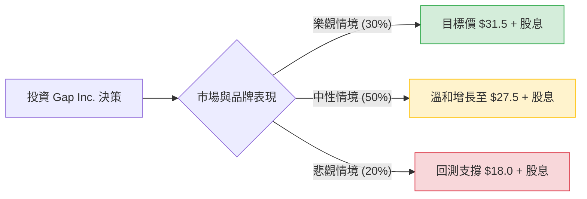

這份分析報告將結合您提供的基本面數據與最新的市場動態（包含 2024 年第二季財報表現與執行長 Richard Dickson 的轉型策略），利用**決策樹（Decision Tree）**與**期望值分析（Expected Value Analysis）**評估 Gap Inc. (GPS) 的投資價值。

---

### 一、 核心假設與市場背景分析

在建立決策樹之前，我們基於數據與最新資訊設定以下核心假設：

1.  **品牌復甦動能（核心驅動力）：** Gap Inc. 正在經歷由新任 CEO 領導的品牌重塑。Old Navy（貢獻最大營收）已恢復增長，Gap 品牌在夏季表現強勁，Athleta 正在觸底反彈。
2.  **估值優勢：** 目前 **P/E (11.17)** 與 **Forward P/E (9.19)** 均低於行業平均，且 **PEG 為 0.85**，顯示股價相對於盈餘增長被低估。
3.  **財務健康度：** **ROE (23.1%)** 表現優異，且 **Gross Margin (40.7%)** 顯示成本控制與庫存管理改善。
4.  **宏觀環境：** 美國聯準會（Fed）可能的降息政策將有利於零售業消費支出，但通膨壓力仍是潛在風險。

---

### 二、 決策樹分析 (Decision Tree)

我們將未來一年的表現分為三種情境：**樂觀（Bull）**、**中性（Base）**、**悲觀（Bear）**。

#### 節點詳細數據：

| 情境 | 發生機率 (P) | 預期股價 | 預期報酬率 (R) *含股息* | 期望值 (P * R) |
| :--- | :--- | :--- | :--- | :--- |
| **樂觀 (Bull Case)** | 30% (0.3) | $31.50 | +34.5% | +10.35% |
| **中性 (Base Case)** | 50% (0.5) | $27.50 | +17.8% | +8.90% |
| **悲觀 (Bear Case)** | 20% (0.2) | $18.00 | -22.0% | -4.40% |
| **總計** | **100%** | - | - | **+14.85%** |

---

### 三、 計算過程與情境說明

#### 1. 報酬率計算方式：
*   **目前股價：** $23.91
*   **股息收益率：** 2.76%
*   **樂觀報酬率：** `(($31.50 - $23.91) / $23.91) + 2.76% ≈ 34.5%`
    *   *假設：* 轉型極為成功，Old Navy 與 Athleta 雙引擎帶動，P/E 回升至 14 倍。
*   **中性報酬率：** `(($27.50 - $23.91) / $23.91) + 2.76% ≈ 17.8%`
    *   *假設：* 營收維持低個位數增長，利潤率穩定，股價向分析師平均目標價靠攏。
*   **悲觀報酬率：** `(($18.00 - $23.91) / $23.91) + 2.76% ≈ -22.0%`
    *   *假設：* 消費者支出大幅萎縮，品牌重塑失敗，股價回測 52 週低點。

#### 2. 整體期望值 (Expected Value, EV) 計算：
$$EV = (0.3 \times 34.5\%) + (0.5 \times 17.8\%) + (0.2 \times -22.0\%)$$
$$EV = 10.35\% + 8.90\% - 4.40\% = 14.85\%$$

---

### 四、 綜合評估與最終結論

#### 1. 核心分析觀點：
*   **估值吸引力：** GAP 目前的 **PEG (0.85)** 遠低於 1，這在零售股中屬於典型的「價值窪地」。Forward P/E 僅 9.19，顯示市場尚未完全反映其未來的盈利增長預期。
*   **營運效率提升：** **ROE 23.1%** 顯示管理層利用股東權益創造利潤的能力極強。近期財報顯示庫存水平下降，這將減少未來打折促銷的壓力，保護毛利率（目前 40.7%）。
*   **技術面與籌碼：** 雖然短期（月、季）表現疲軟（-15%），但這反而提供了較好的介入點。**Short Float (9.86%)** 略高，若業績超預期，可能引發軋空行情。
*   **風險因素：** **Debt/Eq (1.48)** 偏高，且零售業受宏觀經濟波動影響大。

#### 2. 最終判斷：

**結論：適合投資 (Suitable for Investment)**

**理由：**
1.  **正向期望值：** 經過決策樹分析，預期年化報酬率為 **14.85%**，優於標普 500 指數的長期平均表現。
2.  **安全邊際：** 低 P/E 與低 PEG 提供了良好的安全邊際，即便在悲觀情境下，股息發放也能抵銷部分跌幅。
3.  **轉型紅利：** 新執行長對品牌形象的成功重塑（如 Gap 品牌與流行文化的重新連結）正處於上升期，目前股價回檔提供了分批佈局的機會。

**建議策略：**
考慮到近期 SMA20 與 SMA50 的負向趨勢，建議採取**分批買進**策略，首批資金可在 $23-$24 區間建立，若股價回測 SMA200 ($23.8 附近) 站穩，可進一步加碼，目標價看 $31.5。