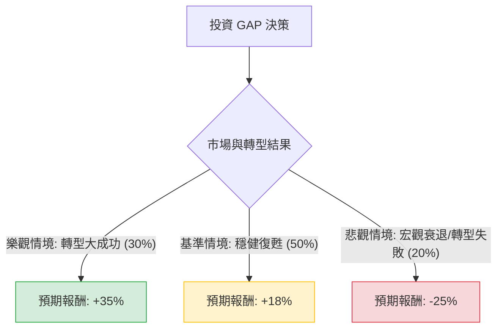

這份分析報告將結合您提供的基本面數據，以及最新的市場動態（包含 2024 年第一季財報表現與執行長 Richard Dickson 的轉型計畫），利用**決策樹（Decision Tree）**與**期望值分析（Expected Value Analysis）**評估 Gap Inc. (GPS) 的投資價值。

---

### 1. 市場動態與核心假設補充

在進行計算前，根據最新資訊（截至 2024 年 6 月）補充以下關鍵點：
*   **財報利多**：Gap 最近一季的財報優於預期，並上調了全年銷售與利潤指引。Old Navy 與 Gap 品牌重回增長軌道。
*   **轉型領導**：新任 CEO Richard Dickson（前美泰兒營運長）正積極推動「品牌重塑」，目前市場對其執行力評價正面。
*   **估值水平**：目前 P/E 約 11.75 倍，低於行業平均，顯示股價尚未完全反映轉型成功的預期。
*   **風險因素**：高通膨可能抑制消費者對非必需品（服飾）的支出；債務股本比（Debt/Eq 1.51）略高。

---

### 2. 決策樹分析 (Decision Tree)

以下決策樹模擬未來一年的三種主要情境：

#### 節點詳細說明：

1.  **樂觀情境 (Bull Case) - 30% 機率**：
    *   **描述**：Richard Dickson 成功提升品牌熱度，Old Navy 獲利大幅擴張，毛利率持續改善。
    *   **預期報酬**：股價達到分析師高端目標價約 $35 (含股息回報約 35%)。
2.  **基準情境 (Base Case) - 50% 機率**：
    *   **描述**：公司達到上調後的全年指引，庫存管理穩定，市場維持目前的估值倍數。
    *   **預期報酬**：股價達到共識目標價 $31 (含股息回報約 18%)。
3.  **悲觀情境 (Bear Case) - 20% 機率**：
    *   **描述**：美國經濟陷入衰退導致消費疲軟，轉型計畫進度不如預期，股價回測支撐位。
    *   **預期報酬**：股價跌至 $20 附近 (含股息回報約 -25%)。

---

### 3. 期望值計算過程 (Expected Value Calculation)

我們將各情境的機率與預期報酬相乘，得出加權平均期望值。

**核心公式：**
$$EV = \sum (Probability_i \times Return_i)$$

**計算步驟：**
1.  **樂觀情境貢獻**：$0.30 \times 35\% = 10.5\%$
2.  **基準情境貢獻**：$0.50 \times 18\% = 9.0\%$
3.  **悲觀情境貢獻**：$0.20 \times (-25\%) = -5.0\%$

**總期望報酬率 (Total EV)：**
$$10.5\% + 9.0\% - 5.0\% = 14.5\%$$

---

### 4. 核心假設與數據支持

*   **估值支持**：P/E 11.75 與 Forward P/E 11.32 顯示獲利預期穩定且估值合理。PEG 1.77 雖不算極低，但在零售轉型股中尚可接受。
*   **獲利能力**：ROE 達 25.1%，顯示管理層利用股東權益創造利潤的能力極強。
*   **技術面**：SMA200 為 +14.1%，顯示長期趨勢向上；近期 Perf Week (-5.41%) 提供了一個較好的回檔買點。
*   **股息安全感**：2.52% 的股息率為投資者提供了下行保護（Downside Protection）。

---

### 5. 最終結論

#### **判斷：適合投資 (Buy / Overweight)**

**理由：**
1.  **正向期望值**：經過風險加權後的期望報酬率為 **14.5%**，顯著高於無風險利率（如美債收益率），具有投資吸引力。
2.  **轉型紅利**：新執行長帶來的品牌重塑效果已在財報中顯現，Gap 正在從「衰退品牌」轉型為「復甦品牌」，市場通常會給予這類公司估值修復（Re-rating）的機會。
3.  **財務穩健度改善**：儘管債務稍高，但 Current Ratio 1.72 顯示短期流動性無虞，且 P/FCF 12.53 顯示現金流強勁，足以支撐股息與轉型開支。
4.  **目標價空間**：目前股價 $26.2 距離共識目標價 $31 仍有約 18% 的上漲空間。

**建議操作：**
由於近期股價有小幅拉回（Perf Week -5.41%），建議可在 $25 - $26 區間分批布局，並將止損位設在 $20（悲觀情境支撐點），以追求風險受控下的超額回報。