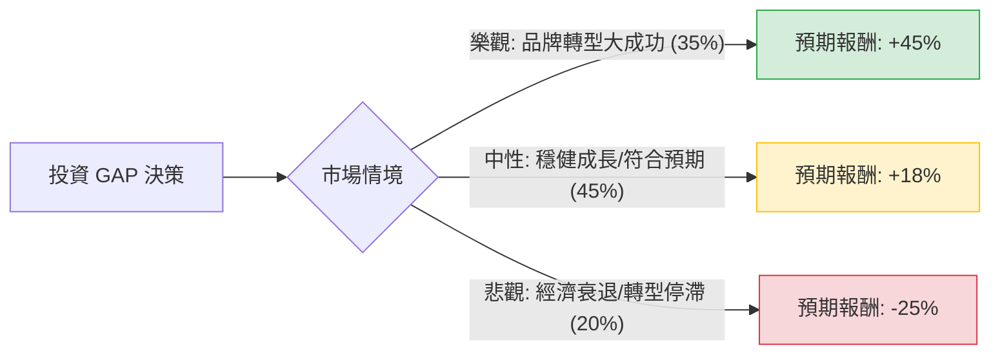

這份分析報告將結合您提供的財務數據與最新的市場動態（包含 2024 年第二季財報表現與執行長 Richard Dickson 的轉型策略），利用**決策樹（Decision Tree）**與**期望值分析（Expected Value Analysis）**評估 Gap Inc. (GPS) 的投資價值。

---

### 一、 核心假設與市場背景分析

在建立模型前，我們先整合基本面與最新資訊：

1.  **轉型成效（核心動能）：** Gap Inc. 在新任 CEO Richard Dickson 的帶領下，品牌重塑（特別是 Old Navy 與 Gap 品牌）初見成效。Q2 財報顯示毛利率大幅提升至 42.6%，且上調了全年營運利潤指引。
2.  **估值水準：** 目前 Forward P/E 僅約 10.24，PEG 為 0.95，顯示相對於其預期成長率，股價並未過熱。
3.  **財務風險：** 債務股本比（Debt/Eq）為 1.48，略高，但在零售業轉型期尚可接受。
4.  **市場情緒：** 空單餘額（Short Float）高達 13.07%，這代表市場仍有疑慮，但也存在「軋空（Short Squeeze）」的潛在爆發力。

---

### 二、 決策樹分析 (Decision Tree)

我們將未來一年的表現分為三種情境：**樂觀（牛市）、中性（基準）、悲觀（熊市）**。

#### 節點詳細說明：

1.  **樂觀情境 (Bull Case) - 35% 機率：**
    *   **條件：** Old Navy 持續強勁，Athleta 恢復成長，且毛利率因供應鏈優化持續擴張。
    *   **目標價：** $38 - $40 (基於 P/E 回升至 14-15x)。
    *   **預期報酬：** 約 +45% (含股息)。

2.  **中性情境 (Base Case) - 45% 機率：**
    *   **條件：** 達到分析師平均目標價 $31.5，公司維持目前的獲利指引，宏觀經濟軟著陸。
    *   **目標價：** $31.5。
    *   **預期報酬：** 約 +18% (股價漲幅 18.2% + 股息 2.5%)。

3.  **悲觀情境 (Bear Case) - 20% 機率：**
    *   **條件：** 美國消費支出大幅萎縮，Banana Republic 品牌持續拖累，高債務壓力增加。
    *   **目標價：** $20。
    *   **預期報酬：** 約 -25%。

---

### 三、 期望值計算 (Expected Value Analysis)

我們將各情境的機率與報酬率相乘，得出總體期望報酬率。

| 情境 | 機率 (P) | 預期報酬率 (R) | 期望值 (P * R) |
| :--- | :--- | :--- | :--- |
| **樂觀 (Bull)** | 0.35 | +45% | 15.75% |
| **中性 (Base)** | 0.45 | +18% | 8.10% |
| **悲觀 (Bear)** | 0.20 | -25% | -5.00% |
| **總計期望值** | **1.00** | | **+18.85%** |

**計算過程：**
$EV = (0.35 \times 0.45) + (0.45 \times 0.18) + (0.20 \times -0.25)$
$EV = 0.1575 + 0.081 - 0.05 = 0.1885$ (即 **18.85%**)

---

### 四、 最終結論與建議

#### **結論：適合投資 (Suitable for Investment)**

#### **判斷理由：**

1.  **正向期望值：** 經過加權計算，未來一年的預期報酬率約為 **18.85%**，遠高於無風險利率（美債）與標普 500 的歷史平均回報。
2.  **估值安全邊際：** PEG 0.95 顯示股價尚未反映其成長潛力。即使在中性情境下，仍有接近 20% 的獲利空間。
3.  **營運轉折點：** 最新財報顯示 Gap 的庫存管理與毛利控制已大幅改善，這通常是零售股股價爆發的前兆。
4.  **技術面支撐：** 股價目前高於 SMA20、50、200，呈現多頭排列，且近期 Perf Month (+11.46%) 顯示動能強勁。

#### **風險提示：**
*   **高空單比例：** 13% 的空單雖然可能引發軋空，但也反映了市場對零售業在通膨環境下表現的擔憂。
*   **債務水平：** 1.48 的 Debt/Eq 意味著在利率長期高企的環境下，利息支出會侵蝕利潤。

**建議操作：**
考慮到目前股價 ($26.65) 距離目標價 ($31.5) 仍有空間，建議可於目前價位分批進場，並將止損位設在 $23.5 (SMA200 附近)，以應對悲觀情境的發生。