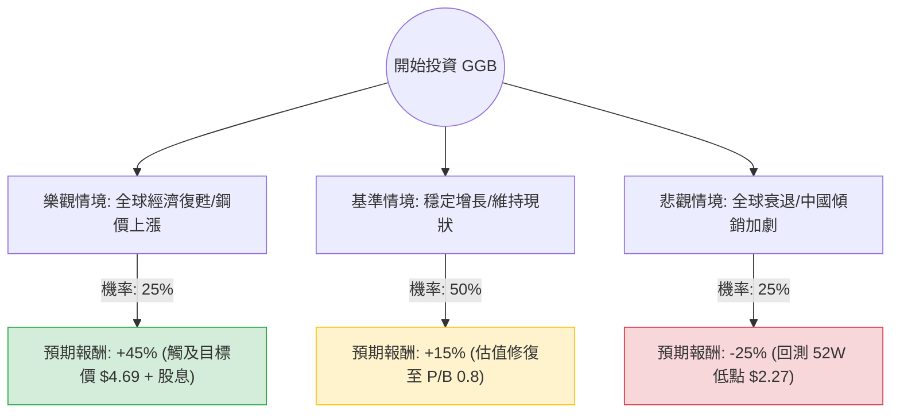

針對美股公司 **Gerdau S.A. (GGB)** 的投資評估，我結合了您提供的基本面數據與最新的市場動態（包含鋼鐵產業趨勢、巴西經濟環境及公司近期財報表現）進行分析。

---

### 一、 核心背景與市場動態分析

1.  **公司定位**：Gerdau 是美洲最大的長鋼生產商，業務重心在巴西與美國。
2.  **產業趨勢**：
    *   **利多**：美國基礎建設法案持續帶動鋼鐵需求；巴西國內建築業回暖。
    *   **利空**：全球鋼鐵產能過剩（尤其是中國出口壓力），導致國際鋼價波動；高利率環境壓抑全球製造業。
3.  **財務亮點**：
    *   **極低估值**：P/B 僅 0.66，遠低於帳面價值；Forward P/E 6.84 顯示市場預期明年獲利將大幅改善。
    *   **財務穩健**：Debt/Eq 0.29 顯示負債極低，抗風險能力強。
    *   **股息吸引力**：3.5% 的殖利率在傳產中具備一定支撐力。

---

### 二、 決策樹分析 (Decision Tree Analysis)

以下決策樹基於未來 12 個月的投資預期：

#### 節點詳細說明：
1.  **樂觀情境 (Bull Case)**：
    *   **條件**：美國基建需求超預期，且中國停止低價傾銷鋼鐵，巴西央行降息刺激房地產。
    *   **預期報酬**：股價回升至分析師目標價 $4.69，加上約 3.5% 股息，總報酬約 45%。
2.  **基準情境 (Base Case)**：
    *   **條件**：鋼價維持區間震盪，公司透過低債務與成本控制維持獲利。
    *   **預期報酬**：股價向帳面價值小幅靠攏，預計回升至 $3.7 - $3.8 區間，總報酬約 15%。
3.  **悲觀情境 (Bear Case)**：
    *   **條件**：全球經濟陷入衰退，鋼鐵需求萎縮，巴西幣 (BRL) 大幅貶值。
    *   **預期報酬**：股價回測 52 週低點 $2.27，跌幅約 30%，扣除股息後淨損約 25%。

---

### 三、 期望值分析 (Expected Value Analysis)

#### 1. 核心假設
*   **市場假設**：鋼鐵業處於週期底部回升階段。
*   **財務假設**：Forward P/E 6.84 能夠兌現，EPS 將從今年的低點反彈。
*   **產業假設**：GGB 在美洲的市佔率穩固，受中國鋼鐵直接衝擊較歐洲同業小。

#### 2. 計算過程
期望值 (EV) = $\sum (機率 \times 預期報酬)$

*   **樂觀情境**：$0.25 \times 45\% = 11.25\%$
*   **基準情境**：$0.50 \times 15\% = 7.5\%$
*   **悲觀情境**：$0.25 \times (-25\%) = -6.25\%$

**總期望報酬率 (Total EV) = $11.25\% + 7.5\% - 6.25\% = 12.5\%$**

---

### 四、 最終結論

**投資建議：適合投資 (適合價值型與中長期投資者)**

#### 判定理由：
1.  **正向期望值**：12.5% 的預期報酬率優於許多成熟產業，且下行風險受限於極低的 P/B (0.66) 與強勁的資產負債表。
2.  **安全邊際高**：目前股價 $3.26 接近 52 週區間的中下部，且 PEG 僅 0.11，顯示相對於其增長潛力，股價被嚴重低估。
3.  **獲利反轉信號**：雖然今年 EPS Q/Q 下滑，但 Forward P/E 遠低於當前 P/E，顯示分析師普遍預期明年獲利將大幅改善。
4.  **技術面觀察**：雖然短期 SMA20/50/200 均呈現負值（處於空頭排列），但這正是價值投資者「買在無人問津時」的機會。

#### 風險提示：
*   **匯率風險**：GGB 很大一部分收入來自巴西，需注意巴西里爾對美元的匯率波動。
*   **週期性**：鋼鐵業受宏觀經濟影響極大，若全球經濟硬著陸，復甦時間將拉長。

**建議操作**：可於 $3.0 - $3.3 區間分批建倉，長期持有以領取股息並等待週期回升帶來的估值修復。