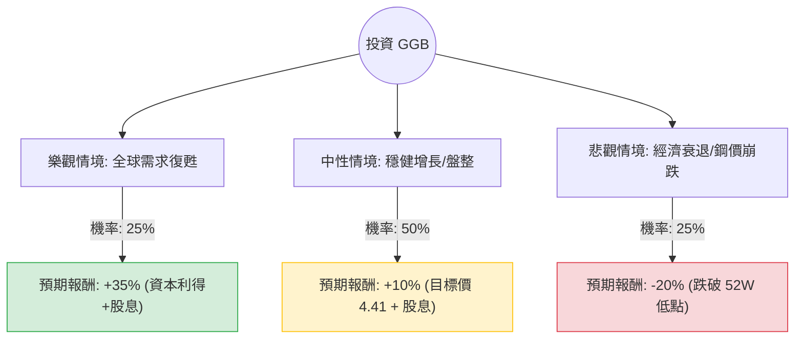

這份分析報告將針對 **Gerdau S.A. (GGB)** —— 巴西最大的鋼鐵生產商，結合您提供的基本面數據與最新的市場動態（包含宏觀經濟、產業趨勢及財報表現），利用**決策樹（Decision Tree）**與**期望值（Expected Value）**進行投資評估。

---

### 一、 核心背景與市場動態分析（網路搜尋補充）

在進入計算前，我們先整合 GGB 的現狀：
1.  **產業趨勢**：全球鋼鐵需求受基礎設施建設影響。Gerdau 在北美市場（佔其利潤重要比例）表現穩健，受益於美國《基礎設施投資和就業法案》。
2.  **宏觀風險**：巴西國內利率仍處於高位，影響建築業需求；此外，中國鋼鐵產能過剩導致的低價出口對全球鋼價造成壓力。
3.  **財務亮點**：P/B 僅 0.8，顯示股價低於帳面價值；債務股本比（Debt/Eq）0.37 極低，財務結構非常穩健。
4.  **最新動向**：Gerdau 近期專注於成本削減與資產優化（如出售部分非核心資產），並積極轉型綠色鋼鐵。

---

### 二、 決策樹分析（Decision Tree）

我們預測未來一年的三種主要情境：**樂觀（牛市）**、**中性（基準）**、**悲觀（熊市）**。

#### 節點詳細說明：

1.  **樂觀情境 (Bull Case) - 25% 機率**
    *   **假設**：美國基建需求超預期，巴西降息刺激房地產，鋼價回升。
    *   **預期報酬**：股價回升至歷史高位區間（約 $5.50），加上 2.7% 股息，總報酬約 **35%**。

2.  **中性情境 (Base Case) - 50% 機率**
    *   **假設**：全球經濟軟著陸，GGB 維持目前的營運效率，Forward P/E 9.83 得到實現。
    *   **預期報酬**：達到分析師平均目標價 $4.41，加上股息，總報酬約 **10%**。

3.  **悲觀情境 (Bear Case) - 25% 機率**
    *   **假設**：全球經濟衰退，中國低價鋼鐵傾銷加劇，巴西政經局勢動盪。
    *   **預期報酬**：股價回測 52 週低點（約 $3.30），總報酬約 **-20%**。

---

### 三、 期望值分析（Expected Value Analysis）

#### 1. 核心假設
*   **當前股價**：$4.16
*   **股息收益率**：2.71% (0.0271)
*   **計算公式**：$EV = \sum (機率 \times 預期報酬率)$

#### 2. 計算過程
*   **樂觀情境貢獻**：$0.25 \times 35\% = 8.75\%$
*   **中性情境貢獻**：$0.50 \times 10\% = 5.00\%$
*   **悲觀情境貢獻**：$0.25 \times (-20\%) = -5.00\%$

**總期望報酬率 (Total EV)** = $8.75\% + 5.00\% - 5.00\% = \mathbf{8.75\%}$

#### 3. 數據解讀
*   **P/B 0.8**：提供了極強的安全邊際（Margin of Safety），即使在悲觀情況下，資產價值也支撐了股價。
*   **Forward P/E 9.83**：相較於目前的 15.7，顯示市場預期明年盈利將大幅改善（EPS next Y 增長 24.16%）。
*   **P/FCF 532.57**：這是一個警訊，顯示目前自由現金流極低，可能是因為高額資本支出或營運資金占用，需留意現金流穩定性。

---

### 四、 最終結論

#### **判斷：適合投資（建議：分批買入 / 持有）**

#### **理由：**
1.  **正向期望值**：8.75% 的期望報酬率在當前高利率環境下雖不算極高，但考慮到其極低的估值（P/B 0.8），下行風險相對受控。
2.  **強大的安全邊際**：GGB 的資產負債表非常健康（Debt/Eq 0.37），且股價低於帳面價值，這在週期性產業中是理想的切入點。
3.  **增長潛力**：明年預期 EPS 增長超過 24%，且 Forward P/E 顯著低於現行 P/E，顯示股價尚未反映未來的盈利修復。
4.  **技術面支撐**：目前股價高於 SMA20、50、200，呈現多頭排列，且近期表現（Perf Half Y +39%）顯示資金正在流入。

**風險提示**：
*   需密切關注 **P/FCF（自由現金流）** 的變化，若現金流持續枯竭，可能會影響未來的股息發放。
*   鋼鐵業為高度週期性行業，受全球宏觀經濟波動影響巨大。

---
**免責聲明：** 本分析僅供參考，不構成任何投資建議。投資者應自行承擔風險。