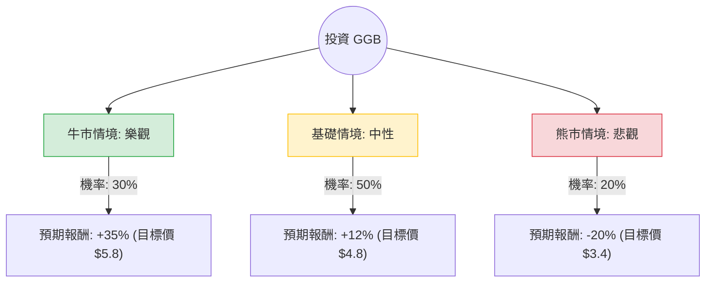

這份分析報告將針對 **Gerdau S.A. (GGB)** 進行深入評估。Gerdau 是美洲領先的長鋼生產商，其業務深受巴西與美國建築、工業及基礎設施市場影響。

以下結合您提供的數據與最新的市場動態（如：巴西對進口鋼鐵的關稅政策、美國基礎建設需求、全球鋼鐵循環）進行決策樹與期望值分析。

---

### 一、 核心假設與市場動態分析

在建立決策樹前，我們基於以下關鍵因素設定情境：

1.  **估值面 (Valuation)：** 目前 P/B 僅 0.87，顯示股價低於淨值；Forward P/E 8.94 遠低於目前的 37.65，預示市場預期未來一年獲利將大幅改善。PEG 0.15 顯示其增長潛力被嚴重低估。
2.  **政策面 (Policy)：** 巴西政府近期對部分鋼鐵產品實施進口配額與關稅，旨在打擊中國廉價鋼鐵傾銷，這對 GGB 在巴西本土市場的利潤率有正面幫助。
3.  **宏觀經濟 (Macro)：** 美國基礎建設法案（IIJA）持續支撐長鋼需求；然而，全球高利率環境仍壓抑建築業。
4.  **財務健康 (Financials)：** 負債率低 (Debt/Eq 0.29)，流動比率高 (2.89)，具備抗風險能力。

---

### 二、 決策樹分析 (Decision Tree)

我們以 **未來 12 個月的投資報酬率 (Total Return)** 為評估目標。

#### 節點詳細說明：

1.  **牛市情境 (Bull Case) - 30% 機率：**
    *   **條件：** 巴西關稅政策超預期有效，鋼價回升；美國基建需求爆發；聯準會降息刺激建築業。
    *   **預期報酬：** 股價回歸歷史平均估值，加上 2.6% 股息，總報酬約 **+35%**。
2.  **基礎情境 (Base Case) - 50% 機率：**
    *   **條件：** 營運維持現狀，獲利如預期修復（符合 Forward P/E 預測）。分析師目標價 $4.81 達成。
    *   **預期報酬：** 價差 (11%) + 股息 (2.6%) ≈ **+12%**（取整數）。
3.  **熊市情境 (Bear Case) - 20% 機率：**
    *   **條件：** 全球經濟衰退，鋼鐵需求萎縮；中國鋼鐵持續透過其他管道傾銷；鐵礦砂成本大幅上升。
    *   **預期報酬：** 股價回測 52 週低點附近，總報酬約 **-20%**。

---

### 三、 期望值分析 (Expected Value Analysis)

根據上述情境，我們計算投資 GGB 的加權期望報酬率：

| 情境 | 發生機率 (P) | 預期報酬 (R) | P × R |
| :--- | :--- | :--- | :--- |
| **牛市 (樂觀)** | 0.30 | +35% | 10.5% |
| **基礎 (中性)** | 0.50 | +12% | 6.0% |
| **熊市 (悲觀)** | 0.20 | -20% | -4.0% |
| **總計期望值** | **1.00** | | **12.5%** |

**計算過程：**
$EV = (0.30 \times 35\%) + (0.50 \times 12\%) + (0.20 \times -20\%)$
$EV = 10.5\% + 6.0\% - 4.0\% = 12.5\%$

---

### 四、 最終結論

#### **判斷：適合投資 (Cautiously Buy)**

#### **理由：**
1.  **正向期望值：** 12.5% 的預期報酬率優於多數傳統產業藍籌股，且風險回報比（Risk-Reward Ratio）合理。
2.  **極低估值提供安全邊際：** P/B 0.87 意味著你正以低於公司資產價值的價格買入。即便在悲觀情境下，強健的資產負債表（低債務、高流動比）也降低了破產或長期崩盤的風險。
3.  **獲利修復預期：** Trailing P/E 與 Forward P/E 的巨大差距（37.6 vs 8.9）顯示公司正處於獲利谷底回升的轉折點。
4.  **政策紅利：** 巴西對進口鋼鐵的保護主義抬頭，將直接改善 GGB 的利潤空間（Gross Margin 目前僅 11.4%，有提升空間）。

#### **投資建議：**
*   **進場點：** 目前股價 $4.33 接近 52 週高點，建議分批進場，或等待股價回測 SMA50 ($3.85 附近) 時加碼。
*   **風險監控：** 需密切關注巴西 SELIC 利率走勢及中國房地產市場對全球鋼價的連鎖反應。

---
*免責聲明：本分析僅供參考，不構成投資建議。投資者應自行承擔市場風險。*