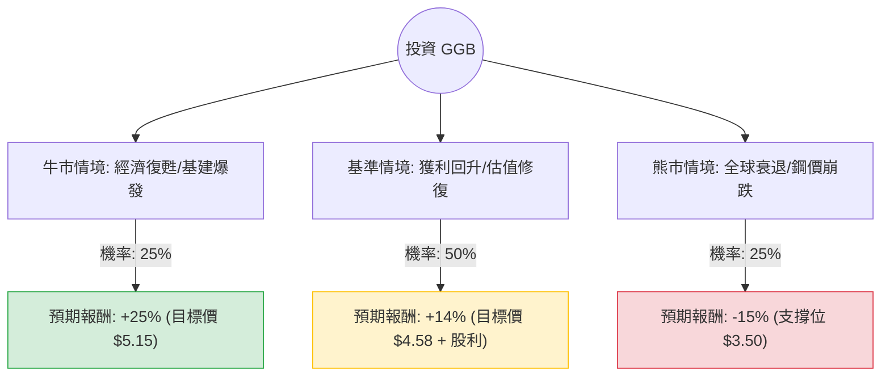

這份分析報告將結合您提供的基本面數據，以及針對 **Gerdau S.A. (GGB)** 的最新市場動態（鋼鐵產業趨勢、巴西與北美市場狀況）進行綜合評估。

---

### 一、 核心假設與市場背景分析

在建立決策樹之前，我們必須基於數據與現狀設定以下核心假設：

1.  **產業週期與需求**：GGB 是美洲領先的長鋼生產商。目前全球鋼鐵業受中國房地產疲軟影響，但北美基礎設施法案與巴西國內降息循環（SELIC 利率下調）對建築用鋼有支撐作用。
2.  **估值安全邊際**：目前 **P/B 為 0.8**，低於帳面價值，顯示具備較強的資產保護。**Forward P/E 為 9.19**，遠低於目前的 15.64，顯示市場預期明年獲利將大幅改善（數據顯示 EPS next Y 預期增長 32.2%）。
3.  **財務健康度**：**Debt/Eq 0.37** 且 **Current Ratio 2.7**，顯示公司財務極其穩健，有能力抵禦景氣寒冬。
4.  **匯率與地區風險**：GGB 營收高度依賴巴西雷亞爾與美金匯率，巴西政經局勢是主要變數。

---

### 二、 決策樹分析 (Decision Tree)

以下使用 Markdown 繪製決策樹，評估未來一年的投資預期報酬。

#### 節點詳細說明：

1.  **牛市情境 (Bull Case) - 25% 機率**：
    *   **條件**：美國基建需求超預期，巴西央行加速降息刺激房地產，鋼價大幅上漲。
    *   **預期報酬**：股價回升至 52 週高點以上，加上 2.7% 股息，總報酬約 **25%**。
2.  **基準情境 (Base Case) - 50% 機率**：
    *   **條件**：公司實現預期的 32.2% EPS 增長，P/E 回歸正常水位。
    *   **預期報酬**：達到分析師平均目標價 $4.58，加上股息，總報酬約 **14%**。
3.  **熊市情境 (Bear Case) - 25% 機率**：
    *   **條件**：全球經濟衰退，中國鋼鐵過剩並向全球傾銷，導致利潤率進一步壓縮。
    *   **預期報酬**：股價回測 52 週低點區域，總報酬約 **-15%**。

---

### 三、 期望值分析 (Expected Value Analysis)

我們根據上述決策樹節點進行定量計算：

#### 1. 計算公式：
$$EV = (P_{Bull} \times R_{Bull}) + (P_{Base} \times R_{Base}) + (P_{Bear} \times R_{Bear})$$

#### 2. 計算過程：
*   **牛市部分**：$0.25 \times 25\% = 6.25\%$
*   **基準部分**：$0.50 \times 14\% = 7.0\%$
*   **熊市部分**：$0.25 \times (-15\%) = -3.75\%$

#### 3. 總期望報酬率：
$$EV = 6.25\% + 7.0\% - 3.75\% = 9.5\%$$

*註：此期望值已包含約 2.7% 的預期股息收益。*

---

### 四、 綜合評估與最終結論

#### 1. 優勢分析 (Pros)：
*   **極低估值**：P/B 0.8 提供了極佳的下行保護（Margin of Safety）。
*   **獲利反轉預期**：Forward P/E 顯著下降，且 EPS 增長預期強勁（32.2%）。
*   **資產負債表強健**：低負債（Debt/Eq 0.37）與高流動性（Current Ratio 2.7）使其在循環產業中具備生存優勢。
*   **技術面支撐**：股價目前在 $4.12，距離 52 週低點（約 $2.27）有距離，但距離目標價（$4.58）仍有 11% 以上的純價差空間。

#### 2. 風險分析 (Cons)：
*   **獲利能力下滑**：ROE 5.21% 偏低，且近期 EPS Q/Q 下滑 14.14%，顯示短期內仍面臨成本或需求壓力。
*   **資本效率**：P/FCF 高達 530，顯示目前的自由現金流轉換效率極低，這可能是由於近期資本支出較大或營運資金占用。

#### 3. 最終判斷：

**結論：適合投資 (建議：分批買入 / 持有)**

**理由：**
1.  **期望值為正 (9.5%)**：雖然不是爆發型成長股，但在當前高波動市場中，GGB 提供了穩健的期望報酬。
2.  **價值窪地**：股價低於帳面價值（P/B < 1），這在大型鋼鐵股中通常意味著長期底部的特徵。
3.  **週期性機會**：隨著巴西進入降息週期與北美製造業回流，GGB 作為區域龍頭將直接受益。
4.  **風險可控**：極低的負債率確保了公司不會在產業低谷期出現財務危機。

**建議操作策略：**
目前股價 $4.12 接近 SMA50 ($4.24) 但高於 SMA200 ($3.32)，建議在 **$3.8 - $4.1** 區間分批建倉，長期持有以等待 2025 年獲利修復的實現。