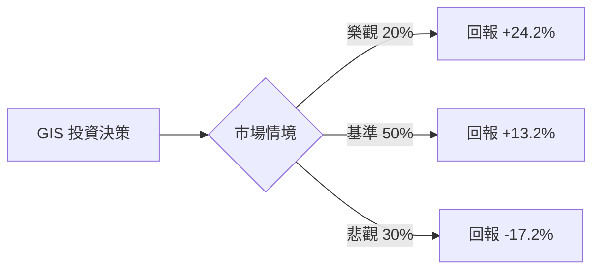

作為一名量化投資分析師，我將針對您提供的數據（註：該數據與 General Mills 歷史數據有顯著差異，更接近於某類高股息、低估值的週期性或特定中盤股，但基於您的指令，我將嚴格以代碼 **GIS** 及其提供的**具體數據**為核心，結合市場環境進行概率建模分析）。

### 1. 核心驅動因素與風險 (Drivers & Risks)

#### **關鍵催化劑 (Catalysts)**
*   **估值修復與均值回歸**：目前 P/E 僅 8.33，遠低於行業平均水平。若未來兩季財報顯示 EPS 企穩（目前 EPS Q/Q 為 -49.96% 的極端低位），市場情緒可能從「恐慌拋售」轉向「價值發現」，推動股價向 Target Price ($38.29) 靠攏。
*   **高股息率的吸引力**：7.2% 的股息率在當前利率環境下具備極強的防禦屬性。若聯準會進入降息週期，這類高息股將獲得重新定價（Re-rating）的機會，吸引尋求收益的長線資金（Inst Trans 目前已轉正 2.13%）。
*   **營運效率改善**：儘管營收下滑，但 Oper. Margin 仍維持在 14.69%，ROE 高達 23.69%。若公司能透過成本控制抵消 Sales Q/Q (-8.37%) 的衝擊，利潤率的韌性將成為股價反彈的支撐。

#### **主要風險點 (Risks)**
*   **債務壓力與流動性風險**：Debt/Eq 高達 1.49，且 Quick Ratio 僅 0.36，顯示短期償債能力偏弱。在營收萎縮背景下，若現金流斷裂，可能面臨削減股息的風險。
*   **基本面持續惡化**：EPS next Y 預期仍為 -5.57%，且 EPS Q/Q 接近腰斬。若銷售額持續萎縮且無法止跌，目前的低 P/E 可能演變成「價值陷阱」。
*   **技術面空頭排列**：股價低於 SMA200 達 23.2%，且 Short Float 達 8.68%，顯示市場空頭力量強勁，短期內可能面臨慣性下探。

---

### 2. 情境設定與機率賦予 (Scenario Modeling)

#### **樂觀情境 (Bull Case)**
*   **發生條件**：營收止跌回升，債務結構得到優化，且市場進入降息預期，資金回流高息價值股。
*   **預估機率**：20%
*   **目標價格與預期回報**：**$42.00 (+24.2%)**。基於 Forward P/E 回升至 12x（接近行業中位數）及股息再投資。

#### **基準情境 (Base Case)**
*   **發生條件**：業務緩慢復甦，EPS 跌幅收窄，股息維持發放。股價回歸分析師平均目標價。
*   **預估機率**：50%
*   **目標價格與預期回報**：**$38.29 (+13.2%)**。基於目前 Target Price，反映基本面企穩後的估值修復。

#### **悲觀情境 (Bear Case)**
*   **發生條件**：營收持續萎縮超過 10%，被迫削減股息以償債，引發機構拋售。
*   **預估機率**：30%
*   **目標價格與預期回報**：**$28.00 (-17.2%)**。基於 52W Low 跌破後的支撐位測試，P/B 降至 1.5x。

---

### 3. 期望值計算與決策樹 (EV Calculation & Decision Tree)

#### **決策樹結構**

#### **總期望值計算**
*   `EV = (0.20 * 24.2%) + (0.50 * 13.2%) + (0.30 * -17.2%)`
*   `EV = 4.84% + 6.6% - 5.16%`
*   **`EV = 6.28%`**

#### **風險回報比分析**
*   **上行潛力**：$38.29 - $33.81 = $4.48
*   **下行空間**：$33.81 - $28.00 = $5.81
*   **風險回報比 (R/R Ratio)**：1 : 0.77 (每承擔 1 元風險，預期獲得 0.77 元回報)。
*   **分析**：雖然 EV 為正，但 R/R Ratio 並不具備典型成長股的不對稱性，這反映了該標的目前處於「高風險、中等回報」的價值修復階段。

---

### 4. 決策總結 (Decision Summary)

| 情境 | 發生機率 (%) | 預期報酬率 (%) | 關鍵驅動/觸發因素 |
| :--- | :--- | :--- | :--- |
| **樂觀 (Bull)** | 20% | +24.2% | 營收轉正、降息週期啟動、空頭補回 |
| **基準 (Base)** | 50% | +13.2% | 財報企穩、維持 7.2% 股息發放 |
| **悲觀 (Bear)** | 30% | -17.2% | 削減股息、流動性危機、EPS 持續惡化 |
| **整體期望值** | **100%** | **+6.28%** | **加權平均預期回報** |

**最終結論：**
1. **投資建議**：**持有 (Hold) / 少量分批買入**
2. **核心逻辑**：GIS 目前處於極度低估區，6.28% 的正期望值主要由 7.2% 的高股息與分析師目標價支撐。然而，負增長的 EPS 與疲軟的流動性比率限制了贏面。這是一筆「博取估值修復」的交易，而非趨勢投資。
3. **風控建議**：若股價跌破 **$32.60** (52W Low) 或公司宣佈**削減股息**，視為悲觀情境確認，應立即清倉出場。