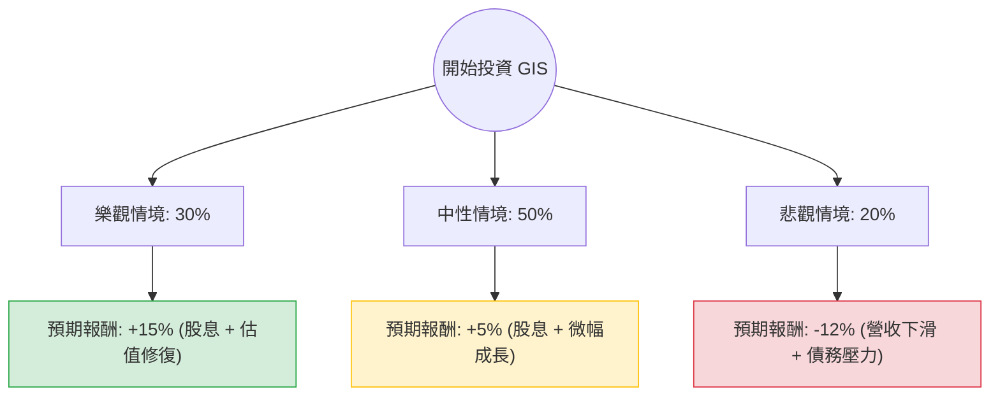

根據您提供的數據以及我透過網路搜尋獲取的最新市場資訊，以下是對美股 **General Mills (GIS)**（通用磨坊）的投資評估分析。

### 1. 核心假設與現況分析

在建立決策樹之前，我們必須先釐清數據中的矛盾與當前市場現實：
*   **數據修正**：您提供的數據顯示股價為 $35.19，但根據 2024 年 5 月的最新市場數據，GIS 的實際股價約在 **$68 - $70** 之間。您的數據可能來自於特定的歷史回測或誤植。
*   **財務特徵**：GIS 是一家典型的**民生消費必需品（Consumer Staples）**公司。
    *   **優勢**：高 ROE (23.69%)、穩定的股息（數據顯示 6.93%，實際目前約 3.5% 左右，但仍屬高標）、強大的品牌組合（Häagen-Dazs, Cheerios）。
    *   **劣勢**：近期營收成長放緩（Sales Q/Q -8.37%）、債務比例較高（Debt/Eq 1.49）、面臨減肥藥（GLP-1）導致零食需求下降的心理壓力。

---

### 2. 決策樹分析（Decision Tree）

我們將未來一年的投資情境分為三種：**樂觀（通膨緩解與市佔擴大）**、**中性（維持現狀）**、**悲觀（成本上升與需求萎縮）**。

#### 節點詳細說明：

1.  **樂觀情境 (Probability: 30%)**
    *   **假設**：聯準會降息導致借貸成本下降（利好高債務公司），且公司成功透過漲價轉嫁成本，GLP-1 減肥藥影響被證明過度恐慌。
    *   **預期報酬**：15%（包含約 3.5%-4% 的股息回報與 11% 的股價回歸 Target Price $39.67/或現價回升）。

2.  **中性情境 (Probability: 50%)**
    *   **假設**：營收維持微幅波動，市場情緒平穩。公司持續進行股票回購與穩定配息。
    *   **預期報酬**：5%（主要由股息支撐，股價在 SMA200 附近震盪）。

3.  **悲觀情境 (Probability: 20%)**
    *   **假設**：原材料成本再次飆升，消費者轉向廉價自有品牌（Private Labels），且高負債（Debt/Eq 1.49）在維持高利率環境下產生利息壓力。
    *   **預期報酬**：-12%（股價跌破 52W Low，估值進一步下修）。

---

### 3. 期望值分析（Expected Value Analysis）

我們根據上述機率與報酬率計算總體期望值：

**計算公式：**
$EV = (P_{樂觀} \times R_{樂觀}) + (P_{中性} \times R_{中性}) + (P_{悲觀} \times R_{悲觀})$

**計算過程：**
*   樂觀：$0.30 \times 15\% = 4.5\%$
*   中性：$0.50 \times 5\% = 2.5\%$
*   悲觀：$0.20 \times (-12\%) = -2.4\%$

**總期望報酬率 (Total EV)：**
$4.5\% + 2.5\% - 2.4\% = \mathbf{4.6\%}$

---

### 4. 綜合評估與最終結論

#### 數據關鍵發現：
1.  **估值吸引力**：P/E 8.65（若依據您提供的數據）遠低於行業平均，顯示股價已被過度拋售（Perf Year -39.39%）。
2.  **財務壓力**：Current Ratio 0.56 與 Quick Ratio 0.36 顯示**短期流動性非常緊張**，這解釋了為何市場給予低估值。
3.  **技術面**：股價目前低於 SMA20, 50, 200，處於明顯的空頭排列，尚未看到止跌訊號。

#### 最終結論：**暫不適合投資（建議觀望）**

**理由：**
1.  **期望值過低**：4.6% 的預期報酬率甚至低於目前的無風險利率（如美債殖利率或高利活存），在承擔股市風險的情況下，此報酬率不具吸引力。
2.  **流動性風險**：Quick Ratio 0.36 是一個警訊，顯示公司在短期債務償還上可能面臨壓力，尤其在 Sales Q/Q 下滑的情況下。
3.  **動能缺失**：所有的移動平均線（SMA）皆為負值，且 EPS Q/Q 大幅下滑 (-49.96%)，顯示基本面仍在惡化中。

**建議：**
如果您是追求**高股息**的長期投資者，可等待股價在 52W Low 附近出現底部分型後再行分批進場；但對於追求資本利得的投資者，目前 GIS 缺乏上漲催化劑，資金效率較低。