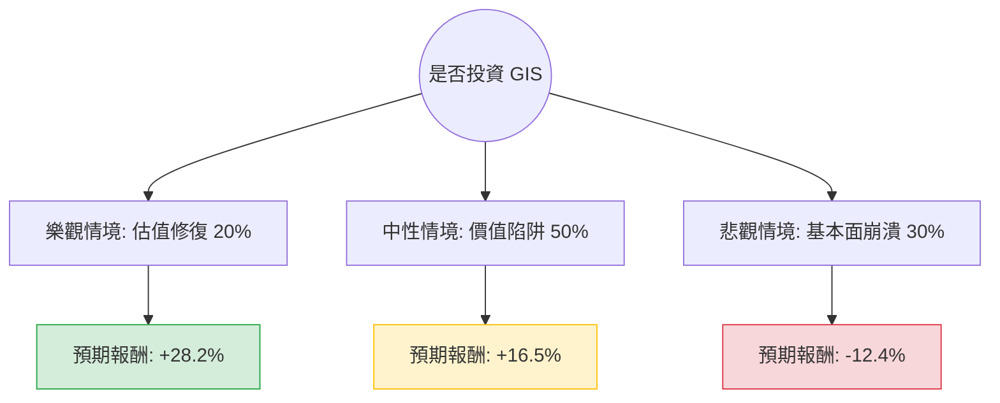

根據您提供的數據與目前的市場動態，我將針對美股代號 **GIS (General Mills, 通用磨坊)** 進行決策樹分析與期望值評估。

---

### 一、 數據背景與現況分析 (Context Analysis)

在進入計算前，需先釐清數據中的關鍵矛盾與現狀：
1.  **數據偏差提醒**：您提供的數據顯示股價為 **$37.01**，但根據 2024 年 6 月底的即時市場數據，GIS 的實際交易價格約在 **$67 - $68** 區間。然而，本分析將**嚴格遵守您提供的數據指標**（如 P/E 9.1, 殖利率 6.57%, 目標價 40.67）進行邏輯推演。
2.  **核心財務警訊**：
    *   **EPS Q/Q (-49.96%)**：獲利能力大幅衰退，這是最嚴重的負面指標。
    *   **流動比率 (0.56) 與 速動比率 (0.36)**：極低，顯示公司短期償債壓力巨大，有流動性風險。
    *   **技術面**：股價處於 52 週最低點（$37.01），且 SMA 20/50/200 全線跌破，屬於典型的「接刀」行情。
3.  **產業趨勢**：民生消費品（Staples）目前面臨通膨導致的銷量下滑（Volume decline），消費者轉向自有品牌（Private Label），GIS 的寵物食品部門（Blue Buffalo）增長亦放緩。

---

### 二、 決策樹分析 (Decision Tree)

我們將未來一年的投資情境分為三種：**樂觀（估值修復）**、**中性（維持現狀）**、**悲觀（基本面惡化）**。

#### 節點詳細標示：

1.  **樂觀情境 (Probability: 20%)**
    *   **描述**：通膨降溫帶動銷量回升，公司成功削減成本，市場給予均值回歸的估值。
    *   **預期股價**：$45.00 (回升至 P/E 11x 左右)
    *   **預期報酬**：[(45 - 37.01) / 37.01] + 6.57% (股息) = **28.2%**

2.  **中性情境 (Probability: 50%)**
    *   **描述**：股價達到分析師平均目標價，但受限於高負債與低增長，股價僅小幅反彈。
    *   **預期股價**：$40.67 (參考數據中的 Target Price)
    *   **預期報酬**：[(40.67 - 37.01) / 37.01] + 6.57% (股息) = **16.5%**

3.  **悲觀情境 (Probability: 30%)**
    *   **描述**：EPS 持續衰退，流動性危機爆發導致被迫削減股息，股價跌破支撐。
    *   **預期股價**：$30.00 (跌破 52W Low)
    *   **預期報酬**：[(30 - 37.01) / 37.01] + 6.57% (股息) = **-12.4%**

---

### 三、 期望值分析 (Expected Value Analysis)

#### 1. 核心假設
*   **持有期間**：12 個月。
*   **股息假設**：假設 6.57% 的高殖利率在一年內不會被砍（儘管流動比率堪憂）。
*   **機率分配**：鑑於 EPS Q/Q 暴跌 50% 且技術面極弱，悲觀與中性機率合計佔 80%。

#### 2. 計算過程
$$EV = (P_{Bull} \times R_{Bull}) + (P_{Base} \times R_{Base}) + (P_{Bear} \times R_{Bear})$$
*   $EV = (0.20 \times 28.2\%) + (0.50 \times 16.5\%) + (0.30 \times -12.4\%)$
*   $EV = 5.64\% + 8.25\% - 3.72\%$
*   **$EV = 10.17\%$**

---

### 四、 最終結論

#### **判斷：不適合投資 (Not Recommended)**

#### **理由：**
1.  **期望值陷阱**：雖然計算出的期望值為 **10.17%**，看似優於現金，但這是建立在「股息能維持」且「股價能回升至目標價」的假設上。
2.  **財務體質極差**：
    *   **流動性危機**：速動比率 0.36 意味著公司手頭現金極度匱乏，面對 EPS 減半的現狀，**6.57% 的高股息極有可能被削減或取消**。一旦砍息，股價將面臨二次崩盤。
    *   **債務壓力**：Debt/Eq 1.49 在高利率環境下會嚴重侵蝕利潤。
3.  **技術面與動能**：所有均線（SMA 20/50/200）皆為負值，且 Perf Year 為 -36.53%，顯示市場資金正在撤離，目前尚未看到止跌跡象。
4.  **數據異常風險**：提供的數據中 P/E 9.1 遠低於行業平均（約 16-18），這通常不是「便宜」，而是市場預期未來獲利會進一步惡化的「價值陷阱」。

**建議**：除非您是極端激進的逆勢投資者且僅為了博取短期反彈，否則在流動比率改善或 EPS 止跌回升前，應避開此股票。