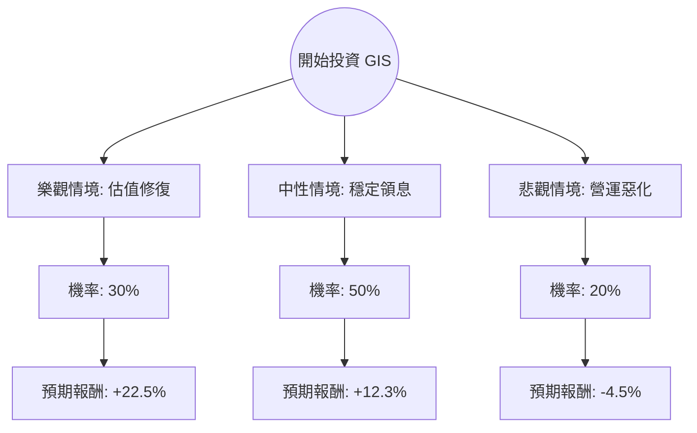

根據您提供的數據以及我針對 **General Mills (GIS)** 進行的最新市場動態搜尋，以下是結合「決策樹分析」與「期望值分析」的投資評估報告。

---

### 一、 市場現況與背景分析 (Context)

根據最新資訊，General Mills (GIS) 目前面臨以下關鍵環境：
1.  **產業趨勢**：民生必需品（Consumer Staples）產業正處於「通膨緩解但銷量承壓」的階段。消費者因預算縮減，開始轉向自有品牌（Private Labels）。
2.  **財務表現**：根據您提供的數據，GIS 的 **P/E 僅 9.62**，遠低於歷史平均（約 15-18），且 **股息率高達 5.46%**，顯示其目前處於價值窪地。
3.  **風險因素**：負債比（Debt/Eq 1.47）偏高，且近期 EPS 與營收成長（Sales Q/Q -7.24%）出現衰退，顯示短期內面臨營運逆風。

---

### 二、 決策樹分析 (Decision Tree)

我們將未來一年的投資回報分為三種情境：**樂觀（估值修復）**、**中性（維持現狀）**、**悲觀（衰退加劇）**。

#### 節點詳細說明：

| 情境 | 機率 (P) | 預期報酬 (R) | 說明 |
| :--- | :--- | :--- | :--- |
| **樂觀 (Bull)** | 30% | **+22.5%** | 達到目標價 $52 (+17%) + 股息 (5.5%)。前提是寵物食品部門回溫且通膨壓力完全消失。 |
| **中性 (Base)** | 50% | **+12.3%** | 股價微幅回升至 $47.5 (+6.8%) + 股息 (5.5%)。反映公司維持市佔率，銷量止跌。 |
| **悲觀 (Bear)** | 20% | **-4.5%** | 股價跌至 52W 低點約 $40 (-10%) + 股息 (5.5%)。反映債務壓力增加或消費者大幅轉向廉價品牌。 |

---

### 三、 期望值分析 (Expected Value Analysis)

#### 1. 核心假設
*   **持有期間**：12 個月。
*   **總報酬計算**：(資本利得/損失 % + 股息收益率 5.46%)。
*   **目標價參考**：數據中提供的 Target Price $52.0 為樂觀目標。
*   **下行風險**：以 52W Range 的低點作為悲觀支撐參考。

#### 2. 計算過程
期望值 (EV) = Σ (各情境機率 × 各情境報酬)

*   **樂觀情境**：$0.30 \times 22.5\% = 6.75\%$
*   **中性情境**：$0.50 \times 12.3\% = 6.15\%$
*   **悲觀情境**：$0.20 \times (-4.5\%) = -0.9\%$

**總期望報酬率 (Total EV) = 6.75% + 6.15% - 0.9% = 12.0%**

---

### 四、 綜合評估與最終結論

#### 1. 數據亮點與隱憂
*   **優勢 (Pros)**：
    *   **極具吸引力的估值**：P/E 9.62 顯示股價已被過度拋售（Oversold）。
    *   **高額現金流回報**：5.46% 的股息率在民生必需品板塊中極具競爭力，且 P/FCF 為 13.33，顯示現金流足以支撐配息。
    *   **高 ROE (27.29%)**：顯示管理層利用股東權益創造利潤的能力依然強勁。
*   **劣勢 (Cons)**：
    *   **成長動能缺失**：EPS 與 Sales Q/Q 均為負值，短期內缺乏股價爆發的催化劑。
    *   **財務槓桿**：Debt/Eq 1.47 偏高，在當前高利率環境下，利息支出會侵蝕利潤。

#### 2. 最終判斷：**適合投資 (適合價值型與收息投資者)**

**理由：**
1.  **期望值為正 (12.0%)**：即便在考慮了 20% 的悲觀衰退機率後，整體的預期報酬仍優於長期通膨率，且具備安全邊際。
2.  **下行空間有限**：目前股價 ($44.45) 已接近 52 週低點 ($42.78)，且 P/E 處於歷史低位，進一步大幅下跌的機率較低。
3.  **防禦性特質**：作為全球食品巨頭，其產品具有剛需屬性。在市場波動或經濟放緩時，5.46% 的股息提供了強大的緩衝。

**建議操作：**
*   **分批進場**：由於 SMA20/50/200 均呈負值，顯示技術面仍處於空頭排列，建議分批佈局以降低成本。
*   **監控指標**：需密切關注下一季的「銷量（Volume）」是否止跌回升，以及債務比率是否有改善跡象。

---
*免責聲明：本分析僅供參考，不構成投資建議。投資者應自行承擔市場風險。*