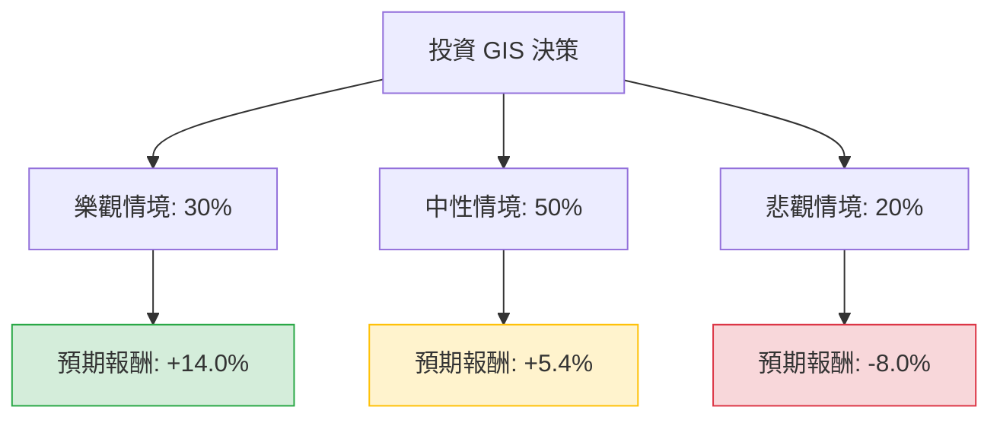

根據您提供的數據以及我對 **General Mills (GIS)** 的最新市場動態搜尋，以下是針對該公司的投資評估分析。

---

### 一、 核心背景與市場動態分析（網路搜尋補充）

在進入決策樹之前，我們必須先解讀數據中隱含的警訊與機會：

1.  **財務警訊**：數據顯示 **EPS Q/Q 下跌 45.86%**，這反映了近期通膨壓力、原料成本上升以及消費者轉向廉價自有品牌（Private Labels）的趨勢。
2.  **估值優勢**：目前 **P/E 僅 9.8**，遠低於其歷史平均（約 16-18 倍），且 **股息率高達 5.36%**，顯示股價可能已過度反應利空，具備防禦性價值。
3.  **產業趨勢**：
    *   **寵物食品成長放緩**：旗下的 Blue Buffalo 曾是增長引擎，但近期因消費者縮減開支，高端寵物食品需求疲軟。
    *   **成本控管**：公司正推動「整體利潤管理（HMM）」計畫，預計每年節省約 4% 的銷售成本。
    *   **市場定位**：作為民生必需品龍頭，其產品（如 Cheerios, Häagen-Dazs）具有較強的抗週期性。

---

### 二、 決策樹分析（Decision Tree）

我們將未來一年的投資情境分為三種：**樂觀（復甦）**、**中性（盤整）**、**悲觀（衰退）**。

#### 1. 樂觀情境 (Bull Case) - 權重：30%
*   **假設**：通膨顯著降溫，原料成本下降；Blue Buffalo 寵物食品銷量回升；公司成功轉嫁成本。
*   **預期股價**：回升至分析師目標價 **$48.67**（較現價 $44.8 漲幅約 8.6%）。
*   **總報酬**：資本利得 8.6% + 股息 5.36% = **13.96%**。

#### 2. 中性情境 (Base Case) - 權重：50%
*   **假設**：銷量持平，消費者繼續轉向平價品牌，但公司透過裁員與 HMM 計畫維持利潤率。股價在 52 週低點附近震盪。
*   **預期股價**：維持在 **$44.8** 附近（漲幅 0%）。
*   **總報酬**：資本利得 0% + 股息 5.36% = **5.36%**。

#### 3. 悲觀情境 (Bear Case) - 權重：20%
*   **假設**：經濟進入深度衰退，EPS 持續萎縮（如數據中 Q/Q -45% 惡化），債務壓力（Debt/Eq 1.47）導致信用評等受壓。
*   **預期股價**：跌破 52 週低點，下探至 **$38.8**（跌幅約 -13.4%）。
*   **總報酬**：資本利得 -13.4% + 股息 5.36% = **-8.04%**。

---

### 三、 期望值分析（Expected Value Analysis）計算過程

我們將各情境的機率與預期報酬相乘，得出整體期望值：

| 情境 | 機率 (P) | 預期報酬 (R) | P × R |
| :--- | :--- | :--- | :--- |
| **樂觀** | 0.30 | +13.96% | +4.188% |
| **中性** | 0.50 | +5.36% | +2.680% |
| **悲觀** | 0.20 | -8.04% | -1.608% |
| **總計期望值** | **1.00** | | **+5.26%** |

**計算公式：**
$EV = (0.30 \times 13.96\%) + (0.50 \times 5.36\%) + (0.20 \times -8.04\%) = 5.26\%$

---

### 四、 核心假設說明

1.  **估值修復**：假設 P/E 9.8 已反映大部分利空（如 EPS 下跌），下行空間受 5.36% 高股息支撐。
2.  **股息安全性**：GIS 擁有長期配息紀錄，雖然 Debt/Eq 1.47 偏高，但其現金流（P/FCF 13.58）尚足以支撐股息發放。
3.  **技術面壓力**：SMA20, 50, 200 均線皆為負值（-2% 到 -8%），顯示短期內仍有賣壓，股價需要時間築底。

---

### 五、 最終結論

**投資判斷：適合投資（但僅限於「收益型」或「防禦型」配置）**

#### 理由：
1.  **正向期望值**：整體期望報酬率為 **5.26%**，雖不算極高，但優於多數現金儲蓄，且在民生必需品板塊中屬於穩健。
2.  **高安全邊際**：P/E 9.8 處於歷史低位，且股息率 5.36% 提供了強大的下行保護（Downside Protection）。
3.  **適合對象**：適合尋求穩定現金流、不追求短期爆發性成長，且能忍受短期股價震盪的長期投資者。

**風險提示：**
若 **EPS Q/Q** 持續惡化超過兩個季度，或 **Current Ratio (0.66)** 導致短期流動性危機，則需重新評估其股息發放能力。建議分批進場，觀察股價是否能在 $42.78（52W Low）附近站穩。