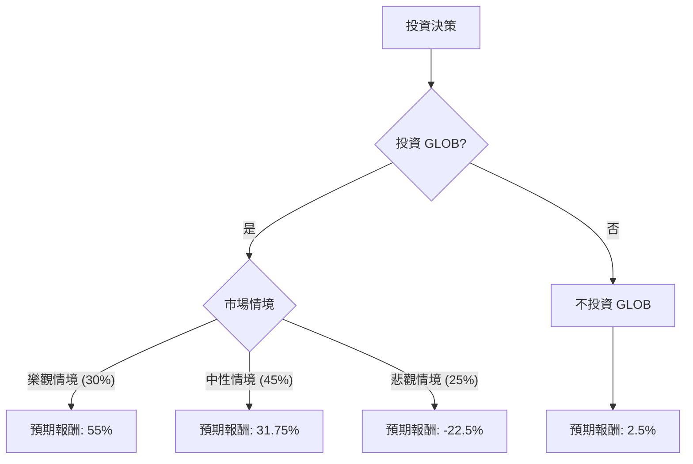

根據對美股公司 GLOB 的「決策樹分析」與「期望值分析」，並參考其基本面數據及最新市場資訊，以下是評估結果：

### **GLOB 基本面數據概覽 (截至 2026 年 3 月 7 日)**

*   **收盤價 (Close):** $51.61
*   **市盈率 (P/E):** 22.66
*   **市淨率 (P/B):** 1.08
*   **52 週高點/低點 (52W Range):** $40.76 - $145.46
*   **目標價 (Target Price):** $73.7 (來自用戶提供數據), 分析師平均目標價介於 $64.18 至 $85.43
*   **市值 (Market Cap):** $2.23 Billion
*   **ROE:** 5.07%
*   **ROA:** 3.17%
*   **毛利率 (Gross Margin):** 30.26% (Q4 2025 調整後為 37.6%)
*   **營業利潤率 (Oper. Margin):** 10.24% (Q4 2025 調整後為 15.5%)
*   **負債權益比 (Debt/Eq):** 0.23
*   **最新 EPS (Q4 2025):** $1.54 (超出預期 $1.40)
*   **最新營收 (Q4 2025):** $612.5 百萬 (年減 4.7%，但超出指引)
*   **2026 年營收指引:** $2,460 百萬至 $2,510 百萬 (年增 0.2% 至 2.2%)
*   **2026 年調整後稀釋 EPS 指引:** $6.10 至 $6.50 (高於市場預期約 $5.67)
*   **自由現金流 (Q4 2025):** $152.8 百萬 (公司歷史新高)
*   **AI Pods 業務:** 2025 年退出年化經常性收入 (ARR) 達 $20.6 百萬，毛利率 45%-60%。2026 年目標為 $60-$100 百萬 ARR。
*   **分析師共識評級:** 「持有」或「適度買入」

### **核心假設 (Core Assumptions)**

*   **市場假設：**
    *   全球經濟在 2026 年預計將實現溫和增長 (約 2.7%-2.8%)，但仍面臨地緣政治緊張、通膨壓力及潛在科技泡沫破裂的風險。
    *   人工智慧 (AI) 技術的發展和應用將持續是市場焦點，並推動企業數位轉型，但其對傳統 IT 服務的影響存在不確定性。
*   **財務假設：**
    *   GLOB 的 2026 年財報指引 (營收增長 0.2%-2.2%，調整後 EPS $6.10-$6.50) 是可實現的，但其 AI Pods 業務的實際增長速度和對整體利潤率的貢獻是關鍵變數。
    *   公司將繼續執行股票回購計劃，並保持健康的自由現金流。
    *   匯率波動和部分地區的法定成本增加將持續對毛利率構成壓力。
*   **產業趨勢假設：**
    *   IT 服務產業正經歷結構性轉變，資本流向 AI 基礎設施，可能影響傳統服務增長。
    *   GLOB 在 AI 解決方案 (如 AI Pods) 方面的創新和市場接受度將是其未來增長的關鍵驅動力。
    *   公司對媒體娛樂和金融服務行業的客戶集中度可能帶來行業特定風險。
*   **投資期限：** 12-18 個月。

### **決策樹分析 (Decision Tree Analysis)**

**當前股價:** $51.61

### **期望值分析 (Expected Value Analysis) - 計算過程**

**1. 投資 GLOB (Invest in GLOB) 的期望值計算：**

*   **情境一：樂觀情境 (Bullish Scenario)**
    *   **情境描述:** 全球經濟加速增長，AI 應用爆發性成長，地緣政治風險趨緩。GLOB 的 AI Pods 業務大幅超越預期，傳統服務穩定復甦，利潤率顯著提升。股價達到分析師高點附近，例如 $80。
    *   **機率 (Probability):** 30%
    *   **預期報酬 (Expected Return):** (($80.00 - $51.61) / $51.61) * 100% = 55.00%
    *   **期望值 (Expected Value):** 0.30 * 55.00% = **16.50%**

*   **情境二：中性情境 (Neutral Scenario)**
    *   **情境描述:** 全球經濟溫和增長，AI 採用穩健但非爆發性，地緣政治不確定性持續。GLOB 達成 2026 年財報指引，AI Pods 業務穩步增長，傳統服務保持穩定。股價達到分析師平均目標價附近，例如 $68。
    *   **機率 (Probability):** 45%
    *   **預期報酬 (Expected Return):** (($68.00 - $51.61) / $51.61) * 100% = 31.75%
    *   **期望值 (Expected Value):** 0.45 * 31.75% = **14.29%**

*   **情境三：悲觀情境 (Bearish Scenario)**
    *   **情境描述:** 全球經濟陷入衰退，地緣政治衝突加劇，科技股泡沫破裂。GLOB 未能達成 2026 年指引，AI Pods 增長不及預期，傳統服務進一步下滑，利潤率受壓。股價跌至 52 週低點附近，例如 $40。
    *   **機率 (Probability):** 25%
    *   **預期報酬 (Expected Return):** (($40.00 - $51.61) / $51.61) * 100% = -22.50%
    *   **期望值 (Expected Value):** 0.25 * -22.50% = **-5.63%**

**整體投資 GLOB 的期望值 (Overall Expected Value for "Invest in GLOB"):**
= 16.50% (樂觀) + 14.29% (中性) - 5.63% (悲觀) = **25.16%**

**2. 不投資 GLOB (Do Not Invest in GLOB) 的期望值計算：**

*   **情境一：持有現金/低風險投資 (Hold Cash/Low-Risk Investment)**
    *   **情境描述:** 假設將資金投入年化 2.5% 的低風險資產 (例如短期國債或高評級債券)。
    *   **機率 (Probability):** 100%
    *   **預期報酬 (Expected Return):** 2.5%
    *   **期望值 (Expected Value):** 1.00 * 2.5% = **2.5%**

### **最終結論 (Final Conclusion)**

根據上述決策樹分析和期望值計算，**GLOB 目前適合投資**。

**簡短理由 (Brief Justification):**

投資 GLOB 的整體期望值為 **25.16%**，顯著高於不投資 GLOB（即持有現金或進行低風險投資）的期望值 **2.5%**。儘管 GLOB 面臨傳統 IT 服務收入年減、毛利率受匯率和成本壓力以及客戶集中等挑戰，但其在 2025 年第四季度實現了創紀錄的自由現金流，並透過 AI Pods 等創新 AI 解決方案展現出強勁的增長潛力與更高的毛利率。公司 2026 年的 EPS 指引也超出市場預期。分析師普遍給予「持有」或「適度買入」評級，且平均目標價顯示出顯著的潛在上升空間 (24%至 71%)。綜合考量，GLOB 在 AI 轉型中的積極布局及其財務表現的亮點，使其在風險與報酬權衡下，相較於低風險替代方案具有更高的預期回報。