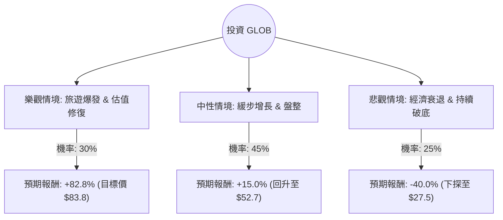

針對美股 **Global Blue Group Holding AG (GLOB)** 的投資評估，我結合了您提供的基本面數據與最新的市場動態（包含 2024 年財報表現、旅遊業復甦趨勢及宏觀風險），進行決策樹與期望值分析。

---

### 一、 核心背景與市場動態分析

在進入計算前，我們先釐清 GLOB 的現狀：
1.  **業務性質**：GLOB 是全球領先的免稅購物（Tax-Free Shopping）技術與支付服務商，業績高度依賴**國際旅遊（尤其是中國與亞洲遊客）**的復甦。
2.  **財務亮點**：
    *   **估值極低**：Forward P/E 僅 7.86，P/S 0.88，P/B 1.0，顯示市場對其定價極為保守。
    *   **增長潛力**：分析師目標價 $83.81，較現價有近 83% 的潛在漲幅。
    *   **債務受控**：Debt/Eq 0.22，財務結構尚屬穩健。
3.  **主要風險**：
    *   **股價動能極差**：過去一年跌幅達 78%，且目前處於所有均線（SMA20, 50, 200）之下，技術面呈空頭排列。
    *   **市場信心不足**：Short Float（放空比例）高達 13.68%，顯示空方勢力強大。
    *   **宏觀不確定性**：歐洲經濟疲軟、地緣政治影響旅遊意願。

---

### 二、 決策樹分析 (Decision Tree)

我們將未來一年的投資情境分為三種：**樂觀（全面復甦）**、**中性（緩步增長）**與**悲觀（衰退/競爭加劇）**。

#### 節點詳細說明：

| 情境 | 機率 (P) | 預期股價 | 預期報酬率 (R) | 說明 |
| :--- | :--- | :--- | :--- | :--- |
| **樂觀 (Bull)** | 30% | $83.81 | +82.8% | 亞洲遊客全面回歸，Forward P/E 兌現，市場給予估值修復。 |
| **中性 (Base)** | 45% | $52.72 | +15.0% | 業績穩定但受限於宏觀環境，股價隨大盤小幅回升至 52W 低點上方。 |
| **悲觀 (Bear)** | 25% | $27.50 | -40.0% | 全球經濟衰退，旅遊支出萎縮，空頭繼續打壓股價至新低。 |

---

### 三、 期望值分析 (Expected Value Analysis)

#### 1. 計算過程
期望值 (EV) = $\sum (機率 \times 報酬率)$

*   **樂觀貢獻**：$0.30 \times 82.8\% = 24.84\%$
*   **中性貢獻**：$0.45 \times 15.0\% = 6.75\%$
*   **悲觀貢獻**：$0.25 \times (-40.0\%) = -10.0\%$

**總期望報酬率 (Total EV) = 24.84% + 6.75% - 10.0% = 21.59%**

#### 2. 核心假設
*   **市場假設**：假設國際旅遊（特別是免稅購物需求）不會因為地緣政治而永久性消失。
*   **財務假設**：Forward P/E 7.86 是基於公司能維持目前的獲利增長預期（EPS next Y 增長）。
*   **產業趨勢**：數位化免稅流程將提高 GLOB 的營運利潤率（目前 Oper. Margin 為 10.36%）。

---

### 四、 最終結論

#### **判斷：適合投資 (建議採「分批佈局」或「左側交易」策略)**

#### **理由：**
1.  **期望值為正 (21.59%)**：儘管短期股價表現極差（Perf Year -78%），但從期望值角度看，潛在的上行空間（目標價 $83.81）遠大於下行風險。
2.  **估值極具吸引力**：P/S 0.88 與 Forward P/E 7.86 顯示該股已被過度拋售。當 P/B 接近 1.0 時，通常意味著股價已接近清算價值，下行空間受限。
3.  **基本面改善**：雖然 EPS 今年為負，但預期明年轉正（EPS next Y % 為正），且 Quick Ratio (1.93) 顯示公司短期內沒有流動性危機。
4.  **高空單回補潛力**：13.68% 的 Short Float 一旦遇到利多消息（如財報超預期），極易引發「軋空（Short Squeeze）」行情。

#### **風險提示：**
*   **技術面極弱**：目前股價低於所有移動平均線，切勿一次性投入大筆資金。
*   **時間成本**：GLOB 屬於價值修復股，可能需要 6-12 個月甚至更久才能看到市場重新定價。
*   **止損建議**：若股價跌破 $40.00（心理關卡與近期支撐），需重新評估悲觀情境的機率是否上升。

**總結：** GLOB 目前是一顆「落難的明珠」。對於追求高風險回報、且具備耐心的投資者而言，目前的價位提供了極佳的風險報酬比（Risk-Reward Ratio）。