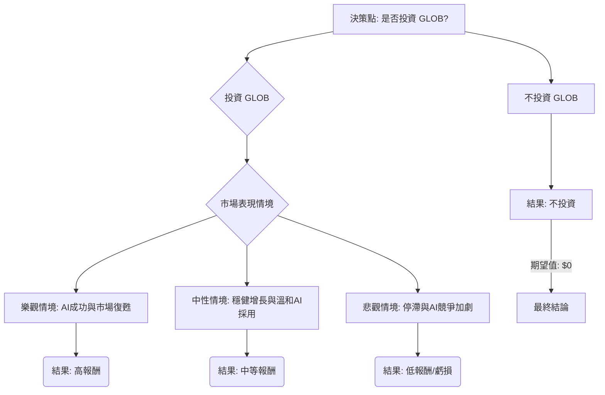

根據對美股公司 GLOB 的基本面數據、最新新聞、財報、市場動態及產業趨勢的綜合評估，以下將使用決策樹分析與期望值分析來判斷目前是否適合投資。

### 核心假設

在進行決策樹分析前，我們建立以下核心假設：

*   **市場趨勢：** 儘管全球經濟存在停滯風險，但數位轉型、雲端服務和人工智慧 (AI) 領域的需求持續增長，為 IT 服務公司帶來結構性機會。GLOB 積極佈局 AI 領域，並預計在 2026 年中恢復正向的同比有機營收增長。
*   **公司財務：** GLOB 在 2025 年第四季度營收同比下降 4.7%，但超出預期，且 Q4 預訂量同比增長 32%。2025 年全年營收為 24.5 億美元，淨利潤為 1.0292 億美元，同比下降 37.90%。然而，分析師預計其未來一年 EPS 將增長 20.62%。公司正積極轉型 AI Studios 和 AI-native 交付模式，並設定 2026 年 AI Pods 業務目標為 6000 萬至 1 億美元。
*   **產業競爭：** IT 服務行業競爭激烈，AI 的顛覆性潛力對公司護城河構成挑戰。GLOB 需要持續創新並有效執行其 AI 策略以維持競爭力。
*   **估值：** 目前 GLOB 的股價約為 45.68 美元，遠低於多數分析師的平均目標價（約 63.55 美元至 80.80 美元），甚至有分析認為其被低估 54.8% 至 62%。

### 決策樹分析

**決策點：是否投資 GLOB？**

*   **當前股價 (Current Price):** $45.68

**節點詳情與計算過程：**

**1. 決策點：是否投資 GLOB？**

*   **情境名稱：** 投資 GLOB
*   **機率：** N/A (這是決策點)
*   **預期報酬 / 期望值：** 待計算

**2. 投資 GLOB -> 市場表現情境 (Chance Node)**

*   **核心假設：** GLOB 未來的股價表現將受其 AI 策略執行、整體市場環境和產業競爭影響。

    *   **2.1 樂觀情境：AI 成功與市場復甦**
        *   **預測情境名稱：** 樂觀情境
        *   **對應的機率 (Probability)：** 30%
            *   **理由：** 公司積極投入 AI 領域，Q4 預訂量強勁增長，且預計 2026 年 AI Pods 業務將有顯著增長。若 AI 策略成功，加上全球經濟復甦，股價有望達到分析師高點預期。
        *   **預期報酬 (Estimated Return)：** 118.9%
            *   **計算方式：** 假設股價達到分析師高點預期或更高，例如 $100 (接近 52 週高點 $142.24 的中位數，且有分析師給出 $160 的高預期)。
            *   `($100 - $45.68) / $45.68 = 1.189 = 118.9%`
        *   **期望值 (Expected Value)：** `0.30 * 118.9% = 35.67%`

    *   **2.2 中性情境：穩健增長與溫和 AI 採用**
        *   **預測情境名稱：** 中性情境
        *   **對應的機率 (Probability)：** 45%
            *   **理由：** 分析師普遍給予「持有」或「溫和買入」評級，平均目標價約為 $72.48。公司預計 2026 年中恢復有機營收增長，AI 採用穩健。
        *   **預期報酬 (Estimated Return)：** 58.6%
            *   **計算方式：** 假設股價達到提供的平均目標價 $72.48。
            *   `($72.48 - $45.68) / $45.68 = 0.586 = 58.6%`
        *   **期望值 (Expected Value)：** `0.45 * 58.6% = 26.37%`

    *   **2.3 悲觀情境：停滯與 AI 競爭加劇**
        *   **預測情境名稱：** 悲觀情境
        *   **對應的機率 (Probability)：** 25%
            *   **理由：** 2025 年 Q4 營收同比下降，利潤率收縮。若 AI 競爭加劇或全球經濟進一步惡化，可能導致營收停滯甚至下滑，股價可能跌至 52 週低點或更低。
        *   **預期報酬 (Estimated Return)：** -23.4%
            *   **計算方式：** 假設股價跌至 $35 (低於 52 週低點 $40.76)。
            *   `($35 - $45.68) / $45.68 = -0.234 = -23.4%`
        *   **期望值 (Expected Value)：** `0.25 * -23.4% = -5.85%`

**3. 不投資 GLOB -> 結果：不投資**

*   **情境名稱：** 不投資
*   **機率：** N/A
*   **預期報酬 / 期望值：** 0% (假設資金投入其他無風險資產或維持現金，不考慮機會成本)

### 整體期望值計算

**投資 GLOB 的總期望值 (Total Expected Value of Investing in GLOB):**
`= (樂觀情境期望值) + (中性情境期望值) + (悲觀情境期望值)`
`= 35.67% + 26.37% - 5.85%`
`= 56.19%`

**不投資 GLOB 的總期望值：**
`= 0%`

### 最終結論

根據上述決策樹分析和期望值計算，投資 GLOB 的整體期望值為 **56.19%**，而不投資的期望值為 0%。

因此，基於目前的數據和分析，**適合投資 GLOB**。

**簡短理由：**
儘管 GLOB 面臨營收增長放緩和利潤率收縮的挑戰，且 IT 服務行業競爭激烈，但公司在 AI 和數位轉型領域的積極佈局、強勁的 Q4 預訂量以及分析師普遍看好的平均目標價，顯示其具有顯著的潛在上升空間。目前的股價相對於其內在價值和分析師目標價被嚴重低估，提供了較高的安全邊際和吸引人的預期報酬。雖然存在悲觀情境的風險，但樂觀和中性情境的綜合權重預期報酬遠大於潛在虧損，使得整體投資期望值為正且可觀。